# CodeTruth OS — Complete Work Model

**Platform Category:** AI-Assisted Project Cognition & System Visualization Platform  
**Derived From:** CodeTruth OS Formal Product Thesis v1.0  
**Document Type:** Operational Reference — Institutional-Grade Work Model Specification  
**Version:** 1.0  
**Date:** June 2026

---

## 1. System Overview & Work Model Philosophy

### 1.1 Purpose and Scope of This Document

This document defines the operational reality of CodeTruth OS: how work flows through the system from ingestion to insight. Where the product thesis establishes what the platform is and why it exists, the work model operationalizes that architecture into executable process definitions specifying the **entities** that enter the system, the **transformations** applied to them, the states they pass through, and the outputs they produce. It is the dynamic counterpart to static architecture documentation.

A static architecture document describes components at rest. A procedural manual describes how a user interacts with an interface. The **work model** occupies the space between them: it describes the system *in motion* — the continuous flow of data, decisions, and state transitions that constitute the platform's operational life[^1^]. It answers not "what is built?" but "how does the system behave when running?"

The target audience spans four groups: internal engineering teams aligning implementation with operational intent; institutional buyers evaluating process rigor as a proxy for output quality; technical architects designing integrations who need exact entity flows and state machines; and operational planners reasoning about resource requirements and workflow design. This document operationalizes the thesis architecture into executable process definitions[^2^], defining exactly how the "live, multi-dimensional model"[^3^] is constructed, updated, validated, and rendered.

**Table 1.1** maps the eight chapters, each covering a distinct dimension of the platform's work model.

| Chapter | Dimension | What It Describes | Key Entities |
|:---|:---|:---|:---|
| 1. System Overview & Work Model Philosophy | Foundational framing | The work model concept, system context, philosophy-to-process translation | Work Model, Philosophy, Confidence Level |
| 2. Functional Work Model | Core operational processes | End-to-end entity flows through the 8-layer pipeline from ingestion through governance | Snapshot, Project Model, Architecture Graph, Evidence Chain |
| 3. AI Governance & Truth Council Model | AI reasoning processes | Multi-model adversarial review, contradiction detection, confidence synthesis | Truth Council, Contradiction Register, Consensus Truth Report |
| 4. User & Workspace Work Model | User-facing operations | Workspace lifecycle, user roles, session flows, collaboration mechanics | Workspace, Workstream, Review Session, Annotation |
| 5. Technical & Data Work Model | System internals | Data architecture, API contracts, state persistence, caching, queue mechanics | Snapshot Record, Symbol Index, Dependency Graph, Scorecard |
| 6. Operational Process Model | Runtime behavior | Execution scheduling, error handling, retry logic, concurrency, scaling triggers | Analysis Job, Queue, Worker Pool, Incremental Re-analysis |
| 7. Quality, Trust & Confidence Model | Output integrity | Confidence taxonomy, evidence linking, severity classification, trust propagation | Confidence Tag, Evidence Ledger, Risk Heatmap, Severity Class |
| 8. Organizational & Handoff Model | External integration | Report generation, export flows, third-party integrations, institutional handoff | Truth Report, Export Payload, Ticket Format, Approval Workflow |

*Table 1.1 — Document Chapter Map. Each chapter covers one dimension of the platform's operational reality, from core pipeline flows through external handoff mechanics.*

The chapter sequence follows a logical dependency chain: Chapters 1–3 establish the conceptual and functional foundation; Chapters 4–5 describe user-facing and technical interfaces; Chapters 6–8 cover runtime operations, quality assurance, and external integration.

### 1.2 CodeTruth OS System Context

CodeTruth OS is an **AI-Assisted Project Cognition and System Visualization Platform**[^4^] belonging to an emerging category: a system that actively maintains and renders an accurate model of a software project at every level of abstraction — from raw file structure through architecture and runtime behavior to build-phase progression and implementation planning — making that model continuously accessible and actionable by both technical and non-technical builders[^5^].

The platform addresses **cognitive compression failure**: as a project grows in files, agents, integrations, environments, and services, the human ability to hold the whole system in mind deteriorates faster than the project's actual complexity grows[^6^]. The consequences include architectural drift, late-discovered integration failures, onboarding friction, and compounding technical debt that becomes invisible without a structural view. CodeTruth OS closes this gap by maintaining a persistent **cognitive layer** — an intelligence that always knows what the project is, how it works, what is wrong, and what needs to happen next[^7^].

The processing pipeline comprises **eight layers**[^8^]. Layer 1 (Ingestion) receives project source and produces an immutable **Snapshot Record** — a hash-identified capture of the project's complete file state. Layer 2 (Parsing) converts raw files into structured knowledge: AST extraction yields a Symbol Index; dependency patterns yield a **Dependency Graph**. Layer 3 (Reconstruction) assembles file-level evidence into a systems-level **Architecture Graph** — a machine-readable representation of service boundaries, runtime flows, and data flow mappings. Layer 4 (Evaluation) scores the model across ten domains including code structure, runtime readiness, security posture, and test maturity[^9^], classifying findings by severity. Layer 5 (Multi-Model **Truth Council**) orchestrates five role-specialized models — Architecture, Runtime, DevOps, Security, and Planning — conducting independent assessments using shared evidence, then cross-reviewing findings[^10^]. Contradictions are preserved rather than averaged away; the output is a **Consensus Truth Report** with an **Evidence Ledger** linking every assertion to its source. Layer 6 (Planning) converts understanding into executable plans, grouping recommendations into **workstreams** by domain with acceptance criteria. Layer 7 (Spatial Visualization) renders the project model as a navigable environment where services are zones, data flows are paths, and **confidence levels** are encoded as visual solidity[^11^]. Layer 8 (Governance) supports role-based access, human review workflows, and audit logging.

The platform occupies the intersection of five domains: software architecture intelligence, technical due diligence, AI-assisted reasoning, spatial system visualization, and institutional-grade project governance[^12^]. No existing platform covers all five coherently. This positioning shapes the work model at every layer: the system must simultaneously perform deep technical analysis, maintain audit-grade evidentiary standards, leverage multi-model AI reasoning, render results spatially, and support institutional governance — all within a single operational flow.

### 1.3 Work Model Philosophy

The work model is grounded in eight core philosophies. Each is an **operational constraint** — a rule governing how processes are defined, how entities are transformed, and how outputs are validated. Table 1.2 maps each philosophy to its work model implication.

| Philosophy Statement | Work Model Implication | Affected Chapters |
|:---|:---|:---|
| **System Truth Over File Truth** — The project is the system files produce (services, flows, behaviors), not the files themselves[^13^] | Every transformation elevates from file-level evidence to system-level understanding; outputs describe services and flows, not syntax | 2, 3, 5 |
| **Evidence-Linked Every Claim** — No output states something without pointing to specific justifying evidence[^14^] | Every entity carries an **Evidence Chain**: a linked list of source files, symbols, and configs; unevidenced claims are rejected | 2, 3, 7 |
| **Confidence Transparency** — Every understanding is tagged with evidentiary strength[^15^] | A five-tier **Confidence Level** taxonomy (confirmed, strongly inferred, weakly inferred, unknown, contradicted) applied to every entity at every layer | 3, 7 |
| **Non-Coder Sovereignty** — Complex system understanding must be accessible to non-traditional coders who own the system[^16^] | All outputs have dual render paths: technical depth for engineers, structural/conceptual translation for non-coders; underlying depth is never reduced | 2, 4, 7 |
| **Spatial Comprehension** — Human cognition handles complex environments better as navigable spaces than as flat lists[^17^] | The rendering layer transforms graph-structured project models into spatial environments with navigable zones, paths, and visual confidence encoding | 2, 5 |
| **Continuous Rather Than One-Time** — The project model is maintained continuously as files change[^18^] | Snapshots trigger incremental re-analysis; the **Project Model** updates rather than being rebuilt; webhook-driven ingestion replaces batch processing | 2, 6 |
| **From Understanding to Execution** — Every insight must connect to a taskable implementation path[^19^] | Layer 6 (Planning) is mandatory: every finding routes through remediation planning with sequenced tasks, acceptance criteria, and dependency ordering | 2, 8 |
| **Institutional-Grade Without Institutional Complexity** — Outputs at institutional depth without requiring an infrastructure team[^20^] | Automated processes replace manual review teams: the Truth Council performs adversarial review, severity classification replaces human triage, report generation is fully automated | 3, 6, 8 |

*Table 1.2 — Philosophy-to-Work-Model Mapping. Each of the eight core philosophies translates into a concrete operational constraint governing process definition across the document.*

These implications are hard constraints, not aspirations. "Evidence-Linked Every Claim" means any process producing a claim without an attached **Evidence Chain** is incomplete. "Confidence Transparency" means every output entity carries a **Confidence Level** tag — there is no untagged output. "From Understanding to Execution" means Layer 6 (Planning) is a mandatory continuation, not an optional add-on.

The interplay between these philosophies produces the platform's distinctive operational character. **System Truth Over File Truth** combined with **Evidence-Linked Every Claim** means the system reconstructs architectural reality from file-level evidence without losing the evidentiary chain. **Confidence Transparency** combined with the **Multi-Model Truth Council** means disagreements between expert models are preserved and surfaced rather than smoothed away. **From Understanding to Execution** combined with **Institutional-Grade Without Institutional Complexity** means a single builder can produce architecture maps, maturity assessments, and remediation roadmaps at a depth that previously required dedicated teams. Chapter 2 traces these cascades through the **Functional Work Model**, defining the end-to-end entity flows through the eight-layer pipeline — from the moment a **Snapshot** enters Layer 1 to the moment a rendered spatial model and implementation plan exit Layers 7 and 8.

---

## 2. Functional Work Model

The CodeTruth OS platform processes every connected project through an eight-layer analytical pipeline. Each layer accepts a specific set of input entities, applies a defined transformation, and produces output entities that become the input for the subsequent layer. The progression moves from raw source material at Layer 1 through progressively higher levels of abstraction — structural, architectural, evaluative, deliberative, planning, spatial, and governance — until the full system model emerges at Layer 8 as a navigable, auditable, and actionable project cognition artifact.

The pipeline operates on **progressive refinement**: no layer discards information from preceding layers. Instead, each enriches the entity graph with new entities and relationships while preserving links to source evidence. A finding at Layer 4 can trace its evidentiary chain back through Layer 3 and Layer 2 to the specific files and symbols in Layer 1 that produced it[^1^]. This provenance chain is the operational mechanism behind the platform's evidence-linked confidence model.

**Failure isolation** is enforced at every layer boundary. A single file that fails to parse, a single analyzer that returns an error, or a single service boundary that cannot be inferred does not abort the full layer run. The platform records the failure, marks affected downstream entities as having incomplete evidence, and continues processing all other entities[^2^]. This design allows the platform to deliver partial but actionable results for projects containing malformed files, mixed-language repositories, or non-standard infrastructure configurations.

**Table 2.1** presents the complete layer responsibility matrix.

**Table 2.1 — Layer Responsibility Matrix**

| Layer | Purpose | Input Entities | Key Transformations | Output Entities | Side-Output Reports |
|---|---|---|---|---|---|
| 1 — Ingestion | Source admission and snapshot creation | Repository URL, OAuth token, folder path, zip archive | Connection, file traversal, hash computation, stack auto-detection, manifest generation | Source Connection Record, Snapshot Record, File Manifest, Detected Stack Profile | Connection audit log, ingestion error log |
| 2 — Parsing and Intelligence | Structural extraction from files to queryable knowledge | File Manifest, Detected Stack Profile | AST extraction, symbol graph construction, dependency graph construction, secret detection, infra parsing | Symbol Index, Dependency Graph, Endpoint Map, Schema Map, Environment Requirement Set, Infra Config Map | Parsing error report, secret exposure alert, doc gap notice |
| 3 — Reconstruction | File-level evidence assembly into system-level model | Symbol Index, Dependency Graph, Endpoint Map, Infra Config Map | Service boundary inference, pattern recognition, runtime flow reconstruction, coupling/cohesion analysis | Architecture Graph, Runtime Flow Map, Operational Map, Agent/Service Map, External Dependency Map, Deployment Topology Map | Inference confidence report, unmapped component list |
| 4 — Evaluation | Scoring and gap detection | Architecture Graph, Runtime Flow Map, all Layer 3 artifacts | 10-domain scoring, 12-category gap detection, 5-tier severity classification | Build-State Scorecard, Maturity Stage Classification, Missing Infrastructure Matrix, Risk Heatmap, Priority-Ordered Finding List | Domain score breakdown, gap inventory, dependency risk analysis |
| 5 — Multi-Model Truth Council | Adversarial multi-model truth synthesis | All Layer 4 artifacts, all evidence chains from Layers 1-3 | Independent first-pass, cross-review challenge, contradiction detection, consensus synthesis | 5 Individual Assessments, Contradiction Register, Consensus Truth Report, Evidence Ledger | Model disagreement summary, unresolvable contradiction list |
| 6 — Planning | Convert findings into executable plans | Consensus Truth Report, Priority-Ordered Finding List, Evidence Ledger | Fix recommendation, prerequisite chain analysis, phase planning, effort estimation, workstream grouping | Phased Implementation Roadmap, Priority Matrix, Workstream Breakdown, Ticket-Ready Task List, Acceptance Test Checklist | Effort rationale, dependency conflict analysis |
| 7 — Spatial Visualization | Cognition surface generation | All entities from Layers 1-6 with confidence and risk metadata | 3D/layered rendering, confidence encoding, risk heat zones, time animation | Navigable Spatial Model, Risk Heatmap Visualization, Build-Phase State Render, Evidence Drill-Down Interface | View presets, render performance metrics |
| 8 — Governance and Collaboration | Policy enforcement and collaborative oversight | All preceding entities, human annotations, policy configurations | RBAC enforcement, human review workflow, approval processing, audit logging, version pinning | Signed Report, Audit Log, Version-Pinned Analysis Record, Workspace Policy State | Access control log, annotation summary, version history |

Each layer increases semantic density. Layer 1 outputs describe files and hashes — low semantic density, high fidelity. Layer 3 outputs describe services, flows, and architecture patterns — high semantic density, with every claim linked to supporting evidence. Layer 5 outputs represent the apex of analytical abstraction: synthesized truth claims produced by adversarial deliberation among five specialized models, each grounded in the full evidence chain[^3^].

### 2.1 Layer 1 — Ingestion: Source Admission and Snapshot Creation

The Ingestion Layer accepts a project from an external source, validates access, enumerates files, computes cryptographic identities, detects the technology stack, and produces an immutable Snapshot Record.

**Connection protocols.** The platform supports seven connection modalities: (1) **GitHub OAuth** — repository read access via GitHub's OAuth flow; (2) **Personal Access Token (PAT)** — user-supplied GitHub PAT with repository scopes; (3) **GitHub App install** — CodeTruth GitHub App on a repository or organization, enabling webhook-driven continuous ingestion; (4) **Folder upload** — local directory tree via web interface; (5) **Zip upload** — compressed archive extraction; (6) **Cloud drive sync** — connection to supported cloud storage; (7) **Webhook triggers** — commit, pull request, or branch creation events initiating incremental or full re-ingestion[^4^].

**File enumeration and hash computation.** The platform traverses the repository tree, applying ignore rules in layered precedence: platform-global defaults (vendor directories, build output, binary artifacts), repository `.gitignore` patterns, user-configured exclusions, and language-specific defaults. For each file passing filters, the platform computes a SHA-256 hash. The hash serves dual purposes: unique content identity for incremental re-analysis, and immutable binding of the Snapshot Record to a specific repository state. The File Manifest enumerates every file with hash, path, size, and MIME type. The Snapshot Record aggregates all file hashes into a Merkle-style snapshot hash[^5^].

**Stack profile auto-detection.** During enumeration, the platform inspects file extensions, lockfile presence, configuration filenames, and directory patterns to produce the **Detected Stack Profile**: programming languages, frameworks, lockfile types, containerization technology, infrastructure-as-code tooling, CI/CD configuration, and test framework signatures[^6^].

**Snapshot state machine:**

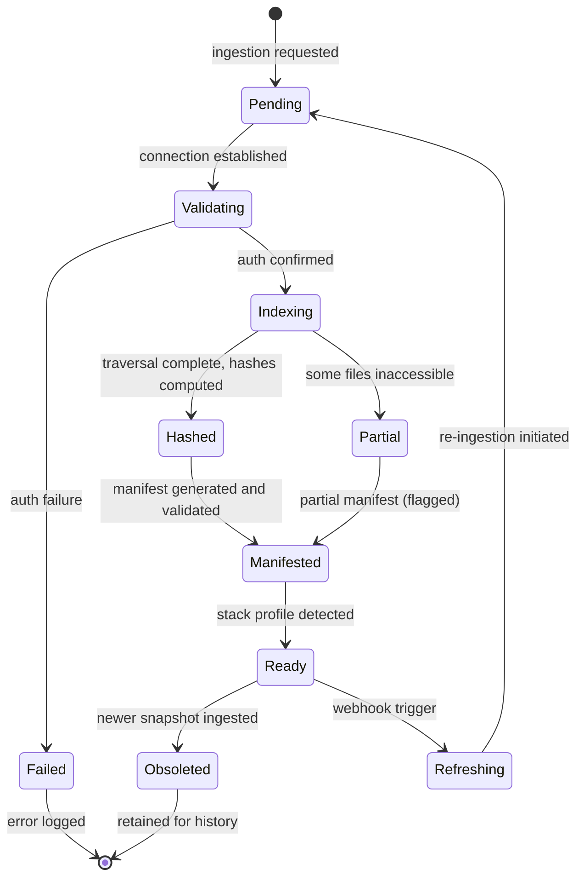

The `Indexing --> Partial` transition occurs when the platform can read the repository but encounters files or directories without read permission. The snapshot is marked Partial, inaccessible paths are recorded, and processing continues. The `Ready --> Refreshing` transition is the webhook path: a commit push triggers a new snapshot cycle, with the prior snapshot eventually becoming Obsoleted[^7^].

**Output entities:** Source Connection Record, Snapshot Record, File Manifest, Detected Stack Profile[^8^].

### 2.2 Layer 2 — Parsing and Intelligence: Structural Extraction

The Parsing Layer converts raw files into structured knowledge. Where Layer 1 treated files as opaque content blocks, Layer 2 extracts internal structure — symbols, dependencies, endpoints, schemas, secrets, and infrastructure configurations.

**AST extraction and normalization.** For each source file, the platform selects a language-specific parser based on extension and Detected Stack Profile. The parser produces an Abstract Syntax Tree (AST), which is normalized into a language-agnostic representation capturing function and method definitions, class and type definitions with inheritance, variable declarations, control flow, and export/import statements[^9^]. This normalization enables cross-language analysis: a TypeScript service and a Python service are parsed into a common representation that Layer 3 reasons about uniformly.

**Symbol graph construction.** From normalized ASTs, the platform builds a **Symbol Graph** — a directed graph where nodes are symbols (functions, classes, types, interfaces, variables) and edges are relationships (calls, inherits, imports, exports, implements). The **Symbol Index** maps every symbol to its defining file, its relationships, and its visibility scope[^10^].

**Dependency graph construction.** Dependencies are extracted at four granularities: **package-level** from lockfiles and import statements; **module-level** from import/require statements; **service-level** from cross-service imports and shared database references; **external** as packages not in the repository, including third-party libraries and external service clients[^11^].

**Infrastructure extraction.** The platform parses: Docker image definitions, port mappings, and Compose configurations; Kubernetes deployment, service, ingress, and config maps; Terraform resource declarations and provider configurations; CI/CD pipeline definitions including stages, triggers, secrets references, and artifact handling; and environment variable declarations from .env files and configuration files[^12^].

**Security scanning and redaction protocol.** A pattern library detects potential secret exposures: API keys, access tokens, private keys, database connection strings, and password literals. When detected, the **redaction protocol** applies: the secret value is replaced with a non-reversible hash in user-facing outputs, the original location is stored in a secure evidence store accessible only to the Layer 5 Security Model, and the finding is flagged for human review in Layer 8[^13^].

**Parsing state machine (per-file):**

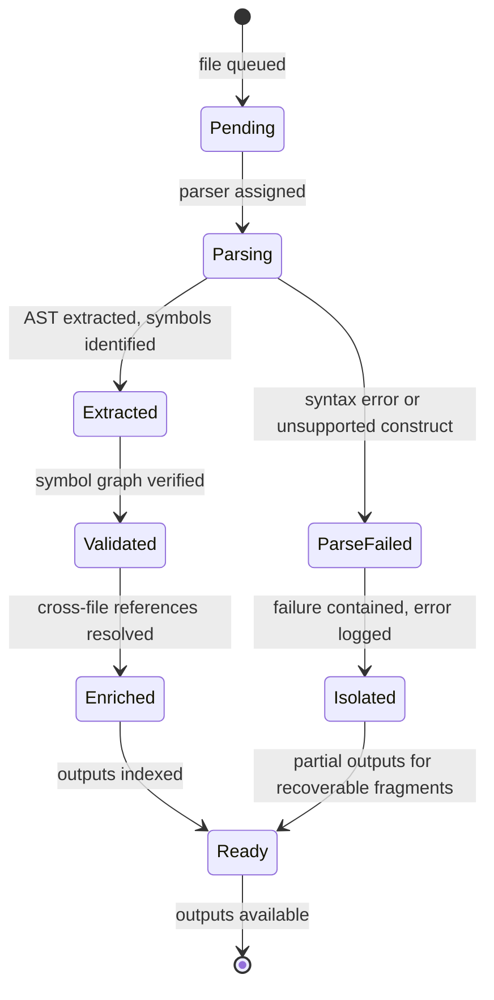

The `Parsing --> ParseFailed --> Isolated` transition is the critical failure isolation path. A single malformed file in a 10,000-file repository does not prevent the other 9,999 files from being fully analyzed[^14^].

**Output entities:** Symbol Index, Dependency Graph, Endpoint Map, Schema Map, Environment Requirement Set, Infra Config Map[^15^].

### 2.3 Layer 3 — Reconstruction: From File Truth to System Truth

Layer 3 is the critical transformation point. Layers 1-2 operate on **file truth** — what files exist and contain. Layer 3 transforms file-level evidence into **system truth** — what services exist, how they interact, what architecture patterns govern them, and how data flows. This is the operational realization of the platform's principle: a project is not its files; the system is what emerges from them[^16^].

**Service boundary inference.** **Confirmed services** are backed by explicit configuration: a Dockerfile, a Kubernetes deployment manifest, a package.json start script, or a Docker Compose service entry — tagged *confirmed*. **Inferred services** are identified through pattern analysis: directories with independent package management, distinct API route sets, or cross-repository import patterns — tagged *inferred* with a reasoning trace[^17^].

**Architecture pattern recognition.** The platform classifies the project pattern by analyzing dependency graphs and cross-service communication: **microservices** (independently deployable services with API boundaries); **monolith** (single deployable unit with internal modularization); **event-driven** (communication via message queues or pub/sub); **layered** (strict horizontal layering); **hexagonal** (domain logic isolated through ports/adapters); **serverless** (function-as-a-service with event triggers). Classifications are confidence-weighted, and multiple patterns may coexist[^18^].

**Runtime flow reconstruction.** Three categories are reconstructed: **request-response tracing** (endpoint-to-handler-to-database-call chains); **event flow mapping** (queue publications, cron triggers, webhook handlers); and **data flow between services** (shared storage writes and reads, data transformation in transit)[^19^].

**Coupling and cohesion analysis.** **Coupling** measures inter-service interconnection strength; **cohesion** measures functional unity within services. These metrics inform the Architecture Model in Layer 5 and the structural quality score in Layer 4[^20^].

**Specialized mappings.** For AI agent systems, the **Agent/Service Map** identifies agent roles, coordination patterns, and message passing. For blockchain projects, the **Protocol/Contract Relationship Map** identifies smart contract deployments, protocol interactions, and financial flow patterns[^21^].

The Layer 3 inference engine applies a rule-based system with machine learning augmentation. Rules encode known architecture patterns (a directory with its own package.json and Dockerfile is a service candidate; imports crossing that boundary are inter-service dependencies). ML augmentation resolves ambiguous cases where multiple patterns could apply, ranking hypotheses by evidence strength[^22^].

**Reconstruction state machine:**

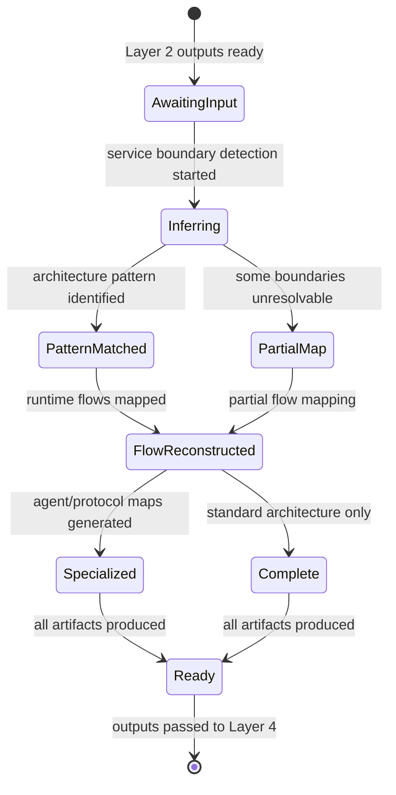

**Output entities:** Architecture Graph, Runtime Flow Map, Operational Map, Agent/Service Map, External Dependency Map, Deployment Topology Map[^23^].

### 2.4 Layer 4 — Evaluation: Scoring and Gap Detection

The Evaluation Layer applies structured scoring and gap detection to the reconstructed system model.

**10-domain scoring rubric.** Every project is evaluated across ten domains. **Code structure** — maintainability, complexity, consistency. **Build readiness** — buildability without errors, dependency resolution. **Runtime readiness** — environment completeness, configuration validity. **Test maturity** — coverage depth, test type distribution, assertion quality. **Security posture** — trust-boundary integrity, authentication, authorization, vulnerability surface. **DevOps maturity** — deployment automation, environment management, rollback capability. **Observability** — logging, monitoring, alerting, tracing. **Documentation** — inline docs, README, API docs, architecture docs. **Product completeness** — feature coverage against intended scope. **Integration health** — dependency freshness, external API stability, cross-service contract validity. Scores combine objective metrics (Layers 2-3) with qualitative judgments (Layer 5) into the **Build-State Scorecard**[^23^].

**12-category gap detection.** The **Missing Infrastructure Matrix** checks: CI/CD pipeline; secrets management; authentication system; error tracking; monitoring and alerting; backup and recovery; test layers (unit, integration, end-to-end); health checks; migration management; release and rollback workflow; environment configuration; and documentation surfaces[^24^].

**Severity classification.** Every finding is classified into one of five tiers.

**Table 2.2 — Severity Classification**

| Severity Level | Definition | Example | Required Action |
|---|---|---|---|
| Critical blocker | Prevents production deployment; causes immediate failure, data loss, or breach if deployed | Hardcoded production credentials; missing auth on public API endpoints | Resolve before production deployment; immediate owner alert |
| High-risk flaw | Significant vulnerability or reliability risk; likely failure under load, attack, or edge case | No input validation on uploads; missing database backup; dependency with critical CVE | Resolve within current sprint; explicit risk acceptance required to defer |
| Medium-priority weakness | Meaningful technical debt or gap; compounds over time | Incomplete test coverage for critical paths; missing log aggregation | Address in next planning cycle; defer with tracking ticket acceptable |
| Low-priority debt | Quality or maintainability concern; no immediate functional impact | Code style inconsistency; missing internal docs; outdated dev dependency | Address as capacity permits; suitable for backlog grooming |
| Informational | Context, enhancement opportunity, or architectural note; not a deficiency | Alternative library available; shared component extraction opportunity | Reviewed for planning context; no required action unless prioritized |

Severity depends on the project's maturity stage and intended scope. A missing CI/CD pipeline is Critical for a production-bound project, but Informational for an early prototype[^25^].

The composite score is a weighted aggregation: domain scores are normalized to a 0-100 scale, then combined using domain-specific weights that reflect the project's Detected Stack Profile and apparent intended scope. A microservice project receives higher DevOps and integration weightings; a blockchain project receives higher security and external dependency weightings[^26^].

**Evaluation state machine:**

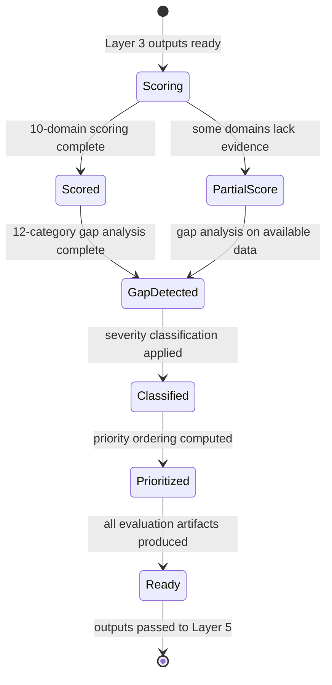

**Output entities:** Build-State Scorecard, Maturity Stage Classification, Missing Infrastructure Matrix, Risk Heatmap, Priority-Ordered Finding List[^27^].

### 2.5 Layer 5 — Multi-Model Truth Council: Adversarial Truth Synthesis

The Truth Council deploys five role-specialized models that assess evidence independently, challenge each other, and synthesize a consensus preserving dissent.

**Council composition.** The **Architecture Model** assesses decomposition, boundaries, coupling, and structural debt. The **Runtime Model** assesses execution paths, user flows, integration breakpoints, and failure modes. The **DevOps Model** assesses deployability, environment completeness, secrets management, and release process. The **Security Model** assesses trust boundaries, credential exposure, auth weaknesses, and exploit patterns. The **Planning Model** converts all findings into sequenced implementation recommendations[^27^].

**Three-phase deliberation.** **Phase 1 — Independent first-pass:** each model produces its own assessment from shared evidence, with no visibility into other models' outputs. **Phase 2 — Cross-review challenge:** each model's findings are exposed to the other four for challenge; disagreements are recorded in the **Contradiction Register**. **Phase 3 — Consensus synthesis:** a builder process reviews all assessments and contradictions, incorporating agreed findings and preserving dissent with both positions and supporting evidence[^28^].

The council's adversarial design serves a quality control function. When four models agree and one dissents, the consensus records the majority position but preserves the minority view with its evidence. When models split without a clear majority, the finding is labeled *contradicted* and routed to human review in Layer 8[^29^].

**Truth Council state machine:**

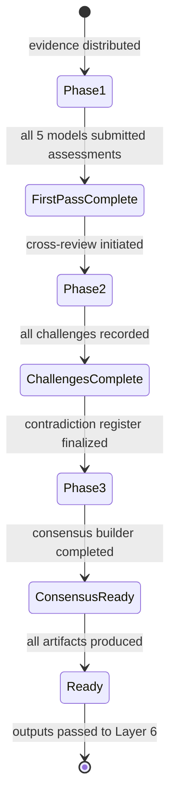

**Output entities:** 5 Individual Assessments, Contradiction Register, Consensus Truth Report, Evidence Ledger, No-Fluff Summary (with labels: *confirmed*, *inferred*, *broken*, *missing*, *unsafe*, *unproven*, *contradicted*)[^30^].

### 2.6 Layer 6 — Planning: From Findings to Execution

The Planning Layer converts Truth Council findings into executable implementation plans.

**Fix recommendation and prerequisite chain analysis.** Each finding generates a recommendation with: description, affected files, expected outcome, and a **prerequisite chain** — fixes that must complete before this one can begin. Chains prevent ordering errors where a team implements a change before its dependencies are ready[^31^].

**Phase planning across five tracks.** **Stabilize** — address Critical and High-risk findings for production safety. **Complete** — add missing infrastructure for intended scope. **Harden** — improve security, error handling, monitoring, and resilience. **Optimize** — performance improvements, dependency updates, architecture refinements. **Scale** — structural changes for growth in users, services, or complexity[^32^].

**Effort estimation and workstream grouping.** Recommendations receive effort estimates: **XS** (hours), **S** (1-2 days), **M** (3-5 days), **L** (1-2 weeks), **XL** (more than 2 weeks). The **Priority Matrix** ranks by severity × business impact × implementation dependency. Tasks are grouped into workstreams: code, security, DevOps, architecture, and product[^33^].

**Ticket-ready task generation.** Each recommendation is formatted as a ticket with title, description, acceptance criteria, affected files, effort estimate, prerequisites, and priority score. Export formats include GitHub Issues, Jira, Linear, and CSV[^34^].

**Planning state machine:**

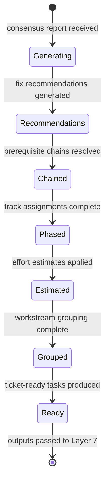

### 2.7 Layer 7 — Spatial Visualization: Cognition Surface Generation

The Spatial Layer transforms the analytical model into a navigable visual environment, implementing the principle that human cognition handles complex environments better as navigable spaces than as flat lists[^35^].

**3D/layered rendering.** Services and modules appear as distinct zones; data flows and runtime paths appear as directional connections between zones; missing infrastructure appears as visible gaps or incomplete surfaces; build-phase progression appears as construction state — solid for complete, active indicators for in-progress, voids for missing[^36^].

**Confidence encoding and risk visualization.** **Confidence** is rendered as visual solidity: confirmed entities are fully opaque; strongly inferred are mostly solid; weakly inferred are translucent; unknown or contradicted are wireframes. **Risk** appears as heat zones glowing with intensity proportional to severity concentration[^37^].

**Navigation modes.** **Zoom** transitions from whole-system to service-level to file-level. **Focus** isolates a service or flow, dimming all others. **Filter** shows matching criteria: security risks only, missing infrastructure only, broken flows only. **Time animation** replays project evolution across snapshot history. **Evidence drill-down** selects any node and inspects its full evidence chain back to source files[^38^].

**Spatial rendering state machine:**

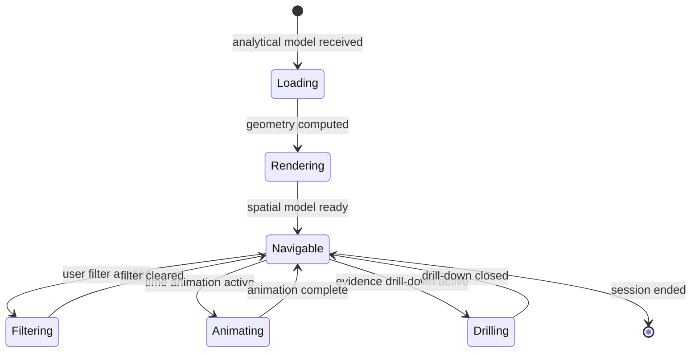

### 2.8 Layer 8 — Governance and Collaboration: Policy Enforcement

The Governance Layer provides institutional accountability through access control, human review, audit trails, and reproducible analysis.

**RBAC model.** Five roles are defined. **Owner** — full workspace control, including deletion and billing. **Admin** — project management, analysis execution, member invitation. **Engineer** — project connections, analysis triggers, output viewing. **Reviewer** — finding review, annotation, approval workflows; no analysis triggers. **Viewer** — read-only access to reports and spatial views[^39^].

**Human review layer.** Every finding supports four actions: **annotate** — add context without status change; **accept** — confirm validity for final report inclusion; **reject** — dismiss with required rationale; **defer** — postpone with required deadline. All actions are recorded in the **Audit Log** with actor identity, timestamp, and rationale[^40^].

**Report signing and version pinning.** A signed report binds cryptographically to the specific snapshot, analyzer versions, and prompt versions used. **Version pinning** records exact analyzer, model, and prompt template versions, enabling identical reproduction on the same snapshot later. This supports audit requirements, regulatory compliance, and due diligence workflows[^41^].

**Audit logging.** The append-only, tamper-evident Audit Log records: project connections/disconnections, snapshot ingestions, analysis runs, annotations, approvals, member changes, policy modifications, and deletion requests[^42^].

**Governance state machine:**

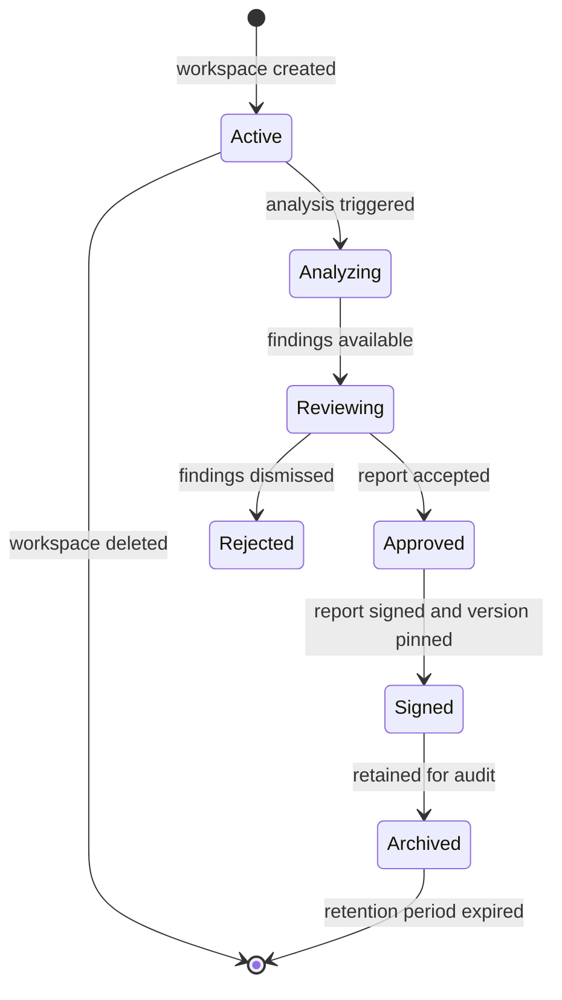

The confidence taxonomy and entity lifecycle conventions below apply across all layers.

**Table 2.3 — Confidence Taxonomy Reference**

| Confidence Level | Definition | Visual Encoding (Layer 7) | Downstream Treatment |
|---|---|---|---|
| Confirmed | Directly evidenced by configuration or unambiguous code structure | Fully opaque, solid | Ground truth in all model assessments |
| Strongly inferred | Multiple independent evidence sources converge | Mostly solid, slight transparency | Weighted heavily in scoring; high-confidence inference |
| Weakly inferred | Plausible but supported by sparse or single-source evidence | Translucent | Flagged for human review; excluded from critical-path planning |
| Unknown | Cannot be determined from available evidence | Wireframe or dashed outline | Explicitly labeled; no assumptions in scoring |
| Contradicted | Evidence conflicts with the finding | Pulsing or flagged | Preserved in Contradiction Register; excluded from consensus |

**Table 2.4 — Entity Lifecycle Summary**

| Entity Category | Creating Layer | Terminal Layer | State Machine Scope | Retention Policy |
|---|---|---|---|---|
| Snapshot Record | Layer 1 | Layer 8 (archive) | Layer 1 (Pending→Ready→Obsoleted) | Immutable; retained until workspace deletion |
| Symbol Index | Layer 2 | Layer 5 (evidence) | Layer 2 (per-file: Ready or Isolated) | Rebuilt per snapshot; prior archived |
| Architecture Graph | Layer 3 | Layer 7 (rendering) | Implicit per-snapshot versioning | Versioned per snapshot; historical retained |
| Build-State Scorecard | Layer 4 | Layer 8 (signing) | Implicit per-snapshot versioning | Versioned per snapshot; signed reports immutable |
| Consensus Truth Report | Layer 5 | Layer 8 (signing) | Deliberation phases (1→2→3) | Versioned per snapshot; signed reports immutable |
| Phased Roadmap | Layer 6 | Layer 8 (tracking) | Implicit per-snapshot with progress deltas | Updated with progress; baselines retained |
| Spatial Model | Layer 7 | Layer 7 (session) | User-controlled view state | Session-based; regenerable from Layers 3-6 |
| Audit Log | Layer 8 | Layer 8 (append-only) | Append-only sequence | Permanent; deleted only with workspace |

The confidence taxonomy (Table 2.3) governs how findings are treated throughout the pipeline. A Weakly inferred finding at Layer 3 cannot be elevated to Critical severity at Layer 4 without additional evidence. The Planning Model excludes Weakly inferred and Unknown findings from critical-path planning, routing them to informational workstreams or human review queues[^43^]. The entity lifecycle summary (Table 2.4) defines persistence contracts. Immutable snapshots and signed reports form the audit backbone that makes the platform suitable for institutional governance and due diligence workflow

---

## 3. AI Governance Work Model

The Multi-Model Truth Council is the platform's central architectural innovation. Where conventional tools deploy a single model to produce a unified output — flattening nuance and suppressing uncertainty — the Truth Council orchestrates five role-specialized models through an adversarial review protocol that treats disagreement as signal rather than noise. Each model evaluates the same evidence from a distinct analytical perspective; findings survive only after cross-examination from models with different domain expertise. The result is a **Consensus Truth Report** that preserves contradiction, labels uncertainty explicitly, and links every claim to source artifacts.

No competing platform implements multi-model adversarial review.[^1^] Static analysis tools run deterministic rules. Code review platforms apply single-model inference. Technical due diligence relies on human consultants whose judgments cannot be systematically contradicted or confidence-graded. The Truth Council fills this gap by embedding institutional-grade adversarial process into an automated governance layer. As established in Chapter 2, the Council operates within **Layer 5** of the functional pipeline, receiving the reconstructed system model from Layer 3 and evaluation findings from Layer 4, and producing synthesized truth artifacts that feed Layer 6 (Planning) and Layer 7 (Visualization).

---

### 3.1 Truth Council Architecture

#### 3.1.1 Five-Model Specialization

The Council comprises five models, each assigned a domain-specific role and prompt-engineered to evaluate evidence through a distinct conceptual lens.[^2^]

The **Architecture Model** reasons about system decomposition, service boundaries, module coupling, and structural debt — which components belong together, which interfaces are well-defined versus accidental, and where structural integrity degrades.

The **Runtime Model** traces execution paths, user flows, integration breakpoints, and operational failures — which entry points fire, which services communicate, where request chains break, and which environmental assumptions fail under load.

The **DevOps Model** evaluates deployability, environment completeness, secrets management posture, and release process maturity — whether the system can be reliably shipped and rolled back.

The **Security Model** analyzes trust boundaries, credential exposure, authentication weaknesses, and exploit patterns — identifying attack entry points, unguarded data flows, and vulnerable dependencies.

The **Planning Model** converts all findings into a sequenced, taskable implementation plan, prioritizing remediation by dependency order, effort, and criticality.[^3^]

Each model receives identical evidence — the reconstructed project model, parsed symbol graphs, dependency maps, and configuration artifacts — but evaluates it through its own analytical framework without prior knowledge of the other models' conclusions.

#### 3.1.2 Activation Patterns

The Council supports three activation modes tuned to analysis scope and cost.

**Full Council** activates all five models for comprehensive analysis, triggering on initial ingestion, milestone reviews, and complete system assessments. It produces the full artifact set: individual assessments, contradiction register, consensus truth report, and evidence ledger.

**Sub-Council** activates a targeted subset for focused review — for example, Security, Architecture, and Runtime for a security review, or DevOps, Runtime, and Architecture for deployment-readiness. Sub-council mode reduces latency and cost while preserving adversarial review.

**Single-Model** activates one model for specialized queries. A builder seeking only a deployability assessment might run the DevOps model alone. Single-model mode bypasses cross-review and contradiction detection; the platform flags such outputs with a **non-consensus** warning.

#### 3.1.3 Model Capability Matrix

Table 3.1 defines which models activate for each analysis dimension. Primary designations indicate principal analytical authority. Secondary designations indicate cross-domain contribution without lead assessment authority. Not-applicable designations indicate scope exclusion.

| Model | Architecture | Runtime | Security | DevOps | Planning |
|---|---|---|---|---|---|
| Architecture Model | **Primary** | Secondary | Secondary | Not applicable | Secondary |
| Runtime Model | Secondary | **Primary** | Secondary | Secondary | Secondary |
| Security Model | Secondary | Secondary | **Primary** | Secondary | Not applicable |
| DevOps Model | Not applicable | Secondary | Secondary | **Primary** | Secondary |
| Planning Model | Secondary | Secondary | Not applicable | Secondary | **Primary** |

*Table 3.1 — Model Capability Matrix. Primary indicates principal analytical authority; Secondary indicates cross-domain contribution; Not applicable indicates scope exclusion.*

The matrix reveals an important structural property: no single model holds primary authority across more than one dimension, and every dimension receives at least one secondary review. Architecture assessments receive secondary evaluation from both the Runtime and Security models, creating cross-domain challenge without requiring every model to participate in every assessment. This design balances analytical depth with adversarial coverage — enough models touch each dimension to enable meaningful contradiction.

---

### 3.2 Cross-Review and Contradiction Mechanics

The Council's deliberation protocol proceeds through three sequential phases. Each phase transforms the outputs of the previous phase, moving from independent opinion through structured disagreement toward synthesized truth.

#### 3.2.1 Independent First-Pass Assessment

In Phase 1, each model evaluates the shared evidence independently with no knowledge of other models' assessments.[^4^] This independence is structurally enforced — model outputs are isolated until all first-pass assessments complete, preventing anchoring effects where an early conclusion biases subsequent analysis.

The Phase 1 output is five **Individual Assessment Reports**, each containing domain-specific findings, per-finding confidence labels, and explicit statements of what the model could not determine. Each report is internally consistent but may contradict other reports in ways that surface in Phase 2.

#### 3.2.2 Cross-Review Challenge

In Phase 2, models gain access to each other's Phase 1 findings and issue **evidence-weighted rebuttals**: challenges citing specific evidence artifacts to refute, qualify, or downgrade another model's conclusion.[^5^] A Runtime Model finding that an endpoint is operational may be rebutted by the Security Model citing evidence that the endpoint lacks authentication — the same evidence interpreted differently. An Architecture Model finding of loose coupling may be rebutted by the Runtime Model demonstrating a dense call graph between the modules.

Rebuttals must reference specific evidence — source files, dependency graphs, configuration values — not merely express disagreement. This ensures Phase 2 challenges are substantive rather than rhetorical. The platform logs every rebuttal in the **Contradiction Register** with its evidence citations, participating models, and severity classification.

#### 3.2.3 Contradiction Detection

The Contradiction Register captures explicit inter-model disagreements with structured severity classification. Contradictions are not suppressed, averaged, or resolved by voting at this stage. They are documented as first-class analytical objects.[^6^]

Contradictions receive one of three severity classifications. **Structural** contradictions indicate fundamental disagreement about system properties — for example, the Architecture Model classifying two modules as independent while the Runtime Model demonstrates dense cross-module call paths. **Confidence** contradictions indicate agreement on a finding's direction but disagreement on its confidence level — for example, the Security Model rating a vulnerability as confirmed while the Architecture Model rates it only strongly inferred. **Scope** contradictions indicate that one model identifies a finding another missed entirely — for example, the DevOps Model flagging a missing secrets management system no other model assessed.

#### 3.2.4 Contradiction Resolution

Phase 3 applies a tiered resolution protocol. The system attempts resolution at each tier before escalating to the next, ensuring that only genuinely irresolvable contradictions reach human attention.

| Pattern | Description | Resolution Path | Escalation Trigger |
|---|---|---|---|
| Local Resolution | Models reach agreement through evidence re-examination without external intervention | Re-examining shared evidence causes one or more models to revise position based on new interpretation | No agreement after evidence re-examination within model-defined iteration budget |
| Evidence Reweighting | Contradiction stems from differential weighting of evidence sources; resolved by recalibrating evidence strength across models | Platform recalculates per-model evidence weights using cross-model agreement as signal; models reassess with adjusted weights | Recalibration fails to reduce contradiction below threshold or produces new contradictions |
| Scope Expansion | Contradiction reflects insufficient evidence; resolved by requesting additional analysis from complementary models | Platform activates secondary models (from capability matrix Table 3.1) to provide missing perspective | Additional models cannot resolve the gap or analysis scope exceeds resource budget |
| Human Arbitration | Models fundamentally disagree and no automated resolution path exists | Platform surfaces contradiction to human reviewer with full evidence chain, model positions, and confidence labels | Automated tiers exhaust without resolution; or contradiction severity is Structural with no path to agreement |

*Table 3.2 — Contradiction Resolution Patterns. Patterns are evaluated sequentially; each pattern attempts resolution before escalation to the next tier.*

The majority of contradictions resolve at the Local tier when models, upon re-examining evidence, recognize that their initial interpretation was incomplete. Evidence Reweighting handles cases where models weighted sources differently. Scope Expansion addresses gaps where an insufficient model subset participated. Human Arbitration serves as a final safety valve for genuinely ambiguous cases.

The following Mermaid sequence diagram illustrates the three-phase deliberation protocol:

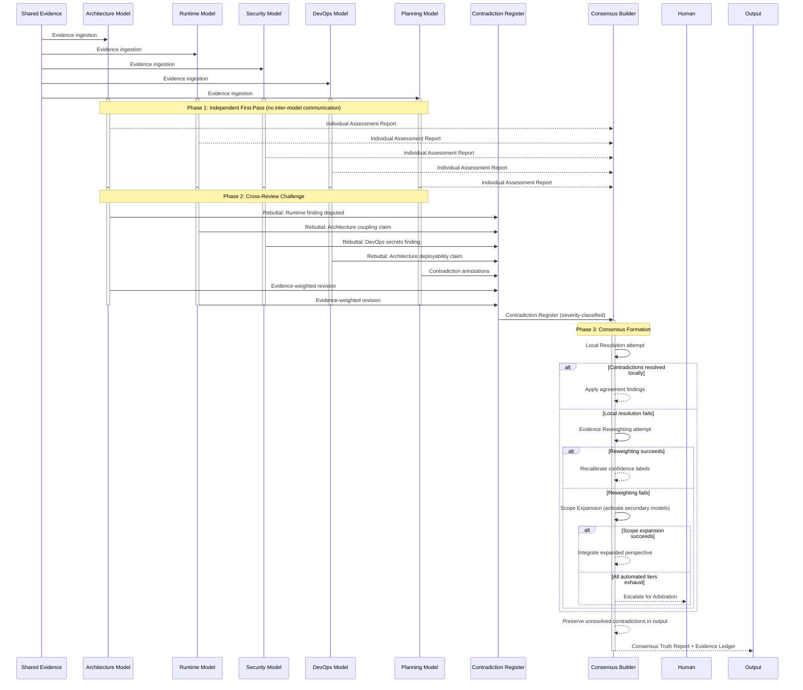

---

### 3.3 Consensus Formation Protocol

#### 3.3.1 Consensus Types

The Consensus Builder produces one of four consensus types depending on the degree of inter-model agreement. Unlike conventional voting mechanisms that suppress minority positions, the Truth Council's consensus protocol preserves all model positions — agreement is documented, disagreement is preserved, and the output format adapts to reflect the actual state of agreement rather than manufacturing false unity.[^7^]

| Type | Required Agreement | Use Case | Output Format |
|---|---|---|---|
| Unanimous | All 5 models agree on finding and confidence level | High-confidence architectural claims with direct evidence; security vulnerabilities with clear exploit paths | Single finding with unified confidence label; no minority report generated |
| Supermajority | 4 of 5 models agree; 1 model dissents or assigns different confidence | Most runtime assessments and DevOps findings where one model has domain-specific nuance | Consensus finding with primary confidence label; dissenting model produces Minority Report documenting alternative position |
| Plurality | 3 of 5 models agree; models disagree on specifics or confidence | Complex architectural judgments with ambiguous evidence; novel pattern assessments | Consensus finding tagged as plurality-level confidence; Minority Reports from dissenting models; explicit contradiction documentation |
| Dissent-Recorded | No consensus (2-2-1 or 3-1-1 splits) | Fundamentally ambiguous evidence; cases requiring human judgment | No consensus finding; all model positions preserved as competing hypotheses; full escalation to human arbitration recommended |

*Table 3.3 — Consensus Type Definitions. The required agreement threshold determines output format and confidence treatment.[^8^]*

The consensus type directly modulates the confidence taxonomy applied to findings. Unanimous findings may be labeled confirmed when evidence supports it. Supermajority findings are capped at strongly inferred unless evidence is overwhelming. Plurality findings are capped at weakly inferred. Dissent-Recorded findings carry no consensus confidence and require human adjudication before action.

#### 3.3.2 Confidence Aggregation

The Consensus Builder computes aggregate confidence through a weighted combination of per-model confidence scores with a disagreement penalty applied.[^9^] Each model assigns confidence using the taxonomy defined in Section 3.4.2. The builder converts categorical levels to numerical weights, computes a weighted average, then applies a penalty based on cross-model disagreement magnitude. Higher disagreement increases the penalty, reducing aggregate confidence regardless of individual model certainty. This prevents a single highly confident model from dominating the consensus when other models dissent.

The penalty function is non-linear: small disagreements incur modest penalties, while large disagreements (models on opposite ends of the confidence spectrum) produce severe confidence reductions. In extreme cases — where models assign contradicted and confirmed to the same finding — the penalty forces the aggregate to contradicted, requiring human arbitration.

#### 3.3.3 Minority Report Generation

When consensus falls below unanimous, dissenting models produce **Minority Reports**: documented positions explaining why the model disagrees with the consensus finding, citing evidence for its alternative position, and stating what additional evidence would resolve the disagreement.[^10^] Minority Reports are first-class output artifacts displayed alongside the consensus finding, ensuring the platform never presents a simplified conclusion where genuine analytical disagreement exists.

The Planning Model receives all Minority Reports during remediation sequencing. A finding with an active Minority Report may produce parallel remediation paths — one reflecting the consensus interpretation, one the minority position — allowing human builders to decide which interpretation to act upon.

#### 3.3.4 Consensus Packaging

The final **Consensus Truth Report** packages consensus findings, active Minority Reports, unresolved contradictions, and the full Evidence Ledger into a single artifact. The report follows a strict **never-hide-disagreement** principle: contradictions surface in executive summaries, confidence levels display prominently, and the contradiction count appears in the report header.[^11^]

The report includes a **No-Fluff Summary** applying direct categorical labels — confirmed, inferred, broken, missing, unsafe, unproven, or contradicted — translating analytical nuance into actionable language for builders who need immediate orientation.

---

### 3.4 Evidence and Confidence Governance

#### 3.4.1 Evidence Chain Requirement

Every claim in every model output must link to specific evidence sources: source files, symbol definitions, configuration values, dependency patterns, or infrastructure declarations.[^12^] Claims without evidence links are flagged during output validation and either rejected or tagged as speculative. The **Evidence Ledger** maintains a bidirectional index: for any claim, it lists supporting evidence; for any evidence artifact, it lists all referencing claims.

This chain requirement serves as the primary anti-hallucination safeguard. A model cannot assert that a service exists without citing its definition file, entry point, or registration configuration. A model cannot claim a vulnerability without pointing to the specific code pattern, dependency version, or trust boundary creating the exposure. The Evidence Ledger makes these linkages inspectable.

#### 3.4.2 Five-Tier Confidence Taxonomy

Every finding receives a confidence label drawn from a five-tier taxonomy.[^13^] The taxonomy appears throughout the Truth Council's output — in individual assessments, in the Consensus Truth Report, and in the Evidence Ledger. Confidence levels are defined as follows:

- **Confirmed**: Directly evidenced by unambiguous source artifacts. The finding is observable in the code, configuration, or dependency graph without interpretation. A service existence claim is confirmed when the service file, its entry point, and its registration are all visible.
- **Strongly Inferred**: Supported by multiple converging evidence sources. No single source confirms the finding, but the combined weight of indirect evidence makes it highly probable. A data flow pattern is strongly inferred when multiple call sites reference the same data structure, the schema defines matching fields, and the API contract documents the transfer.
- **Weakly Inferred**: Plausible based on limited or ambiguous evidence. The finding is consistent with available evidence but lacks the convergence or specificity needed for stronger confidence. An architectural pattern is weakly inferred when one or two files suggest it but the broader structure does not confirm.
- **Unknown**: Cannot be determined from available evidence. The model recognizes that a question is relevant but cannot answer it with the evidence at hand. This state is explicitly labeled rather than silently skipped.
- **Contradicted**: Evidence sources conflict, or models disagree at the structural level with no resolution path. The finding cannot be reliably assessed without additional evidence or human arbitration.

Chapter 7 defines the confidence taxonomy in full. The Truth Council applies these labels during both first-pass assessment and consensus formation, with final consensus confidence potentially lower than any individual model's due to the disagreement penalty (Section 3.3.2).

#### 3.4.3 Anti-Hallucination Safeguards

The platform's anti-hallucination mechanisms operate as an integrated system rather than isolated features.[^14^] Three structural properties create a defense-in-depth architecture against model-generated falsehoods.

First, the **multi-model adversarial review** protocol ensures that any single model's hallucination faces challenge from four other models evaluating the same evidence. A hallucinated claim — one without evidence support — is likely to be contradicted during Phase 2 cross-review because other models cannot locate supporting evidence. The Contradiction Register captures these challenges and prevents unsupported claims from reaching consensus.

Second, the **evidence-linking requirement** (Section 3.4.1) creates a verifiability threshold. Claims without evidence links fail validation. Human reviewers can inspect any claim's evidence chain, making hallucinations detectable through audit.

Third, the **unknown-state explicit labeling** policy requires models to flag what they cannot determine rather than fabricating plausible-sounding conclusions.[^15^] A model that cannot confirm whether an endpoint requires authentication must label the status as unknown, not assume it based on typical patterns. This transforms knowledge gaps from hidden weaknesses into documented limitations.

---

### 3.5 AI Safety and Policy Controls

#### 3.5.1 Model Behavior Boundaries

All Truth Council models operate within strict behavioral constraints enforced at the infrastructure level. Models are prohibited from executing code — they analyze static evidence only, never run the projects they evaluate. Models are prohibited from making external network calls — all reasoning operates on ingested evidence within the platform's secure analysis environment. Models are prohibited from exfiltrating data — outputs flow only through defined platform channels to authenticated users with workspace permissions.[^16^]

These boundaries are architectural, not policy-based. The model execution environment lacks network egress, file system write access outside temporary directories, and any interface for executing ingested code. Enforcement occurs at the container and network level, not through prompting, making circumvention impossible through prompt engineering.

#### 3.5.2 Bias Monitoring

The platform monitors for systematic scoring bias across projects. Bias detection compares model outputs across structurally similar projects to identify patterns where models consistently over-score or under-score specific categories.[^17^] For example, if the Security Model assigns higher vulnerability severity to TypeScript than Python projects with equivalent security patterns, the platform flags potential language bias.

When bias detection identifies a pattern, two responses trigger. First, the affected model's recent outputs receive additional cross-review scrutiny from models less likely to share the same bias. Second, the model's prompt template and rules are flagged for revision. Persistent bias results in model version rollback.

#### 3.5.3 Model Version Management

The platform maintains reproducible analysis results through pinned model versions, versioned prompt templates, and versioned evaluation rules.[^18^] Each analysis run records the exact model version, prompt hash, and rule set version used. When a builder re-runs analysis on the same snapshot, the platform uses identical analyzer configurations unless explicitly updated. This ensures that changes in model output reflect changes in the project — not changes in the analyzer.

Model version upgrades follow a staged rollout: new versions are validated against a benchmark corpus with known expected outputs before promotion to general availability. Builders may opt into newer versions on a per-workspace basis, with analysis history preserved across changes so trend comparisons remain valid.

The version management system also applies to the consensus algorithm itself. Changes to the confidence aggregation formula, disagreement penalty function, or contradiction resolution sequencing are versioned and recorded in the analysis audit log. Builders can inspect which consensus protocol version produced any historical report, ensuring that governance methodology remains transparent and reproducible.[^19^]

---

## 4. User & Collaboration Work Model

The CodeTruth platform is designed around the principle of **Non-Coder Sovereignty** — the conviction that complex system understanding must be accessible to people who are not traditional coders but are nevertheless the architects and owners of the systems being built[^1^]. This principle does not simplify the underlying analytical depth; rather, it translates code-level reality into structural and conceptual language that any intelligent builder can act upon. The user model serves two distinct populations simultaneously: technical builders who need granular evidence and execution paths, and non-technical owners who need system truth at the architectural and executive level.

The platform supports seven distinct user types: solo builders and independent architects; non-coder founders and institutional-grade project owners; technical leads managing complex codebases; engineering agencies delivering client projects; investment and acquisition teams conducting technical due diligence; AI agent system builders managing multi-agent architectures; and open source maintainers overseeing large contributor-driven codebases[^2^]. Each user type enters the platform with different capabilities, expectations, and action requirements. The work model in this chapter defines how the platform structures access, orchestrates collaborative workflows, and ensures that every finding carries an unbroken evidence chain to its source.

### 4.1 User Roles and Permission Model

All collaborative interaction within CodeTruth OS occurs within a **Workspace** — the logical boundary that contains projects, snapshots, reports, users, and policies. Access within a Workspace is governed by a role-based permission system comprising five discrete roles, each matching a distinct set of responsibilities in the software governance lifecycle[^3^].

The **Owner** holds full workspace control. This role is assigned at workspace creation and cannot be self-assigned by other members. The Owner manages billing and subscription configuration, controls member invitation and removal, defines workspace-level policies including privacy settings and data retention, and has sole authority to decommission or archive the workspace. In institutional deployments, the Owner is typically the project founder, executive sponsor, or account principal.

The **Admin** serves as the operational manager of day-to-day workspace activity. Admins can create and manage projects, invite new users and assign roles up to Admin (but not Owner), approve or reject reports through the approval workflow, and enforce policy compliance. This role bridges governance and execution without requiring full ownership privileges.

The **Engineer** is the primary technical operator. Engineers can trigger analysis runs on connected repositories, view all report types and their full evidentiary depth, annotate findings with comments and resolution suggestions, and export tasks to external backlog systems (GitHub Issues, Jira, Linear) in ticket-compatible formats. The Engineer role assumes hands-on interaction with the functional pipeline described in Chapter 2 — ingestion, parsing, reconstruction, evaluation, and planning — and represents the population most frequently initiating analysis workflows.

The **Reviewer** participates in the quality assurance and validation layer. Reviewers can view all reports at any presentation depth, annotate findings with comments in threads, accept or reject recommendations generated by the Planning Layer, and participate in shared review sessions. This role is designed for stakeholders who must validate findings — senior engineers, security auditors, client representatives — without triggering new analysis runs or managing workspace membership.

The **Viewer** has read-only access to reports and spatial visualization. Viewers can consume the Executive Truth Report, navigate the spatial project model at all zoom levels, and export reports in PDF format. They cannot annotate, approve, trigger analysis, or export tasks. This role serves non-technical owners, investors, client executives, and other stakeholders who need system understanding without operational interaction.

#### Table 4.1: Role-Permissions Matrix

| Permission | Owner | Admin | Engineer | Reviewer | Viewer |
|---|---|---|---|---|---|
| Workspace Management | Full | Partial | None | None | None |
| Trigger Analysis | Full | Full | Full | None | None |
| View Reports | Full | Full | Full | Full | View |
| Annotate Findings | Full | Full | Full | Full | None |
| Approve Reports | Full | Full | None | Partial* | None |
| Export Tasks | Full | Full | Full | None | None |
| Manage Users | Full | Full | None | None | None |
| Configure Policies | Full | Partial | None | None | None |

*Reviewer can accept or reject individual recommendations within a review session but cannot execute final report approval or signing.

The matrix reveals a deliberate permission gradient. Only Owner and Admin roles possess workspace governance capabilities. Only Owner, Admin, and Engineer can trigger analysis or export tasks. View Reports and Annotate Findings are the most broadly distributed permissions — shared by four of five roles — reflecting the platform's design philosophy that evidence-linked system understanding should be accessible to the widest possible audience within a workspace. The Reviewer's limited approval permission ensures that recommendation validation is participatory while final report authority remains with governance roles.

### 4.2 User Journeys

A user journey is defined as the sequence of touchpoints — interface interactions, report consumptions, decision points, and action outputs — that a specific user type experiences from initial workspace entry to sustained operational use. The platform does not enforce a single prescribed path; it exposes capabilities that different user types naturally assemble into distinct journey patterns based on role, technical depth, and organizational context.

#### Table 4.2: User Type Journey Mapping

| Journey Stage | Solo Builder | Non-Coder Owner | Technical Lead | Agency |
|---|---|---|---|---|
| **Connect** | Link personal GitHub repo; select branch; trigger first snapshot | Receive workspace invite; connect project via guided setup wizard | Import team repos; configure monorepo targets; invite team members | Create client workspace; connect client repo; set privacy policy |
| **Analyze** | Run full pipeline; review build-state scorecard; inspect architecture graph | Receive Executive Truth Report; review maturity classification | Monitor architecture drift across repos; run gap analysis on critical services | Generate due diligence report package; review all six report types |
| **Review** | Drill to file-level findings; annotate with fix notes; mark items resolved | Participate in review session; ask questions via annotations | Review engineering detail; validate recommendation priorities | Share report with client via Viewer invite; collect client annotations |
| **Act** | Export tasks to personal backlog; implement fixes; re-run analysis to verify | Direct team based on findings; track progress via spatial view | Assign tasks via Jira/GitHub export; monitor completion | Address client feedback; iterate analysis on new commits; finalize signed report |
| **Collaborate** | Optional: invite collaborator as Reviewer | Maintain ongoing workspace; receive updated reports on re-analysis | Scale workspace membership; establish approval workflows | Deliver final signed report; archive or transfer workspace to client |

**Solo Builder Journey.** The solo builder enters through direct GitHub repository connection. After OAuth authentication and branch selection, the builder triggers the first analysis run. The primary engagement surface is the Build-State Scorecard, which delivers an immediate maturity classification across ten scoring domains[^4^]. The builder navigates from the executive overview into the Engineering Report, following evidence links from findings to source files. Findings are annotated with implementation notes, marked as resolved when fixed in code, and verified through re-analysis on a new snapshot. Task export to personal backlog systems closes the loop from understanding to execution.

**Non-Coder Owner Journey.** The non-coder owner enters through a workspace invitation. A guided setup wizard handles repository connection and initial snapshot creation without requiring technical configuration knowledge. The owner's primary touchpoint is the Executive Truth Report, which delivers what the project is, what works and what does not, maturity classification with investment or delivery risk, the top five critical findings, and recommended immediate actions[^5^]. The owner participates in shared review sessions where clarifying questions are asked via annotations, navigates the spatial visualization to comprehend system structure without reading code, and uses the build-phase progression display to track team implementation progress. Decision-making authority flows from report understanding to team direction.

**Technical Lead Journey.** The technical lead's journey is characterized by scale and continuity. Multiple team repositories are imported — including monorepo subdirectory targeting — and team members are invited with role assignments. The lead's operational focus is on **architecture drift detection**: comparing the Architecture Graph across snapshots to identify where implementation has diverged from intended structure. The Gap Analysis output from Layer 4 is consumed regularly, and the lead reviews Engineering Report detail to validate priorities before assignment. Task export to Jira or Linear distributes work across the team, and the spatial visualization serves as a shared reference during architecture discussions. Over time, the lead establishes formal approval workflows for report validation and signing before stakeholder distribution.

**Agency Journey.** The agency operates CodeTruth OS as a quality assurance and client communication instrument. A dedicated workspace is created per client project, with privacy policies configured to restrict cross-project data visibility. After connecting the client repository, the agency generates the full report package — all six report types[^6^]. The agency's distinctive pattern is the **due diligence loop**: the report package is shared with the client through Viewer-role invitations, the client annotates findings with questions, the agency responds within comment threads, and the report is iterated until final. The final report is pinned to a specific snapshot version with analyzer and prompt version identifiers for full reproducibility, then delivered as a signed artifact. The workspace is either archived for record retention or transferred to the client.

### 4.3 Interaction Patterns

The platform exposes four core interaction patterns that define how users transform platform outputs into decisions and actions: report consumption at graduated depths, spatial navigation from system-level to file-level views, annotation workflows with audit trails, and approval workflows for institutional-grade report validation.

**Report Consumption.** Every report is available at three presentation depths selectable by the user based on role and information need[^7^]. The **Executive** depth presents high-level, risk-focused summaries: project identity, what works and what does not, maturity classification, the top five critical findings, and recommended immediate actions. This depth is optimized for decision-makers who need actionable intelligence without engineering detail. The **Engineering** depth provides full analytical granularity: architecture breakdowns with evidence links to source files, runtime flow decompositions with confirmed versus inferred sections labeled, file-level and module-level findings, priority remediation items with dependency chains, and acceptance test recommendations. The **No-Fluff Truth** depth applies direct categorical labels to every finding: confirmed, inferred, broken, missing, unsafe, unproven, or contradicted[^8^]. This depth is designed for users who need unambiguous status classification without explanatory prose.

**Spatial Navigation.** The spatial visualization layer (Layer 7) enables a three-level navigation pattern[^9^]. At the **whole-system view**, the user perceives all services, modules, and external dependencies as spatial objects, with risk concentration visible as heat zones and confidence encoded as visual solidity or opacity. The user then focuses on a specific service or module — the **service focus** level — where data flows, runtime paths, and integration points are rendered as spatial connections. Finally, the user drills to **file-level detail**, where clicking any node reveals the complete evidence chain: source files, configuration entries, and dependency patterns justifying the platform's claims. This pattern makes institutional-level complexity accessible to non-technical users by leveraging human spatial reasoning while preserving the evidentiary link to underlying code reality.

**Annotation Workflow.** Every finding in every report is annotatable. The workflow follows a defined state sequence:

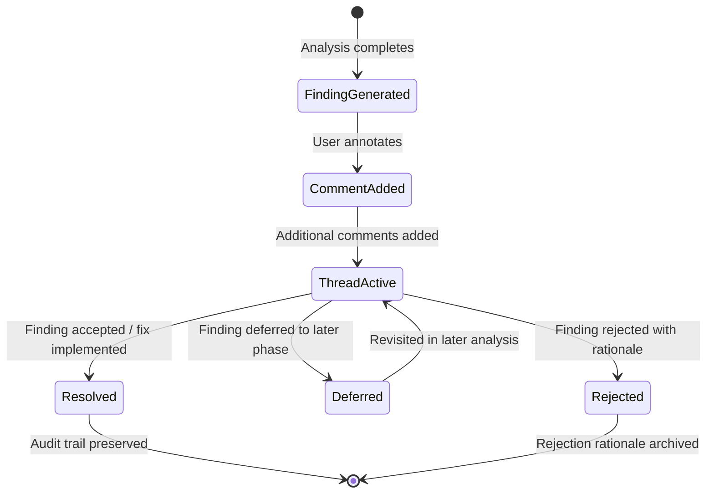

When a user annotates a finding, a comment thread is initiated. Members with annotation permissions respond, creating a threaded discussion linked to the specific finding and its evidence. The finding transitions through resolution states: Resolved (accepted and a fix is implemented or planned), Deferred (acknowledged but scheduled for later), or Rejected (disagreed with, requiring a rejection rationale that is archived). Every transition is recorded in the workspace audit log, creating an immutable trail of human judgment applied to machine-generated findings.

**Approval Workflow.** For workspaces requiring institutional-grade report validation, the platform implements a formal approval workflow:

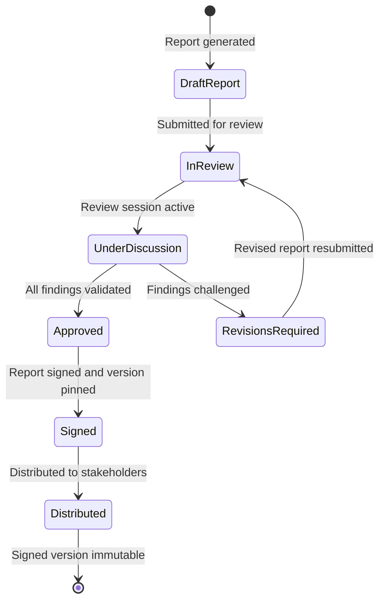

A draft report is generated by the analysis pipeline. The Engineer or Admin submits it for review. Reviewers participate in a shared review session — a real-time collaborative environment with synchronized report viewing and live comment threads — where findings are validated, challenged, or clarified. If revisions are required, the report returns to draft for re-generation on updated evidence. Upon approval, the report is **signed** — pinned to a specific snapshot version with analyzer and prompt version identifiers for full reproducibility — and distributed. The signed version is immutable; subsequent analysis generates a new report rather than modifying the signed artifact.

### 4.4 Workspace Governance

Workspace governance defines the structural boundaries, lifecycle states, and policy controls that ensure multi-user workspaces operate securely and accountably.

**Workspace Lifecycle.** Every workspace progresses through five lifecycle states[^10^]:

| State | Definition | Transitions |
|---|---|---|
| **Creation** | Workspace instantiated with Owner assignment; billing profile attached; initial policy defaults applied | Creation → Configuration |
| **Configuration** | Projects connected; members invited with role assignments; privacy and retention policies customized | Configuration → Active Operation |
| **Active Operation** | Full workspace capability available; analyses running; collaboration ongoing | Active Operation → Archival |
| **Archival** | Data preserved in read-only state; no new analyses or member changes; audit log retained per policy | Archival → Active Operation or Archival → Decommissioning |
| **Decommissioning** | All data purged per retention policy; audit log exported to Owner; workspace identifier released | Terminal state |

The lifecycle enforces that workspace termination is deliberate and governed rather than accidental. The Archival state provides a protected interval for reactivation, preventing data loss from administrative error or billing interruption. Decommissioning occurs only after the retention period defined in workspace policy has elapsed.

**Project Isolation.** Within a workspace, projects are isolated at the data level. Each project maintains its own snapshot history, report archive, and annotation records. All workspace members can view all projects within that workspace, but cross-workspace project visibility is prohibited by default. The Owner may configure **cross-project visibility rules** that allow specific projects to be shared across workspaces — a pattern used by agencies managing multiple client workspaces. Data boundaries are enforced at the storage layer: repository contents, analysis artifacts, and report exports are scoped to the project that generated them.

**Policy Engine.** The workspace policy engine controls three operational dimensions[^11^]. **Privacy settings** determine whether data is processed by shared or isolated compute, whether repository contents are retained after analysis, and whether reports can be shared via public links or require authenticated access. **Model usage controls** allow the Owner to specify which AI model providers are permitted for analysis runs — a critical control for organizations with vendor restrictions or data residency requirements. **Data retention configuration** defines the duration for which snapshot data, report archives, and audit logs are preserved before automated purging. The Owner can configure delete-on-demand policies that trigger immediate purging upon explicit request, ensuring compliance with zero-retention guarantees for sensitive repositories.

The policy engine operates at the workspace level and applies uniformly to all projects and members. Admin roles can modify policies within Owner-defined constraints but cannot override Owner-level policy locks. This hierarchical control ensures that organizational compliance requirements propagate consistently while preserving operational flexibility for day-to-day workspace management.

---

## 5. Technical Work Model

The functional pipeline described in Chapter 2 — ingestion, parsing, reconstruction, evaluation, multi-model truth synthesis, planning, spatial visualization, and governance — is realized through a distributed service architecture specified in this chapter. The **Technical Work Model** defines the service decomposition that maps each of the eight functional layers to a deployable computational unit, the polyglot data tier that persists the entities produced at each stage, the synchronous and asynchronous APIs through which consumers and external systems interact with the platform, and the integration patterns connecting CodeTruth OS to Git providers, CI/CD pipelines, issue trackers, and communication systems. This chapter is the technical bridge between the functional capabilities defined in Chapter 2 and the operational governance of that architecture described in Chapter 6.

### 5.1 System Architecture

#### 5.1.1 Service Decomposition

Each of the eight functional layers defined in the product architecture is implemented as an independently deployable service[^1^]. This alignment ensures that each pipeline stage scales, fails, and evolves independently — a requirement following directly from the non-functional specification for analyzer failure isolation and queue-based orchestration[^2^].

The **Ingestion Service** (Layer 1) accepts repository connections via GitHub OAuth, App installation, or personal access token (PAT); handles folder uploads, ZIP archives, and cloud drive sync; and manages webhook-triggered continuous ingestion on commit or pull request events[^1^]. It performs framework and language auto-detection, applies ignore rules, and produces an immutable Snapshot Record with a hash-based identity chain. Its outputs — Snapshot Record, File Manifest, and Detected Stack Profile — form the downstream input contract.

The **Parsing Engine** (Layer 2) consumes Snapshot Records and performs language-specific AST extraction, symbol graph construction, dependency resolution, and infrastructure configuration parsing[^1^]. It detects entry points, API routes, database schemas, environment variables, secret patterns, and CI/CD definitions, producing a Symbol Index, Dependency Graph, Endpoint Map, Schema Map, and Infrastructure Configuration Map.

The **Reconstruction Engine** (Layer 3) assembles file-level evidence into a systems-level model[^1^]. It infers service boundaries, analyzes module coupling and cohesion, recognizes architecture patterns, reconstructs request-response and event flows, maps data flows, reconstructs authentication flows, and infers deployment topology. Its primary output is the **Architecture Graph** — a structured, traversable system representation in visual and JSON form — alongside Runtime Flow Maps and External Dependency Maps.

The **Evaluation Engine** (Layer 4) applies scoring across 10 domains: code structure, build readiness, runtime readiness, test maturity, security posture, DevOps maturity, observability, documentation, product completeness, and integration health[^1^]. It classifies findings into five severity tiers and produces a Build-State Scorecard, Maturity Classification, Missing Infrastructure Matrix, Risk Heatmap, and Priority-Ordered Finding List.

The **Truth Council Orchestrator** (Layer 5) coordinates five role-specialized model assessments: Architecture, Runtime, DevOps, Security, and Planning[^1^]. It manages independent first-pass assessment, cross-review with contradiction detection, consensus building that preserves disagreement, and confidence-weighted synthesis, producing the Contradiction Register, Consensus Truth Report, and Evidence Ledger.

The **Planner** (Layer 6) converts findings into executable plans[^1^]. It generates fix recommendations with prerequisite chain analysis, produces phased roadmaps across stabilize, complete, harden, optimize, and scale tracks, estimates effort in XS through XL bands, groups workstreams by domain, and generates ticket-ready tasks with acceptance criteria.

The **Spatial Renderer** (Layer 7) transforms the project model into a navigable spatial environment[^1^]: services, modules, and agents as spatial objects; data flows as spatial connections; missing infrastructure as visible gaps; build-phase progression as construction state — operating at interactive frame rates on consumer hardware without GPU acceleration[^2^].

The **Governance Service** (Layer 8) manages multi-user workspaces, RBAC, human review workflows, audit logging, and retention policies[^1^]. It supports five workspace roles — owner, admin, engineer, reviewer, viewer — and maintains a tamper-evident audit trail.

**Table 5.1 — Service Decomposition Matrix**

| Service | Responsibility | Communication Pattern | Primary Data Store | Scalability Strategy |
|---|---|---|---|---|
| Ingestion Service | Repository connection, snapshot creation, file indexing, webhook handling | Synchronous REST for uploads; Async message queue for job dispatch | Object Storage (snapshots), Document Store (connections) | Horizontal scaling with queue distribution; incremental re-analysis on changed files only |
| Parsing Engine | AST extraction, symbol graph construction, dependency resolution, config parsing | Async: message queue for jobs; event bus for symbol publication | Graph DB (symbol/dependency nodes), Document Store (artifacts) | Stateless workers scaled by queue depth; language-specific parser plugins isolate memory |
| Reconstruction Engine | Service boundary inference, flow reconstruction, topology mapping, architecture synthesis | Async: event bus consuming symbols; message queue for reconstruction jobs | Graph DB (architecture graph nodes and edges) | Pipeline-parallel: coupling, flow, and topology as parallel sub-jobs |
| Evaluation Engine | 10-domain scoring, gap detection, severity classification, risk heatmap | Async: message queue for scoring; event bus for findings | Document Store (scorecards, findings), Graph DB (evidence links) | Domain-scoped worker pools with failure isolation per scoring domain |
| Truth Council Orchestrator | 5-model coordination, contradiction detection, consensus synthesis | Async: message queue for sessions; event bus for cross-model sharing | Document Store (reports, register, consensus), Graph DB (evidence chains) | Model-parallel: 5 assessments concurrent; cross-review after all first-pass complete |
| Planner | Fix recommendation, prerequisite analysis, roadmap generation, task export | Async queue consuming findings; sync REST for plan retrieval | Document Store (roadmaps, tasks, criteria) | Stateless: deterministic function of findings and workspace policies |
| Spatial Renderer | 3D/layered spatial rendering, confidence encoding, risk heat visualization | Sync: WebSocket for frames; REST for scene state | Object Storage (scene assets), Document Store (viewport state) | Client-side rendering; server pre-computes layouts to minimize GPU load |
| Governance Service | Workspace management, RBAC, audit logging, retention, review workflows | Sync: REST for CRUD; WebSocket for collaboration | Document Store (workspace/users/policies), Time-Series (audit logs) | Shard by workspace; read replicas for audit; permission caching at gateway |

The matrix reveals a deliberate pattern: Layers 2 through 5 — the core analytical pipeline — communicate exclusively through asynchronous patterns, decoupling stages and enabling independent scaling[^2^]. Layers 1, 6, 7, and 8 expose synchronous interfaces for user interaction while delegating long-running work to the async pipeline, optimizing responsiveness and throughput independently.

#### 5.1.2 Communication Patterns

The platform employs two communication paradigms matched to the latency and reliability requirements of each interaction type.

**Synchronous communication** serves query-oriented operations requiring immediate response. RESTful HTTP APIs handle resource CRUD for projects, snapshots, workspaces, and users. GraphQL supports flexible knowledge graph traversal and report customization without the N+1 query problem of naive REST. WebSocket connections stream analysis progress, notifications, and collaboration events such as shared review sessions with live comment threads[^1^].

**Asynchronous communication** handles all analytical and computational workloads. An **event bus** propagates domain events between pipeline stages — when the Parsing Engine publishes a Symbol Indexed event, the Reconstruction Engine consumes it to begin service boundary inference without blocking continued parser work. Events include: Snapshot Created, Symbol Indexed, Graph Reconstructed, Score Computed, Finding Published, Council Completed, and Plan Generated. A **message queue** manages analysis jobs with durability guarantees: ingestion, reconstruction, scoring, and truth council sessions are enqueued with priority ordering, retry policies with exponential backoff, and dead-letter handling for terminally failed jobs[^2^]. This queue-based orchestration enables concurrent workspace processing and ensures that a failure in one scoring domain does not cascade to abort the full analytical run.

#### 5.1.3 Data Stores

**Table 5.2 — Data Store Allocation**

| Data Store | Stores | Access Pattern | Scale Target | Retention Policy |
|---|---|---|---|---|
| Graph Database | Architecture Graph nodes (services, modules, agents, contracts, endpoints); edges (calls, depends, flows-to, authenticates, imports, serves); Symbol relationships; Finding-to-evidence chains | Traversal queries; batch write during reconstruction | 1M+ nodes, 5M+ edges per project; sub-100ms for 3-hop | Snapshot-scoped with diff-based incremental updates |
| Document Store | Snapshot records; Scorecards/findings; Model reports; Contradiction registers; Roadmaps/tasks; Workspace/user records; RBAC policies | CRUD with secondary indexes; aggregations for dashboards | 10K+ docs per snapshot; 100K+ findings across histories | Tiered: active per workspace policy (default 90d); delete-on-demand with zero retention |
| Object Storage | Snapshot file trees (immutable, content-addressed); Spatial scene assets; Report exports (PDF/MD/CSV); Audit archives | Write-once-read-many; streaming reads; batch downloads | 10GB+ per snapshot; 1TB+ per workspace with history | Snapshots until deletion; exports TTL 30d; audit 7 years |
| Time-Series | Job execution metrics; API latency/throughput; Render frame timing; Audit event stream | Time-range queries; downsampling; real-time streaming | 1M+ events per workspace per day; 30-day hot | Hot 30d at full resolution; hourly aggregates 1 year; archived annually |

The Graph Database materializes the **Architecture Graph**, the platform's central structure. Nodes represent services, modules, agents, contracts, endpoints, databases, and external systems. Edges encode calls, depends, flows-to, authenticates, imports, and serves relationships. This schema enables the traversal underlying both spatial scene construction and evidence chain linkage[^1^]. The Document Store handles metadata-rich entity storage; the Graph handles relationship-dense traversal queries. Object Storage guarantees immutability via content-addressed hashing — each snapshot's SHA-256 identity ensures identical file sets produce identical IDs[^1^].

### 5.2 Data Models

#### 5.2.1 Core Entities

The platform operates on a closed entity set. A **Project** represents a connected codebase with source configuration, stack profile, and latest Snapshot reference. A **Snapshot** is an immutable, content-addressed file tree capture linked to its parent in a version chain[^1^]. A **File** carries path, content hash, language detection, and symbol references. A **Symbol** is a typed element — functions, classes, interfaces, exports, imports — linked via the graph database.

A **Relationship** is a typed Architecture Graph edge. A **Finding** carries severity, confidence, domain attribution, evidence chain, description, and remediation path[^1^]. A **Task** is a work item with effort estimate, workstream, prerequisites, acceptance criteria, and status. A **Report** is an aggregated output — Executive Truth, Engineering, Infrastructure, Security, Planner, or Spatial — in JSON, Markdown, PDF, CSV, GitHub Issues, or Jira/Linear formats[^1^]. A **Workspace** contains Projects, Users, policies, and audit scope. A **User** has workspace memberships and role assignments.

#### 5.2.2 Knowledge Graph Schema

**Node types:** Service (deployable boundary), Module (code package), Agent (AI/autonomous unit), Contract (API/smart contract), Endpoint (route/entry point), Database (data store with schema), ExternalSystem (third-party dependency), Configuration (infra/environment artifact). Each node carries a confidence annotation — confirmed, strongly inferred, weakly inferred, unknown, or contradicted — governing rendering weight and scoring inclusion[^1^].

**Edge types:** CALLS (runtime invocation), DEPENDS_ON (compile-time dependency), FLOWS_TO (data movement), AUTHENTICATES (trust validation), IMPORTS (module inclusion), SERVES (endpoint binding), TRIGGERS (event/job), HOSTS (deployment). Directionality is significant: FLOWS_TO encodes data direction; AUTHENTICATES encodes trust direction.

Graph construction occurs in two phases. **Parsing** creates symbol-level nodes and IMPORTS edges from ASTs. **Reconstruction** lifts these into service-level abstractions: symbol clusters become Modules, module groupings become Services, endpoint bindings become SERVES edges. Every high-level claim is traceable to file-level evidence through graph traversals.

#### 5.2.3 Insight Model

A **Finding** contains: unique identifier; domain from 10 scoring domains; severity (Critical blocker, High-risk flaw, Medium-priority weakness, Low-priority debt, Informational observation); confidence (Confirmed, Strongly Inferred, Weakly Inferred, Unknown, Contradicted); description; **evidence chain** linking to files/symbols via graph references; **remediation path** from the Planner; and contradiction flag from the Truth Council[^1^].

The evidence chain is the distinguishing feature. Each Evidence Record contains: snapshot hash, file path and line range, symbol identifier, raw text snippet, and extraction method (AST, pattern match, or inference). This enables verification of every claim against source material — the operational standard separating evidence-linked analysis from assertion-based reporting[^1^].

#### 5.2.4 Snapshot Versioning

Snapshots are the platform's fundamental unit of temporal identity. Each is **immutable** — once created, file trees and metadata never change, enabling reproducible analysis. Identity is **content-addressed** via SHA-256 hash computed over the complete file tree structure and content[^1^]. Identical files produce identical IDs regardless of when or how they were ingested, enabling deduplication and cache-friendly incremental processing.

Snapshots form a **parent-child chain** through explicit parent references, creating a directed acyclic graph of project history. The diff engine computes a Merkle-style tree diff between parent and child snapshots by comparing content hashes at each directory and file level. This diff drives **incremental re-analysis**: only files whose hashes changed trigger re-parsing and downstream re-evaluation[^2^]. Unchanged files retain their symbol indexes and architectural inferences from the parent snapshot. For a typical large project where commits modify 2-5% of files, incremental processing reduces analysis time by 90% or more compared to full re-analysis. The immutable, content-addressed model also serves as the foundation for the platform's zero-retention guarantee: deleting a snapshot removes all derived artifacts, and no copy of the source data persists beyond the explicit retention window.

### 5.3 API Design

#### 5.3.1 REST Resources

The REST API exposes seven resource collections. All endpoints require JWT bearer tokens; authorization is workspace-scoped by user role[^1^].

**Table 5.3 — API Resource Mapping**

| Resource | Methods | Purpose | Auth Required |
|---|---|---|---|
| /projects | GET (list/filter), POST (create), GET /:id, PATCH /:id, DELETE /:id | Project lifecycle: connect repos, configure profile, set triggers, archive | Yes — workspace member; POST requires Engineer+ |
| /snapshots | GET (list/filter), POST (trigger), GET /:id, GET /:id/download | Snapshot management: history, captures, file tree downloads | Yes — member; POST requires Engineer+ |
| /analyses | GET (list), POST (trigger), GET /:id/status, GET /:id/results, DELETE /:id | Pipeline orchestration: enqueue, track progress, retrieve findings | Yes — member; POST requires Engineer+; results Viewer+ |
| /findings | GET (filter), GET /:id (with evidence), PATCH /:id, GET /:id/tasks | Finding management: browse, apply review decisions, link tasks | Yes — member; PATCH requires Engineer+ |
| /reports | GET (list), POST (generate), GET /:id, GET /:id/download | Report generation: on-demand in JSON/MD/PDF/CSV | Yes — member; POST requires Viewer+ |
| /workspaces | GET, POST, GET /:id, PATCH /:id, GET /:id/members, POST /:id/invite | Workspace admin: boundaries, retention, member access | Yes — PATCH and invite require Admin+ |
| /users | GET /me, PATCH /me, GET /me/workspaces, DELETE /me/workspaces/:id | Self-management: profile, membership visibility | Yes — all /me endpoints |

Resources follow HATEOAS conventions: each response includes links to related resources (snapshots link to parent and project; findings link to evidence chains and tasks), enabling graph navigation without hardcoded URLs.

#### 5.3.2 GraphQL Schema

GraphQL supplements REST with flexible traversal. Root queries expose `project` (with nested history), `snapshot` (with architecture graph and findings), and `finding` (with filterable evidence expansion). Mutations support analysis triggering, annotation, and report generation.

GraphQL is essential for the **Spatial Renderer**, which requires selective Architecture Graph expansion. A query requesting a project's latest snapshot → Architecture Graph → Service nodes → CALLS/FLOWS_TO edges → nested Endpoints/Databases to depth 3 resolves server-side in a single request, avoiding REST round-trips.

#### 5.3.3 Real-Time Streams

WebSocket connections deliver three streams. **Analysis progress** publishes stage-completion events through the pipeline, enabling granular progress indicators[^2^]. **Notifications** push finding alerts, report completions, and invitations. **Collaboration** enables shared review sessions where mutations broadcast to all participants in real time[^1^].

#### 5.3.4 Webhook Integrations

Outgoing webhooks deliver structured, signed (HMAC-SHA256) payloads for three event categories: **analysis completion** (report metadata, download URLs, summary statistics), **finding threshold breach** (alert when new Critical or High-Risk findings are detected with full finding metadata), and **snapshot creation** (snapshot ID, parent reference, branch, commit hash). Consumers verify payload authenticity using a workspace-specific secret and validate the signature before processing.

Incoming webhooks from GitHub and GitLab drive continuous ingestion: push events enqueue new snapshot creation for the affected branch, pull request events trigger branch-targeted analysis with results posted back as PR comments, and issue comment webhooks enable finding discussion threads linked to specific evidence chains[^1^]. Webhook endpoint configuration is workspace-scoped, and delivery failures trigger automatic retry with exponential backoff up to a configured maximum.

### 5.4 Integration Patterns

#### 5.4.1 Git Providers

Integration follows a common abstract interface: connect, list, select, ingest, webhook. **GitHub** supports OAuth, GitHub App, and PAT with repository access, webhooks, and PR comment integration[^1^]. **GitLab** supports OAuth and PAT with webhooks and merge request notes. **Bitbucket** supports OAuth and App Password with webhooks. New providers require only adapter implementation.

#### 5.4.2 CI/CD Integration

The platform integrates as a quality gate. **GitHub Actions** uses a published action triggering analysis via REST API with check run results. **Jenkins** uses a pipeline step plugin enqueuing jobs and polling for completion. **CircleCI** uses an orb gating subsequent steps on severity thresholds.

**Advisory mode** runs analysis in parallel with non-blocking annotations. **Gating mode** fails the build when findings exceed thresholds (e.g., new Critical blockers block deployment). Deployment events captured via webhook correlate with snapshot history for retrospective investigation.

#### 5.4.3 Issue Tracker Integration

**GitHub Issues** export generates drafts with descriptions, evidence links, severity labels, and remediation suggestions. **Jira** export uses the REST API with custom field mappings for severity, confidence, domain, and finding ID. **Linear** export uses the GraphQL API with label categorization[^1^].

**Bidirectional sync** records external issue identifiers on export. Status changes in external systems reflect back to finding review state via webhook or polling, eliminating manual reconciliation.

#### 5.4.4 Communication Integrations

**Slack** uses incoming webhooks and the Slack API for alerts, report links, and severity routing. A slash command enables analysis triggering and status queries from Slack. **Discord** uses webhook posting to server channels.

Routing is workspace-configurable by severity (Critical → alerts channel, Informational → digest) and domain (security → security channel, DevOps → infrastructure). Payloads include summaries with direct links to evidence chains, minimizing channel noise while preserving analytical depth.

---

## 6. Operational Work Model

Chapter 2 defines *what* the eight-layer pipeline produces. Chapter 5 defines *what* technically runs. This chapter closes the operational loop: it specifies *when* the pipeline runs, *how* work is distributed, how results evolve across project history, and how the platform monitors its own health.

The operational model rests on three design commitments from the non-functional specifications: **queue-based orchestration** decouples pipeline stages and enables concurrent workspace processing; **incremental analysis** re-evaluates only changed or impacted artifacts rather than re-running the full pipeline; and **streaming delivery** publishes partial findings before full analysis completes[^1^]. These three commitments shape every mechanism described in this chapter.

### 6.1 Continuous Operation Pipeline

#### 6.1.1 Analysis Scheduling

Three trigger modalities initiate pipeline execution, each carrying distinct priority weighting and latency expectations.

**On-demand triggers** are user-initiated requests through the web interface, REST API (`POST /analyses`), or Slack slash command. These enter the queue with medium priority and execute as capacity becomes available[^2^].

**Scheduled triggers** execute at configured cron intervals — default daily at 02:00 workspace time. Scheduled runs receive the lowest priority; they are distributed across a 60-minute jitter window to prevent thundering-herd effects when many workspaces share the default time[^3^].

**Event-driven triggers** fire on external lifecycle events delivered via webhook. Push events to the default branch enqueue snapshot creation followed by incremental analysis; pull request events trigger branch-targeted analysis with results posted back to the PR. Event-driven triggers receive the highest priority because they correlate with active developer workflows — a push event represents a human waiting for feedback[^4^].

**Table 6.1 — Trigger Type Definitions**

| Trigger Type | Activation Method | Use Case | Priority Level | Example |
|---|---|---|---|---|
| On-demand | User click, API call, Slack command | Ad-hoc analysis; what-if exploration | Medium (2) | Engineer clicks "Analyze Now" on project dashboard |
| Scheduled (cron) | Time-based interval, default daily 02:00 | Continuous drift detection; trend baselining | Low (3) | Nightly snapshot and scorecard update for all connected projects |
| Event-driven (webhook) | Git push, PR create/merge, branch create | Immediate feedback on code changes; CI gating | High (1) | Developer pushes commit to main; analysis enqueues within seconds |

The priority scheme carries direct operational consequences. High-priority event-driven jobs may preempt warm worker slots occupied by scheduled runs. When queue depth exceeds a configurable threshold, the platform pauses new scheduled job submission while preserving event-driven and on-demand throughput[^5^]. This backpressure mechanism ensures that active developer workflows never stall due to batch processing load.

#### 6.1.2 Job Orchestration

Pipeline execution is managed through a distributed job queue with three structural properties: priority ordering, retryable delivery, and workspace-scoped concurrency isolation.

Each pipeline stage — Ingestion, Parsing, Reconstruction, Evaluation, Truth Council, Planning — consumes a dedicated queue topic[^6^]. The Ingestion Service produces a Snapshot Created event; the Parsing Engine consumes it and enqueues per-batch parsing jobs. When parsing completes, the Reconstruction Engine begins service boundary inference. This topic-per-stage design enforces the failure isolation principle: a parsing error in one file does not block reconstruction of the rest of the project[^7^].

Each workspace receives a dedicated virtual queue with a maximum concurrency cap per stage. Within a workspace, jobs execute in dependency order (Layer 2 completes before Layer 3 for a given snapshot). Between workspaces, jobs interleave according to priority and queue depth[^8^]. RBAC permissions govern which roles can trigger which analysis types: Owners and Admins can trigger full analyses including Truth Council deliberation; Engineers can trigger standard pipeline runs; Reviewers and Viewers receive read-only access to completed results without queue injection rights.

Retry policy follows exponential backoff: 5s, 15s, 45s, 2min, 6min. After five attempts, the job moves to a dead-letter queue for manual inspection. Permanent failures — authentication revocation, repository deletion — fail fast without retry[^9^].

#### 6.1.3 Streaming Results

The platform delivers findings as each pipeline stage completes. The progression follows the pipeline's natural dependency order: the Snapshot Record and File Manifest appear first after Ingestion; the Symbol Index and Dependency Graph appear as Parsing completes per batch; the Architecture Graph renders after Reconstruction; scorecard domains populate as Evaluation finishes each of the 10 scoring domains; individual model assessments stream from the Truth Council as each model completes its first-pass; the Consensus Truth Report appears after Phase 3 synthesis[^10^].

WebSocket connections push stage-completion events to connected clients, enabling granular progress indicators. A 1,000-file project may stream 20-30 progress events before the final report. The Spatial Renderer begins scene construction as soon as the Architecture Graph is ready, refining the layout incrementally as additional entities and relationships are discovered[^11^]. This streaming model transforms the analytical experience from a batch wait into a progressive reveal: the builder sees the project's structure emerge in real time, with confidence and risk information accumulating as deeper layers complete their work.

### 6.2 Snapshot Lifecycle Management

A Snapshot Record is the platform's fundamental unit of temporal identity — an immutable, content-addressed capture of project state[^12^]. This section governs how snapshots are triggered, retained, and compared.

#### 6.2.1 Trigger Conditions

Snapshot creation follows the three trigger modalities. Manual snapshots capture the current repository state and optionally enqueue analysis. Scheduled snapshots capture the default branch for trend tracking. Push-event snapshots create a new Snapshot Record linked to its parent through an explicit parent reference, forming a directed acyclic graph of project history[^13^].

PR events create branch-specific snapshots existing outside the main chain, subject to shorter retention. Merge events link the PR snapshot into the main chain, preserving analytical lineage from branch creation through merge[^14^].

#### 6.2.2 Retention Policy

Snapshot storage follows a three-tier model balancing access latency, cost, and compliance requirements.

**Hot tier** contains the most recent snapshot per project plus all snapshots from the past 30 days, stored in standard object storage with sub-100ms latency. This is the working set for comparison, incremental analysis, and spatial rendering[^15^].

**Warm tier** holds snapshots aged 30-90 days in infrequent-access storage (5-30 second retrieval). They support historical comparison and trend analysis but require pre-fetch for spatial rendering. Administrators can promote warm snapshots to hot on demand[^16^].

**Cold tier** archives snapshots for compliance beyond the workspace deletion window, with 1-hour retrieval latency and cryptographic integrity verification. Cold retention is seven years for compliance-bound workspaces, configurable for others[^17^].

#### 6.2.3 Snapshot Comparison

The comparison engine produces four output types for evolution tracking.

**Structural diff** enumerates added files, deleted services, renamed modules, and new dependency edges by comparing content hashes between parent and child snapshots. A file with an unchanged hash contributes nothing regardless of path changes[^18^].

**Scorecard delta** computes per-domain score changes, tagged with direction (improvement, regression, stable) and magnitude (minor <5 points, moderate 5-15 points, major >15 points). A 20-point security score drop between snapshots triggers an automatic alert[^19^].

**Finding change detection** classifies findings as *new* (in child only), *resolved* (in parent only), *persisting* (both snapshots), or *mutated* (both but severity or confidence changed). This classification transforms the static finding view into a dynamic health trajectory[^20^].

**Evolution animation** renders the structural diff as a time-sequenced spatial transition: new services materialize, deleted services fade, and score changes encode as node color transitions playing forward or backward[^21^].

### 6.3 Incremental Analysis Engine

The Incremental Analysis Engine reduces computational scope from the entire project to only what changed or was affected. It follows a four-step decision sequence.

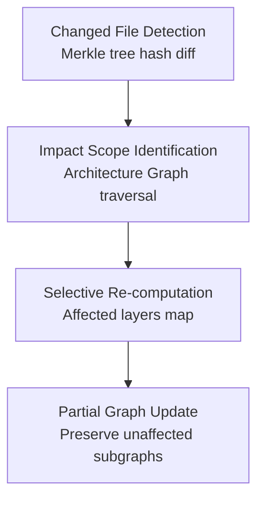

#### 6.3.1 Change Detection

The engine computes a Merkle-style tree diff by comparing SHA-256 content hashes at each directory and file level between parent and child snapshots. Identical hashes produce identical subtree comparisons, enabling efficient short-circuit evaluation. A typical commit modifying 2-5% of files in a 1,000-file project produces a change set of 20-50 files identified in under one second[^22^].

#### 6.3.2 Impact Scope and Selective Re-computation

From the changed file set, the engine traverses the Architecture Graph to identify transitively affected entities. A function body change triggers re-evaluation of its callers (CALLS edges), its containing service (SERVES edges), and its data flows (FLOWS_TO edges). A configuration change triggers re-evaluation of deployment topology. The **affected layers map** specifies which pipeline stages need re-execution for which entities[^23^].

The orchestrator then enqueues jobs only for changed or impacted entities. Unchanged files retain their symbol indexes and architectural inferences from the parent snapshot. Unchanged services retain their scorecard entries. The Truth Council runs only for models whose assessment domains are affected by the change. For a typical commit, incremental processing reduces analysis time by 90% or more compared to full re-analysis[^24^].

#### 6.3.3 Incremental Knowledge Graph Updates

The final step mutates the Architecture Graph through **partial graph mutation**: nodes and edges within the impact scope are deleted and recreated with new inference results; nodes outside the scope retain their confidence labels, evidence chains, and historical metadata intact. A service boundary tagged *confirmed* in the parent snapshot and unaffected by the current change remains *confirmed* in the child. Only findings whose supporting evidence changed are re-evaluated, and their confidence transitions are recorded in the audit log[^25^].

### 6.4 Monitoring and Observability

#### 6.4.1 Pipeline Health Metrics

Every pipeline stage publishes four metric streams: **queue depth** (pending jobs per stage per workspace; sustained depth >100 triggers horizontal scaling); **processing latency** (enqueue-to-completion time segmented by stage, project size, and trigger type; p50/p95/p99 over 5-minute windows); **error rate** (permanent and transient failures; >1% over 10 minutes triggers an alert); and **retry count** (jobs succeeding after retry; rising trends predict incipient dependency outages)[^26^].

#### 6.4.2 Model Performance Tracking

The Truth Council's output quality is tracked through three metrics. **Accuracy** compares model findings to human-reviewed ground truth on a held-out validation set; a >10 percentage point drop from baseline triggers prompt-version review. **Confidence calibration** measures whether confidence labels match empirical accuracy — *confirmed* findings should be near 100% correct, *strongly inferred* at 80-90%. **Contradiction frequency** tracks model disagreement rates; sustained increases suggest an evidence distribution shift such as a new framework or language not well-represented in the training corpus[^27^].

#### 6.4.3 Operational SLAs

**Table 6.2 — Operational SLA Specifications**

| Pipeline Stage | Target Latency (1,000 files) | Scaling Factor | Failure Behavior |
|---|---|---|---|
| Ingestion | <2 minutes | O(n) in file count | Retry 5× with exponential backoff; dead-letter after permanent failure |
| Parsing | <5 minutes | O(n) in files; O(k) in languages (parallel) | Per-file isolation; malformed files logged and skipped |
| Reconstruction | <4 minutes | O(n log n) in symbol count | Partial output on boundary failure; unmapped components flagged |
| Evaluation | <3 minutes | O(d) in domains (10 fixed); parallel per domain | Per-domain isolation; missing domains flagged incomplete |
| Truth Council | <3 minutes | O(m) in models (5 fixed); first-pass parallel | Per-model retry; unresolved contradictions to human review |
| **Full Analysis Total** | **<15 minutes** | Sum of stage latencies; incremental mode reduces to ~3-5 min | Stage-fault isolation; partial results delivered for non-failing stages |

The targets are worst-case bounds for full analysis under standard provisioning. Incremental analysis on a typical commit completes in 3-5 minutes total. The targets assume a project with 1,000 source files, 3-5 programming languages, and 5-10 microservices. Projects exceeding 10,000 files or 20 services scale horizontally with additional worker allocation[^28^].

#### 6.4.4 Alert Type Taxonomy

**Table 6.3 — Alert Type Taxonomy**

| Alert Category | Severity | Trigger Condition | Response Action | Escalation Path |
|---|---|---|---|---|
| Pipeline — queue saturation | Warning | Queue depth >100 per stage per workspace for >5 min | Auto-scale workers; throttle scheduled jobs if persists | Platform ops → workspace admin |
| Pipeline — stage failure spike | Critical | Error rate >1% over 10-minute window for any stage | Alert on-call engineer; reduce concurrency to failing stage | Platform ops → engineering lead if unresolved in 30 min |
| Pipeline — latency degradation | Warning | p95 latency exceeds 2× SLA target for any stage | Investigate resource contention; scale affected workers | Platform ops |
| Model — accuracy drift | Warning | Model accuracy drops >10 percentage points from baseline | Trigger prompt-version review; re-evaluate on validation set | AI governance team → model owner |
| Model — contradiction surge | Warning | Unresolved contradictions >20% for 3 consecutive analyses | Review evidence corpus for new patterns; check model prompt version | AI governance team |
| Security — secret exposure | Critical | Unredacted secret detected in output | Immediate output quarantine; mandatory human review before release | Security team → workspace admin |
| Security — auth anomaly | Critical | Multiple failed auths from single source; unusual token usage | Rate-limit source; revoke compromised tokens; audit log review | Security team |
| Quota — limit approaching | Warning | Storage >80% or analysis count >90% of monthly quota | Notify workspace admin with upgrade options | Workspace admin → billing contact |
| Quota — limit exceeded | Critical | Storage or analysis count exceeds workspace quota | Pause scheduled jobs; allow on-demand with override; notify admin | Workspace admin (immediate) |

**Warning** alerts generate dashboard notifications and daily digest emails but do not page an on-call engineer. **Critical** alerts trigger immediate notification to the responsible team with escalation if unacknowledged within the configured window. Every alert is recorded in the audit log with full trigger context, response timestamps, and resolution notes[^29^].

#### 6.4.5 Audit Logging

The audit log is an append-only, tamper-evident record of every significant platform action. Each entry contains: UTC nanosecond timestamp, actor (user ID, API key, or service account), action (upload, analyze, annotate, approve, export, delete), target entity ID, outcome (success, failure, denied), and a cryptographic hash chaining this entry to the previous[^30^].

The hash chain provides tamper evidence: each entry's hash includes the previous entry's hash, forming a cryptographic linked list. Any historical modification breaks the chain and is detected on the next integrity verification pass — run daily on hot-tier logs, weekly on warm-tier archives[^31^].

Actions recorded span seven categories: project connection and disconnection; snapshot creation and deletion; analysis trigger and completion; finding annotation (accept, reject, defer, comment); report generation and export; workspace policy changes; and user role modifications. Even when a workspace exercises delete-on-demand, the fact of deletion — actor, timestamp, and target — is retained per the non-functional specification for full audit logging with tamper-evident trail[^32^].

The operational model described in this chapter — queue-based orchestration, incremental analysis, streaming delivery, snapshot lifecycle management, and comprehensive monitoring — transforms the static pipeline from Chapter 2 into a continuously operating system backed by the architecture from Chapter 5.

---

## 7. Quality & Trust Work Model

Quality and trust constitute the platform's core differentiator — the operational standard that separates evidence-based system truth from the hallucinated certainty that plagues conventional code analysis tools. Where traditional tools produce flat assertions about code quality or architecture, CodeTruth OS anchors every claim to verifiable evidence, tags every inference with its confidence level, and exposes exactly what the platform cannot determine. This chapter defines the confidence model, evidence framework, explainability system, and trust boundaries that ensure platform outputs are trustworthy, actionable, and auditable.

These quality standards apply as a cross-cutting layer to all pipeline stages described in Chapter 2, all Truth Council operations described in Chapter 3, and all operational monitoring described in Chapter 6. No finding, score, or architectural claim is exempt.

### 7.1 Confidence Model

The confidence model communicates the evidentiary strength behind every claim the platform makes. It prevents the false certainty that arises when inferred conclusions are presented with the same authority as directly observed facts.

#### 7.1.1 Five-Tier Confidence Taxonomy

The platform employs a five-tier taxonomy that tags every piece of system understanding according to the evidence supporting it [^1^]. Each level carries specific evidentiary requirements, visual encodings, and downgrade paths that activate when contradictory or insufficient evidence emerges.

**Table 7.1: Confidence Taxonomy Detail**

| Level | Definition | Evidence Requirement | Visual Encoding | Downgrade Path |
|---|---|---|---|---|
| Confirmed | Direct evidence exists in source material | Explicit declaration in code (function signature, config file, schema definition) or unambiguous runtime trace | Solid opacity, green-coded badge, fully rendered node in spatial view | Contradicted if conflicting evidence emerges |
| Strongly Inferred | Multiple independent evidence sources converge on the same conclusion | Two or more corroborating signals from distinct evidence categories (e.g., import pattern + config reference + endpoint registration) | High opacity, blue-coded badge, mostly solid node with subtle edge transparency | Weakly Inferred if supporting evidence weakens; Unknown if corroborating sources are invalidated |
| Weakly Inferred | Plausible conclusion supported by sparse or single-source evidence | One indirect signal (e.g., file naming convention, directory placement, partial pattern match) | Moderate opacity, amber-coded badge, semi-transparent node rendering | Unknown if the single supporting signal weakens; Strongly Inferred if corroborating evidence emerges |
| Unknown | Insufficient evidence to support any determination | No discernible signal or evidence quantity below the threshold required for weak inference | Low opacity, gray-coded badge, wireframe or placeholder node in spatial view | Remains Unknown until evidence is discovered; cannot be upgraded without new evidence |
| Contradicted | Evidence exists but points to mutually exclusive conclusions | Two or more signals of equal strength that conflict (e.g., config indicates auth enabled but no auth middleware found in runtime path) | Distinctive pattern (striped or pulsing), red-coded badge, flagged with contradiction register entry | Resolved to Confirmed, Strongly Inferred, or Unknown upon additional evidence; remains Contradicted during resolution |

The taxonomy gives builders precise calibration of evidentiary grounding. A Weakly Inferred architectural boundary is not an analysis flaw — it is an honest statement that available evidence supports a plausible conclusion but cannot confirm it definitively [^2^]. This enables prioritization: confirmed elements require no scrutiny, weakly inferred elements merit validation before architectural decisions depend upon them, and unknown elements represent deliberate gaps the builder must close.

Downgrade paths are state transitions triggered by the **Confidence Recalculation Engine** during the Truth Council cross-review pass. When a model challenges another's finding, the confidence level transitions along the downgrade path automatically, with the transition recorded in the contradiction register [^3^].

#### 7.1.2 Per-Layer Confidence Propagation

Confidence propagates and transforms through each pipeline layer, with each layer's output becoming an input to the next:

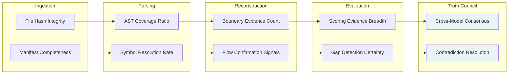

At the **Ingestion Layer**, confidence originates from file hash integrity and manifest completeness; hash mismatch caps maximum confidence at subsequent layers [^4^]. At the **Parsing Layer**, it transforms into AST Coverage Ratio and Symbol Resolution Rate. At the **Reconstruction Layer**, it becomes Boundary Evidence Count and Flow Confirmation Signals. At the **Evaluation Layer**, it manifests as Scoring Evidence Breadth and Gap Detection Certainty. At the **Truth Council Layer**, confidence achieves final form through Cross-Model Consensus and Contradiction Resolution [^5^].

#### 7.1.3 Aggregate Confidence Computation

Individual confidence signals combine into unified aggregate scores through a **weighted consensus function**. The system collects all signals associated with a finding, weights them by source reliability (direct code evidence highest, runtime trace secondary, pattern-based inference tertiary), and maps the aggregate to the taxonomy tier whose evidence requirements the weighted ensemble satisfies.

The function is conservative by design: a single contradicted signal prevents aggregate confirmed status; a single confirmed signal alongside weaker signals elevates the finding to confirmed only if no contradicted signals exist; and absence of any qualifying signal defaults to unknown rather than permitting inference from silence [^6^].

#### 7.1.4 Visual Encoding

Confidence levels render directly into every interface surface. In the **spatial view**, confirmed nodes render at full opacity with sharp edges, strongly inferred at 85% opacity, weakly inferred at 60% opacity, unknown as wireframe placeholders, and contradicted with pulsing or striping patterns [^7^]. In **reports**, each finding carries a color-coded inline badge: confirmed (green), strongly inferred (blue), weakly inferred (amber), unknown (gray), contradicted (red). In the **evidence ledger**, confidence is a structured field enabling programmatic filtering by evidentiary strength.

### 7.2 Evidence Framework

The evidence framework defines how the platform collects, structures, validates, and chains evidence from raw source material to final report claim. It operationalizes the **Evidence-Linked Every Claim** principle: no output states something about a project without pointing to the specific evidence — files, symbols, configs, or dependency patterns — that justifies that claim [^8^].

#### 7.2.1 Evidence Types

The platform recognizes four primary evidence categories.

**Table 7.2: Evidence Requirements by Type**

| Evidence Type | Source | Strength | Confidence Contribution | Validation Method |
|---|---|---|---|---|
| Static Code | Source files, configuration files, build manifests, schema definitions, symbol tables | Highest for explicit declarations; variable for inferred patterns | Confirmed when direct declarations exist; Strongly Inferred when multiple static signals converge | AST parsing with syntax validation, hash verification against snapshot, symbol resolution to definition site |
| Runtime Data | Execution logs, trace outputs, endpoint responses, database query logs, error telemetry | High for observed behavior; dependent on log completeness and freshness | Confirmed when runtime trace matches static prediction; Strongly Inferred when runtime corroborates static evidence; Contradicted when runtime conflicts with static claim | Trace correlation across multiple captures, timestamp validation, log integrity verification |
| Historical Patterns | Prior snapshot records, trend trajectories, change frequency metrics | Moderate for trend-based inference; strength increases with snapshot depth | Weakly Inferred for single-snapshot patterns; Strongly Inferred when multi-snapshot trends confirm | Snapshot-to-snapshot diff validation, trend statistical significance testing |
| External Sources | CVE databases, package registry metadata, documentation repositories, protocol specifications | High for authoritative databases; variable for community documentation | Contributes primarily to security posture and dependency risk; elevates confidence when external vulnerability data corroborates internal detection | Database freshness verification, cross-reference with multiple sources, authority ranking of provenance |

The framework surfaces this differential explicitly rather than collapsing it into a uniform score. A vulnerability flagged on static evidence alone receives lower aggregate confidence than the same vulnerability flagged on static evidence plus CVE corroboration plus runtime trace confirmation.

#### 7.2.2 Evidence Chain Structure

Every finding carries a complete **Evidence Chain** structured as a linked list:

```
Finding → Analyzer → Model → Source File → Line/Symbol → Raw Content
```

The **Finding** is the output claim (e.g., "Authentication middleware is missing from the API gateway request pipeline"). The **Analyzer** identifies the analysis module (auth flow analyzer within the Runtime Model). The **Model** identifies the Truth Council role that executed the analysis. The **Source File** locates the specific files providing evidence (`src/middleware/index.ts` showing no auth imports, `src/routes/api.ts` showing unguarded route registration). The **Line/Symbol** pinpoints exact line numbers and symbol names. The **Raw Content** renders the actual file content as a verifiable snippet [^9^].

This machine-navigable structure enables the platform's three-click drill-down guarantee: from any report claim, a user reaches raw source content within three navigation actions [^13^].

#### 7.2.3 Tamper Evidence

The evidence framework includes three cryptographic protections. **Snapshot Immutability**: every snapshot receives a unique identifier derived from a cryptographic hash of the complete file manifest plus per-file hashes; once created, it cannot be modified, ensuring evidence chains always point to the exact source material that existed at analysis time [^10^]. **Audit Trail Integrity**: every analysis operation is appended to a tamper-evident audit log employing Merkle-chain hash chaining [^11^]. **Evidence Ledger Linking**: the Truth Council produces an **Evidence Ledger** linking every claim to its supporting source files, configs, or symbols, with the same immutability guarantees as snapshot records [^12^].

### 7.3 Explainability System

The explainability system ensures that platform outputs are not merely correct but comprehensible — builders understand not just what the platform concluded, but how it reached that conclusion, what evidence it considered, and what remains uncertain.

#### 7.3.1 Explanation Levels

The platform provides three explanation levels, each designed for a different cognitive task.

**Table 7.3: Explainability Levels**

| Level | Description | Use Case | Information Included | Access Method |
|---|---|---|---|---|
| Summary | A single-sentence explanation of the finding and its significance | Executive review, high-velocity triage, priority filtering | Finding statement, confidence level badge, one-line rationale | Inline in report summaries, hover tooltip on spatial view nodes |
| Contextual | Explanation embedded within surrounding system context — the finding plus its architectural neighborhood | Engineering review, impact assessment, dependency analysis | Finding statement, confidence level, key evidence source, affected components, related findings from the same domain | Engineering report sections, spatial view inspection panel |
| Detailed | Complete reasoning trace from evidence through analysis to conclusion | Deep audit, model review, compliance verification | Full evidence chain, all contributing evidence signals with individual confidence levels, contradiction register entries, model reasoning steps, explicit list of what could not be confirmed | Detailed report export, evidence ledger inspection, audit mode interface |

A technical lead filtering a hundred findings to identify the five requiring immediate action needs only the summary level. An engineer assessing whether a service boundary finding is reliable enough to support a refactoring decision needs the contextual level. A compliance auditor debugging a model disagreement needs the detailed level to reconstruct the complete reasoning trace.

#### 7.3.2 Provenance Tracking

Every output carries a **Generation Lineage** record specifying which analyzers executed, which models participated, which evidence sources were consulted, which prompt and analyzer versions were active, and which human overrides were applied. The lineage is a structured metadata object attached to every finding, report, and spatial view state [^14^].

The lineage serves **reproducibility** — enabling reconstruction of the exact conditions under which a finding was produced, essential for comparing findings across snapshots or validating that model updates improved rather than degraded quality. It also serves **accountability** — when a finding is challenged, the platform identifies which analyzers and models contributed, enabling targeted review rather than blanket re-analysis.

#### 7.3.3 Unknown-State Explicitness

The platform's primary anti-hallucination mechanism is explicit unknown-state declaration. When evidence is insufficient to support even a weak inference, the platform does not guess or extrapolate. It labels the finding as **Unknown** and, in detailed explanation mode, explicitly states what could not be determined and what additional evidence would be required [^15^].

This behavior contrasts with conventional analysis tools, which produce complete assessments even on incomplete information — generating architecture diagrams with inferred connections that may not exist, assigning quality scores based on partial file coverage, or flagging vulnerabilities from pattern matching that produces false positives. The platform's willingness to say "I don't know" is not a limitation; it is a quality feature that protects builders from acting on fabricated certainty [^16^].

### 7.4 Trust Boundaries and Overrides

Trust boundaries define conditions under which platform outputs require human verification before action, and override mechanisms enable users to challenge findings and trigger systematic quality improvement.

#### 7.4.1 Automated vs. Human-Verified Outputs

The platform classifies outputs into two categories based on action risk and evidence strength. **Automated outputs** — findings at Confirmed or Strongly Inferred confidence in low-action-risk domains — flow directly to reports without human gatekeeping. These include confirmed architecture elements and strongly inferred service boundaries [^17^].

**Human-verified outputs** — findings in high-action-risk domains or at lower confidence levels — require explicit human approval before the platform treats them as resolved or incorporates them into planning. High-action-risk domains include security posture determinations (a false negative leaves a vulnerability unpatched), production deployment readiness (a premature go-live causes downtime), and architecture change recommendations (an incorrect refactoring plan breaks working systems). The human review layer enables team members to annotate, accept, reject, or defer any finding, with the decision recorded in the tamper-evident audit log [^18^]. A finding can transition between categories when its confidence upgrades through additional evidence or downgrades through contradiction.

#### 7.4.2 Override Protocol

Users challenge findings through a structured **Override Protocol** that feeds counter-evidence back into the multi-model evaluation pipeline. **Step 1 — Challenge Submission**: the user flags a finding and provides a textual explanation. **Step 2 — Evidence Submission**: the user optionally provides counter-evidence (source files, configuration excerpts, runtime traces) that enters the evidence framework and participates in the same validation chain as platform-discovered evidence. **Step 3 — Model Re-Evaluation**: the challenged finding is re-submitted to the Truth Council with the counter-evidence included in the shared evidence pool; the originating model re-evaluates, cross-review models assess the impact, and the consensus builder produces a revised synthesis. **Step 4 — Resolution Recording**: the outcome (confirmation, revision, or retraction) is recorded in the audit log with full provenance, and the user receives the resolution at their preferred explanation level [^19^].

This design ensures overrides improve the platform's understanding rather than merely replacing machine judgment with human judgment.

#### 7.4.3 Trust Erosion Detection

The **Trust Erosion Detection** system monitors for systematic disagreement between platform outputs and user corrections, triggering model review when disagreement exceeds defined thresholds.

Detection operates on two dimensions. **Per-model disagreement frequency** tracks how often a given Truth Council model's findings are challenged and overridden. A single override indicates a specific finding may be wrong; a pattern across multiple snapshots indicates systematic bias — for example, consistently over-inferring service boundaries from directory structure or under-weighting runtime evidence [^20^]. **Per-finding-type disagreement correlation** tracks which categories generate the most challenges. If security posture findings are overridden at significantly higher rates than architecture findings, the Security model's criteria may require recalibration.

When either dimension crosses the threshold — a rolling override rate exceeding 15% for a given model or finding category across the most recent 20 findings — the platform triggers a **Model Review** workflow. The review assembles all overridden findings from the affected scope, analyzes counter-evidence patterns for common features, and generates an improvement recommendation (prompt refinement, analyzer reweighting, or validation rule adjustment). The improvement is validated against a holdout set of previously correct findings to ensure the fix does not introduce regressions.

This trust feedback loop — user corrections feeding systematic disagreement detection feeding model review feeding platform improvement — ensures quality standards are not static specifications but actively improving capabilities that strengthen over time as they incorporate accumulated evidence of human validation [^21^].

---

## 8. Organizational Integration Work Model

The preceding seven chapters defined the operational machinery of CodeTruth OS: the eight-layer pipeline that transforms raw source into a living system model; the Truth Council that subjects every finding to adversarial multi-model review; the confidence taxonomy that distinguishes confirmed fact from plausible inference; the role-based governance that enables team-wide collaboration; and the continuous analysis engine that keeps the model current as projects evolve. This final chapter bridges those capabilities to organizational reality. A platform, however architecturally sophisticated, delivers value only when teams adopt it, integrate it into their workflows, and mature their usage from initial exploration to institutional dependency.

### 8.1 Adoption Framework

Organizational adoption follows a three-phase progression designed to minimize risk, demonstrate value early, and align feature activation with the platform's **Versioned Roadmap** — V1 Truth Engine, V2 Spatial Navigator, V3 Cognition OS.

**Table 8.1: Adoption Phase Framework**

| Phase | Duration | Scope | Success Criteria | Activation Order |
|:---|:---|:---|:---|:---|
| Pilot | 2 weeks | Single team, single project, one primary repository | Team produces first analysis; reviews Executive Truth Report and Engineering Report; identifies ≥3 actionable findings; completes one annotation cycle | V1 Truth Engine only — full pipeline, scorecard, planning output, markdown/PDF/JSON export |
| Expand | 1–2 months | Team-by-team expansion, up to 3–5 projects | Second team replicates pilot success; first team activates continuous analysis via webhook; at least one task export to backlog (GitHub Issues, Jira, or Linear); multi-user review session completed | V1 fully active; V2 Spatial Navigator piloted with one team |
| Scale | Ongoing | Full organization, multi-workspace, cross-project portfolio | All teams onboarded; CI/CD integration active for critical repos; spatial navigation in regular use; institutional governance (audit logging, report signing, version pinning) operational | V1 fully deployed; V2 active for complex projects; V3 rolled out incrementally |

*Table 8.1 — Adoption Phase Framework. Each phase builds on the previous; success criteria serve as gates before progression.*

The **Pilot Phase** is a bounded evaluation. A single team connects one project — typically 50–500 files in JavaScript, TypeScript, or Python (V1's supported languages)[^1^] — triggers analysis, and reviews the complete output set. Success is measured by the team's ability to act on findings: identifying at least three findings that are accurate, actionable, and previously unknown. The two-week duration reflects the platform's streaming analysis delivery (partial results before full completion)[^2^].

The **Expand Phase** transitions from evaluation to operational integration. The first team enables continuous operation via webhook-triggered re-analysis[^3^]. A second team replicates the pilot, confirming reproducibility. This phase includes the first **task export** — findings converted into ticket-compatible format and imported into the team's backlog system, closing the loop from system understanding to taskable execution[^4^].

The **Scale Phase** is institutional integration: all teams operate within CodeTruth workspaces, spatial visualization is active where flat reports are insufficient, and governance features (audit logging, report signing, analyzer version tracking)[^5^] satisfy compliance requirements. This phase corresponds to **V3 Cognition OS**: live re-analysis on push, multi-project portfolio views with comparative maturity scoring, and full team collaboration with institutional-grade accountability[^6^].

**Change Management.** Three supporting activities enable adoption. **Champion identification**: each team designates a CodeTruth Champion — a technical lead or senior engineer — who owns adoption and validates findings during the first two weeks. **Training curriculum**: three onboarding tracks aligned to the Non-Coder Sovereignty principle[^7^] — a 15-minute "Executive Overview" for owners, a 45-minute "Engineering Deep-Dive" covering annotations and task export, and a 30-minute "Governance & Compliance" module for admins. **Resistance mitigation**: skepticism of AI-generated findings is addressed through the platform's evidence-linking architecture[^8^] — every finding traced to specific source files and config excerpts converts abstract AI output into verifiable claims.

### 8.2 Team Structure Mapping

The platform adapts its operational footprint to three primary team structures.

**Solo Builder.** One individual holds all five roles — Owner, Admin, Engineer, Reviewer, and Viewer — within a personal workspace. The workflow is maximally automated: connect repository, trigger analysis, review the Executive Truth Report, drill into Engineering findings, export tasks to a personal backlog, and track progress through re-analysis cycles. Role consolidation eliminates approval workflows; the builder acts on findings immediately. Support for projects from 10 files to 10,000+ files[^9^] ensures the same workflow serves a weekend prototype and a production multi-service system. For the solo builder, CodeTruth replaces the architectural review, security audit, and infrastructure planning functions that enterprise teams distribute across specialists.

**Small Team.** The standard configuration comprises an Owner, two to four Engineers, and an occasional Reviewer. The Owner configures policies; Engineers trigger analyses, annotate findings, and export tasks; the Reviewer participates in review sessions for significant releases. The full annotation workflow — finding → comment thread → resolution → audit trail[^10^] — is active, and the approval workflow gates report signing before external distribution. Governance features are used but not heavily customized.

**Enterprise.** The institutional configuration includes dedicated Admins managing multiple workspaces, compliance officers requiring full audit trails, and cross-project portfolio views spanning dozens of repositories. Role separation is strict: compliance officers access audit logs but cannot trigger analysis; Admins manage policies but do not own billing; Owners retain sole decommissioning authority. Multi-workspace governance enables project isolation with cross-project visibility[^11^]. The spatial visualization layer becomes essential at this scale — flat reports cannot communicate complexity across 15+ services. Institutional deployments activate all V3 features: live re-analysis, custom policy enforcement, analyzer version pinning, and multi-project portfolio scoring.

### 8.3 Value Delivery Model

The platform produces four categories of measurable organizational value.

**Table 8.3: ROI Benefit Quantification**

| Benefit Category | Before CodeTruth | With CodeTruth | Quantified Improvement | Measurement Method |
|:---|:---|:---|:---|:---|
| Time-to-Understanding | New contributor requires 4–16 hours of codebase exploration to form a functional mental model of a 500-file project | Contributor reviews Executive Truth Report and Architecture Graph in 15–30 minutes for equivalent comprehension | 90–95% reduction in onboarding time | Track time from workspace access to first meaningful annotation or task assignment |
| Defect Detection | Integration failures, architectural drift, and security gaps discovered during deployment or post-incident review — 2–6 weeks after introduction | Same categories identified during pre-commit analysis, surfaced before merge with severity classification and remediation path | 60–80% of integration and architecture issues caught before deployment | Count findings resolved before merge vs. discovered through other channels; track "escaped defect" rate |
| Deployment Risk | Go/no-go decisions based on incomplete manual assessment; blockers identified at deployment time causing rollback or delay | Pre-deployment readiness assessment from 10-domain scorecard with explicit blocker identification | 50–70% reduction in deployment-blocking surprises | Track deployment blockers discovered within 48 hours of scheduled release |
| Knowledge Persistence | Project understanding concentrated in individual contributors' mental models; lost on turnover, inaccessible to non-coders | Persistent, evidence-linked project model maintained continuously; accessible to all workspace members regardless of coding background | 100% of active projects have current system model; non-coder stakeholders independently assess project state | Count active projects with current analysis (within 7 days); measure non-coder engagement with Executive Truth Reports |

*Table 8.3 — ROI Benefit Quantification. Improvements are directional estimates; actual results vary by project complexity, team size, and integration depth.*

**Time-to-Understanding** addresses cognitive compression failure[^12^]. A new contributor to a 500-file project conventionally traces imports and reads configuration manually — a 4–16 hour process. The Architecture Graph and Executive Truth Report compress this to 15–30 minutes. A team of six onboarding one member per quarter recovers 30–60 engineer-hours quarterly.

**Defect Detection** leverages the 5-tier severity classification[^13^] and 12-category gap detection[^14^] to surface issues before they become production incidents. A missing error tracking system, an exposed credential pattern, or an unhandled integration breakpoint — each classified by severity with a remediation path — is addressed during development rather than discovered post-mortem.

**Deployment Risk** reduction derives from the 10-domain scorecard[^15^], which produces explicit readiness assessments. When the scorecard flags Critical blockers in security posture or DevOps maturity, the team has a specific, evidence-linked remediation path before scheduling release. Compliance readiness maintained through the governance layer's audit logging and report versioning[^16^] replaces the pre-release compliance sprint.

**Knowledge Persistence** is the foundational value. The project's mental model is no longer resident in individual engineers' heads — subject to turnover and cognitive bias — but maintained as an external, continuously updated, evidence-backed representation. This is the platform as **persistent cognitive layer**[^17^]: the intelligence that always knows what the project is, how it works, what is wrong, and what needs to happen next.

### 8.4 Maturity Progression

Maturity progresses through four levels, each defined by capabilities in five dimensions.

**Table 8.2: Maturity Level Criteria**

| Dimension | Level 1 — Adopting | Level 2 — Operational | Level 3 — Advanced | Level 4 — Institutional |
|:---|:---|:---|:---|:---|
| Analysis Consumption | On-demand single-snapshot analysis; manual review of Executive and Engineering Reports; findings consumed as static documents | Continuous analysis via webhook; team reviews in shared workspace; scorecard trends tracked; spatial visualization for architecture exploration | Custom analysis policies; snapshot comparison for regression detection; animated evolution view for long-term trend analysis | Custom model tuning; multi-project portfolio dashboard with comparative maturity scoring; predictive analysis for architecture degradation |
| Collaboration | Single user or pair review; annotations for personal reference | Multi-user workspace with full role assignment; shared review sessions with comment threads; finding acceptance/rejection workflow | Cross-team workspace sharing; external reviewer invitations; approval workflow with report signing | Multi-workspace federation; compliance officer dashboards; tamper-evident audit trails; custom governance policies per workspace |
| Integration | Manual task export to backlog (CSV download) | Automated task export to GitHub Issues, Jira, or Linear; CI/CD quality gate integration; Slack/Discord notification routing | Bidirectional ticket status sync; deployment correlation via CI/CD; API-driven custom integrations | Full V3 API ecosystem; custom webhook pipelines; SIEM/GRC platform integration; programmatic portfolio reporting |
| Governance | Default workspace settings; basic data retention | Custom retention policies; workspace privacy controls; analyzer version pinning for reproducibility | Report signing and version pinning; full audit log export; data residency configuration | Institutional compliance framework mapped to platform outputs; custom evidence standards; regulatory audit support (SOC 2, ISO 27001 traceability) |
| Customization | None — standard analysis configuration | Excluded directories and file patterns; notification preferences | Custom severity thresholds per project; domain-specific scoring weights; private model endpoint | Organization-specific analyzer training; custom finding categories; bespoke report templates; tailored confidence calibration |

*Table 8.2 — Maturity Level Criteria. Each cell describes specific behaviors and configurations characteristic of that maturity level within that dimension.*

The four levels map to the versioned roadmap. **Level 1 — Adopting** corresponds to **V1 Truth Engine**: the full eight-layer pipeline producing scorecards, reports, and planning output consumed as static documents. **Level 2 — Operational** also sits within **V1**, augmented by continuous operation and collaboration: webhooks trigger re-analysis, teams review findings together, and tasks flow into backlogs. This is where the platform transitions from a reporting tool to a team instrument.

**Level 3 — Advanced** requires **V2 Spatial Navigator**: interactive spatial visualization rendering project models as navigable environments[^18^], snapshot diff and animated evolution view, and expanded language support for Python AI agents, Solidity smart contracts, and Kubernetes deployments[^19^]. **Level 4 — Institutional** requires **V3 Cognition OS**: live re-analysis on push, full governance and compliance, multi-project portfolio management, and AI agent system support[^20^]. At this level, the platform is not a tool the organization uses — it is a system the organization operates within.

The progression is not strictly sequential. A small team may reach Level 3 in analysis consumption while remaining at Level 2 in governance. An enterprise may enforce Level 4 governance while most teams are at Level 1 in analysis sophistication. The framework's value lies in its diagnostic specificity: it identifies exactly which capabilities are active and which are latent, enabling targeted investment rather than blanket rollout.

The platform's core philosophy — **Institutional-Grade Without Institutional Complexity**[^21^] — finds its final expression in this maturity model. A solo builder at Level 1 receives analysis depth comparable to what an enterprise compliance team receives at Level 4. The difference is not in underlying rigor — the same eight-layer pipeline, Truth Council, and evidence-linking standards apply at every level. The difference is in organizational scaffolding: how many people participate, how deeply the platform is integrated into workflows, and how formally outputs are governed. The architecture makes institutional-grade project cognition accessible from the first file to the ten-thousandth, from the solo builder to the multi-team enterprise, from the initial adoption decision to the fully institutionalized practice. This is the operational realization of the vision that opened the product thesis: a persistent cognitive layer for every complex software project — delivering system truth to every builder who needs it.