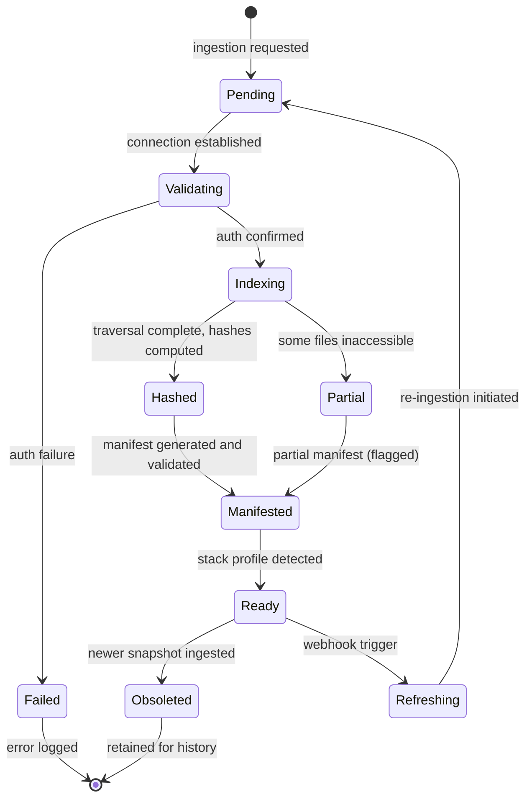
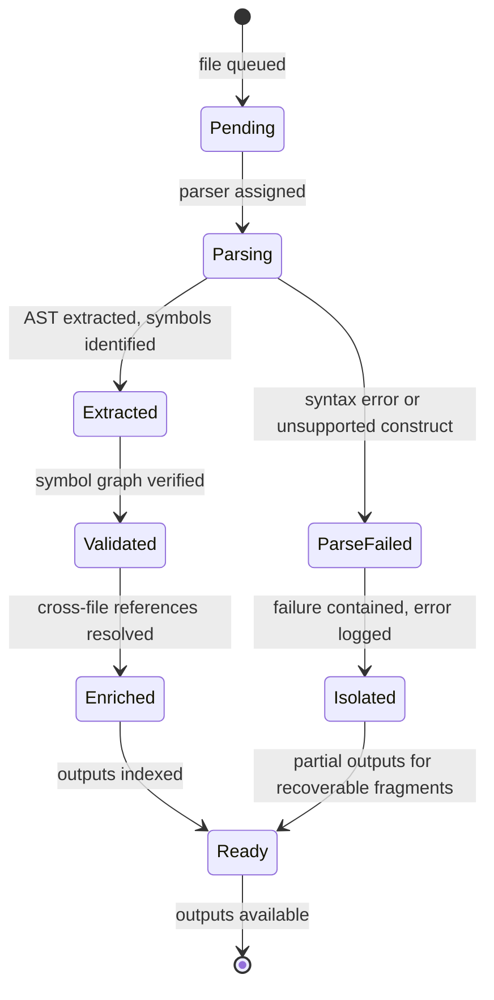
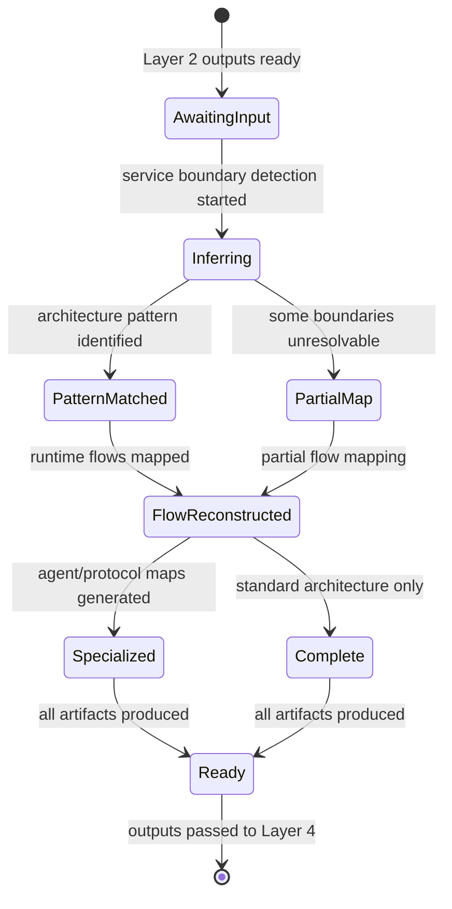
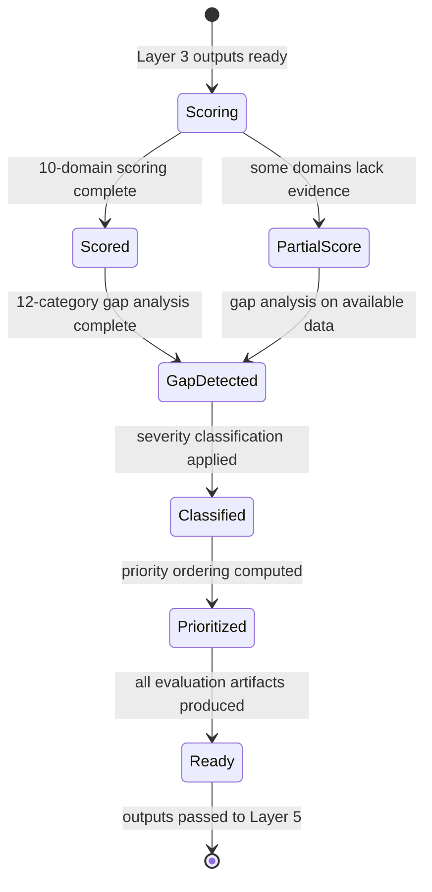
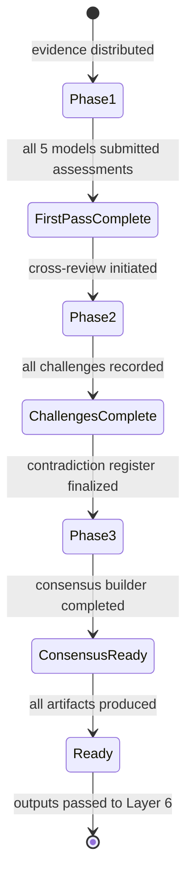
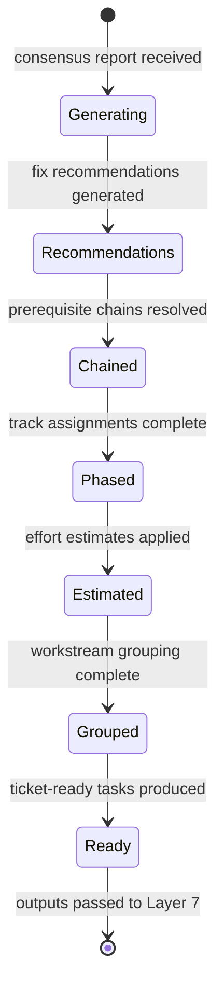
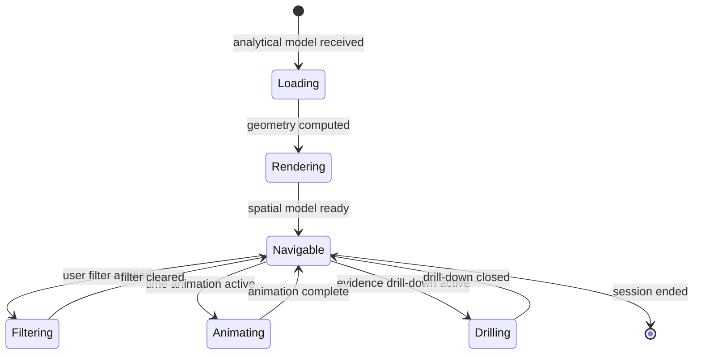
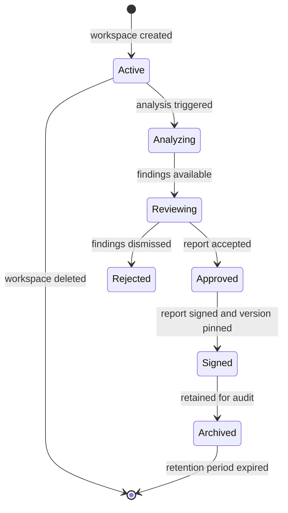

## 2. Functional Work Model

The CodeTruth OS platform processes every connected project through an eight-layer analytical pipeline. Each layer accepts a specific set of input entities, applies a defined transformation, and produces output entities that become the input for the subsequent layer. The progression moves from raw source material at Layer 1 through progressively higher levels of abstraction — structural, architectural, evaluative, deliberative, planning, spatial, and governance — until the full system model emerges at Layer 8 as a navigable, auditable, and actionable project cognition artifact.

The pipeline operates on **progressive refinement**: no layer discards information from preceding layers. Instead, each enriches the entity graph with new entities and relationships while preserving links to source evidence. A finding at Layer 4 can trace its evidentiary chain back through Layer 3 and Layer 2 to the specific files and symbols in Layer 1 that produced it[^1^]. This provenance chain is the operational mechanism behind the platform's evidence-linked confidence model.

**Failure isolation** is enforced at every layer boundary. A single file that fails to parse, a single analyzer that returns an error, or a single service boundary that cannot be inferred does not abort the full layer run. The platform records the failure, marks affected downstream entities as having incomplete evidence, and continues processing all other entities[^2^]. This design allows the platform to deliver partial but actionable results for projects containing malformed files, mixed-language repositories, or non-standard infrastructure configurations.

**Table 2.1** presents the complete layer responsibility matrix.

**Table 2.1 — Layer Responsibility Matrix**

| Layer | Purpose | Input Entities | Key Transformations | Output Entities | Side-Output Reports |
|---|---|---|---|---|---|
| 1 — Ingestion | Source admission and snapshot creation | Repository URL, OAuth token, folder path, zip archive | Connection, file traversal, hash computation, stack auto-detection, manifest generation | Source Connection Record, Snapshot Record, File Manifest, Detected Stack Profile | Connection audit log, ingestion error log |
| 2 — Parsing and Intelligence | Structural extraction from files to queryable knowledge | File Manifest, Detected Stack Profile | AST extraction, symbol graph construction, dependency graph construction, secret detection, infra parsing | Symbol Index, Dependency Graph, Endpoint Map, Schema Map, Environment Requirement Set, Infra Config Map | Parsing error report, secret exposure alert, doc gap notice |
| 3 — Reconstruction | File-level evidence assembly into system-level model | Symbol Index, Dependency Graph, Endpoint Map, Infra Config Map | Service boundary inference, pattern recognition, runtime flow reconstruction, coupling/cohesion analysis | Architecture Graph, Runtime Flow Map, Operational Map, Agent/Service Map, External Dependency Map, Deployment Topology Map | Inference confidence report, unmapped component list |
| 4 — Evaluation | Scoring and gap detection | Architecture Graph, Runtime Flow Map, all Layer 3 artifacts | 10-domain scoring, 12-category gap detection, 5-tier severity classification | Build-State Scorecard, Maturity Stage Classification, Missing Infrastructure Matrix, Risk Heatmap, Priority-Ordered Finding List | Domain score breakdown, gap inventory, dependency risk analysis |
| 5 — Multi-Model Truth Council | Adversarial multi-model truth synthesis | All Layer 4 artifacts, all evidence chains from Layers 1-3 | Independent first-pass, cross-review challenge, contradiction detection, consensus synthesis | 5 Individual Assessments, Contradiction Register, Consensus Truth Report, Evidence Ledger | Model disagreement summary, unresolvable contradiction list |
| 6 — Planning | Convert findings into executable plans | Consensus Truth Report, Priority-Ordered Finding List, Evidence Ledger | Fix recommendation, prerequisite chain analysis, phase planning, effort estimation, workstream grouping | Phased Implementation Roadmap, Priority Matrix, Workstream Breakdown, Ticket-Ready Task List, Acceptance Test Checklist | Effort rationale, dependency conflict analysis |
| 7 — Spatial Visualization | Cognition surface generation | All entities from Layers 1-6 with confidence and risk metadata | 3D/layered rendering, confidence encoding, risk heat zones, time animation | Navigable Spatial Model, Risk Heatmap Visualization, Build-Phase State Render, Evidence Drill-Down Interface | View presets, render performance metrics |
| 8 — Governance and Collaboration | Policy enforcement and collaborative oversight | All preceding entities, human annotations, policy configurations | RBAC enforcement, human review workflow, approval processing, audit logging, version pinning | Signed Report, Audit Log, Version-Pinned Analysis Record, Workspace Policy State | Access control log, annotation summary, version history |

Each layer increases semantic density. Layer 1 outputs describe files and hashes — low semantic density, high fidelity. Layer 3 outputs describe services, flows, and architecture patterns — high semantic density, with every claim linked to supporting evidence. Layer 5 outputs represent the apex of analytical abstraction: synthesized truth claims produced by adversarial deliberation among five specialized models, each grounded in the full evidence chain[^3^].

### 2.1 Layer 1 — Ingestion: Source Admission and Snapshot Creation

The Ingestion Layer accepts a project from an external source, validates access, enumerates files, computes cryptographic identities, detects the technology stack, and produces an immutable Snapshot Record.

**Connection protocols.** The platform supports seven connection modalities: (1) **GitHub OAuth** — repository read access via GitHub's OAuth flow; (2) **Personal Access Token (PAT)** — user-supplied GitHub PAT with repository scopes; (3) **GitHub App install** — CodeTruth GitHub App on a repository or organization, enabling webhook-driven continuous ingestion; (4) **Folder upload** — local directory tree via web interface; (5) **Zip upload** — compressed archive extraction; (6) **Cloud drive sync** — connection to supported cloud storage; (7) **Webhook triggers** — commit, pull request, or branch creation events initiating incremental or full re-ingestion[^4^].

**File enumeration and hash computation.** The platform traverses the repository tree, applying ignore rules in layered precedence: platform-global defaults (vendor directories, build output, binary artifacts), repository `.gitignore` patterns, user-configured exclusions, and language-specific defaults. For each file passing filters, the platform computes a SHA-256 hash. The hash serves dual purposes: unique content identity for incremental re-analysis, and immutable binding of the Snapshot Record to a specific repository state. The File Manifest enumerates every file with hash, path, size, and MIME type. The Snapshot Record aggregates all file hashes into a Merkle-style snapshot hash[^5^].

**Stack profile auto-detection.** During enumeration, the platform inspects file extensions, lockfile presence, configuration filenames, and directory patterns to produce the **Detected Stack Profile**: programming languages, frameworks, lockfile types, containerization technology, infrastructure-as-code tooling, CI/CD configuration, and test framework signatures[^6^].

**Snapshot state machine:**

The `Indexing --> Partial` transition occurs when the platform can read the repository but encounters files or directories without read permission. The snapshot is marked Partial, inaccessible paths are recorded, and processing continues. The `Ready --> Refreshing` transition is the webhook path: a commit push triggers a new snapshot cycle, with the prior snapshot eventually becoming Obsoleted[^7^].

**Output entities:** Source Connection Record, Snapshot Record, File Manifest, Detected Stack Profile[^8^].

### 2.2 Layer 2 — Parsing and Intelligence: Structural Extraction

The Parsing Layer converts raw files into structured knowledge. Where Layer 1 treated files as opaque content blocks, Layer 2 extracts internal structure — symbols, dependencies, endpoints, schemas, secrets, and infrastructure configurations.

**AST extraction and normalization.** For each source file, the platform selects a language-specific parser based on extension and Detected Stack Profile. The parser produces an Abstract Syntax Tree (AST), which is normalized into a language-agnostic representation capturing function and method definitions, class and type definitions with inheritance, variable declarations, control flow, and export/import statements[^9^]. This normalization enables cross-language analysis: a TypeScript service and a Python service are parsed into a common representation that Layer 3 reasons about uniformly.

**Symbol graph construction.** From normalized ASTs, the platform builds a **Symbol Graph** — a directed graph where nodes are symbols (functions, classes, types, interfaces, variables) and edges are relationships (calls, inherits, imports, exports, implements). The **Symbol Index** maps every symbol to its defining file, its relationships, and its visibility scope[^10^].

**Dependency graph construction.** Dependencies are extracted at four granularities: **package-level** from lockfiles and import statements; **module-level** from import/require statements; **service-level** from cross-service imports and shared database references; **external** as packages not in the repository, including third-party libraries and external service clients[^11^].

**Infrastructure extraction.** The platform parses: Docker image definitions, port mappings, and Compose configurations; Kubernetes deployment, service, ingress, and config maps; Terraform resource declarations and provider configurations; CI/CD pipeline definitions including stages, triggers, secrets references, and artifact handling; and environment variable declarations from .env files and configuration files[^12^].

**Security scanning and redaction protocol.** A pattern library detects potential secret exposures: API keys, access tokens, private keys, database connection strings, and password literals. When detected, the **redaction protocol** applies: the secret value is replaced with a non-reversible hash in user-facing outputs, the original location is stored in a secure evidence store accessible only to the Layer 5 Security Model, and the finding is flagged for human review in Layer 8[^13^].

**Parsing state machine (per-file):**

The `Parsing --> ParseFailed --> Isolated` transition is the critical failure isolation path. A single malformed file in a 10,000-file repository does not prevent the other 9,999 files from being fully analyzed[^14^].

**Output entities:** Symbol Index, Dependency Graph, Endpoint Map, Schema Map, Environment Requirement Set, Infra Config Map[^15^].

### 2.3 Layer 3 — Reconstruction: From File Truth to System Truth

Layer 3 is the critical transformation point. Layers 1-2 operate on **file truth** — what files exist and contain. Layer 3 transforms file-level evidence into **system truth** — what services exist, how they interact, what architecture patterns govern them, and how data flows. This is the operational realization of the platform's principle: a project is not its files; the system is what emerges from them[^16^].

**Service boundary inference.** **Confirmed services** are backed by explicit configuration: a Dockerfile, a Kubernetes deployment manifest, a package.json start script, or a Docker Compose service entry — tagged *confirmed*. **Inferred services** are identified through pattern analysis: directories with independent package management, distinct API route sets, or cross-repository import patterns — tagged *inferred* with a reasoning trace[^17^].

**Architecture pattern recognition.** The platform classifies the project pattern by analyzing dependency graphs and cross-service communication: **microservices** (independently deployable services with API boundaries); **monolith** (single deployable unit with internal modularization); **event-driven** (communication via message queues or pub/sub); **layered** (strict horizontal layering); **hexagonal** (domain logic isolated through ports/adapters); **serverless** (function-as-a-service with event triggers). Classifications are confidence-weighted, and multiple patterns may coexist[^18^].

**Runtime flow reconstruction.** Three categories are reconstructed: **request-response tracing** (endpoint-to-handler-to-database-call chains); **event flow mapping** (queue publications, cron triggers, webhook handlers); and **data flow between services** (shared storage writes and reads, data transformation in transit)[^19^].

**Coupling and cohesion analysis.** **Coupling** measures inter-service interconnection strength; **cohesion** measures functional unity within services. These metrics inform the Architecture Model in Layer 5 and the structural quality score in Layer 4[^20^].

**Specialized mappings.** For AI agent systems, the **Agent/Service Map** identifies agent roles, coordination patterns, and message passing. For blockchain projects, the **Protocol/Contract Relationship Map** identifies smart contract deployments, protocol interactions, and financial flow patterns[^21^].

The Layer 3 inference engine applies a rule-based system with machine learning augmentation. Rules encode known architecture patterns (a directory with its own package.json and Dockerfile is a service candidate; imports crossing that boundary are inter-service dependencies). ML augmentation resolves ambiguous cases where multiple patterns could apply, ranking hypotheses by evidence strength[^22^].

**Reconstruction state machine:**

**Output entities:** Architecture Graph, Runtime Flow Map, Operational Map, Agent/Service Map, External Dependency Map, Deployment Topology Map[^23^].

### 2.4 Layer 4 — Evaluation: Scoring and Gap Detection

The Evaluation Layer applies structured scoring and gap detection to the reconstructed system model.

**10-domain scoring rubric.** Every project is evaluated across ten domains. **Code structure** — maintainability, complexity, consistency. **Build readiness** — buildability without errors, dependency resolution. **Runtime readiness** — environment completeness, configuration validity. **Test maturity** — coverage depth, test type distribution, assertion quality. **Security posture** — trust-boundary integrity, authentication, authorization, vulnerability surface. **DevOps maturity** — deployment automation, environment management, rollback capability. **Observability** — logging, monitoring, alerting, tracing. **Documentation** — inline docs, README, API docs, architecture docs. **Product completeness** — feature coverage against intended scope. **Integration health** — dependency freshness, external API stability, cross-service contract validity. Scores combine objective metrics (Layers 2-3) with qualitative judgments (Layer 5) into the **Build-State Scorecard**[^23^].

**12-category gap detection.** The **Missing Infrastructure Matrix** checks: CI/CD pipeline; secrets management; authentication system; error tracking; monitoring and alerting; backup and recovery; test layers (unit, integration, end-to-end); health checks; migration management; release and rollback workflow; environment configuration; and documentation surfaces[^24^].

**Severity classification.** Every finding is classified into one of five tiers.

**Table 2.2 — Severity Classification**

| Severity Level | Definition | Example | Required Action |
|---|---|---|---|
| Critical blocker | Prevents production deployment; causes immediate failure, data loss, or breach if deployed | Hardcoded production credentials; missing auth on public API endpoints | Resolve before production deployment; immediate owner alert |
| High-risk flaw | Significant vulnerability or reliability risk; likely failure under load, attack, or edge case | No input validation on uploads; missing database backup; dependency with critical CVE | Resolve within current sprint; explicit risk acceptance required to defer |
| Medium-priority weakness | Meaningful technical debt or gap; compounds over time | Incomplete test coverage for critical paths; missing log aggregation | Address in next planning cycle; defer with tracking ticket acceptable |
| Low-priority debt | Quality or maintainability concern; no immediate functional impact | Code style inconsistency; missing internal docs; outdated dev dependency | Address as capacity permits; suitable for backlog grooming |
| Informational observation | Context, enhancement opportunity, or architectural note; not a deficiency | Alternative library available; shared component extraction opportunity | Reviewed for planning context; no required action unless prioritized |

Severity depends on the project's maturity stage and intended scope. A missing CI/CD pipeline is Critical for a production-bound project, but Informational for an early prototype[^25^].

The composite score is a weighted aggregation: domain scores are normalized to a 0-100 scale, then combined using domain-specific weights that reflect the project's Detected Stack Profile and apparent intended scope. A microservice project receives higher DevOps and integration weightings; a blockchain project receives higher security and external dependency weightings[^26^].

**Evaluation state machine:**

**Output entities:** Build-State Scorecard, Maturity Stage Classification, Missing Infrastructure Matrix, Risk Heatmap, Priority-Ordered Finding List[^27^].

### 2.5 Layer 5 — Multi-Model Truth Council: Adversarial Truth Synthesis

The Truth Council deploys five role-specialized models that assess evidence independently, challenge each other, and synthesize a consensus preserving dissent.

**Council composition.** The **Architecture Model** assesses decomposition, boundaries, coupling, and structural debt. The **Runtime Model** assesses execution paths, user flows, integration breakpoints, and failure modes. The **DevOps Model** assesses deployability, environment completeness, secrets management, and release process. The **Security Model** assesses trust boundaries, credential exposure, auth weaknesses, and exploit patterns. The **Planning Model** converts all findings into sequenced implementation recommendations[^27^].

**Three-phase deliberation.** **Phase 1 — Independent first-pass:** each model produces its own assessment from shared evidence, with no visibility into other models' outputs. **Phase 2 — Cross-review challenge:** each model's findings are exposed to the other four for challenge; disagreements are recorded in the **Contradiction Register**. **Phase 3 — Consensus synthesis:** a builder process reviews all assessments and contradictions, incorporating agreed findings and preserving dissent with both positions and supporting evidence[^28^].

The council's adversarial design serves a quality control function. When four models agree and one dissents, the consensus records the majority position but preserves the minority view with its evidence. When models split without a clear majority, the finding is labeled *contradicted* and routed to human review in Layer 8[^29^].

**Truth Council state machine:**

**Output entities:** 5 Individual Assessments, Contradiction Register, Consensus Truth Report, Evidence Ledger, No-Fluff Summary (with labels: *confirmed*, *inferred*, *broken*, *missing*, *unsafe*, *unproven*, *contradicted*)[^30^].

### 2.6 Layer 6 — Planning: From Findings to Execution

The Planning Layer converts Truth Council findings into executable implementation plans.

**Fix recommendation and prerequisite chain analysis.** Each finding generates a recommendation with: description, affected files, expected outcome, and a **prerequisite chain** — fixes that must complete before this one can begin. Chains prevent ordering errors where a team implements a change before its dependencies are ready[^31^].

**Phase planning across five tracks.** **Stabilize** — address Critical and High-risk findings for production safety. **Complete** — add missing infrastructure for intended scope. **Harden** — improve security, error handling, monitoring, and resilience. **Optimize** — performance improvements, dependency updates, architecture refinements. **Scale** — structural changes for growth in users, services, or complexity[^32^].

**Effort estimation and workstream grouping.** Recommendations receive effort estimates: **XS** (hours), **S** (1-2 days), **M** (3-5 days), **L** (1-2 weeks), **XL** (more than 2 weeks). The **Priority Matrix** ranks by severity × business impact × implementation dependency. Tasks are grouped into workstreams: code, security, DevOps, architecture, and product[^33^].

**Ticket-ready task generation.** Each recommendation is formatted as a ticket with title, description, acceptance criteria, affected files, effort estimate, prerequisites, and priority score. Export formats include GitHub Issues, Jira, Linear, and CSV[^34^].

**Planning state machine:**

### 2.7 Layer 7 — Spatial Visualization: Cognition Surface Generation

The Spatial Layer transforms the analytical model into a navigable visual environment, implementing the principle that human cognition handles complex environments better as navigable spaces than as flat lists[^35^].

**3D/layered rendering.** Services and modules appear as distinct zones; data flows and runtime paths appear as directional connections between zones; missing infrastructure appears as visible gaps or incomplete surfaces; build-phase progression appears as construction state — solid for complete, active indicators for in-progress, voids for missing[^36^].

**Confidence encoding and risk visualization.** **Confidence** is rendered as visual solidity: confirmed entities are fully opaque; strongly inferred are mostly solid; weakly inferred are translucent; unknown or contradicted are wireframes. **Risk** appears as heat zones glowing with intensity proportional to severity concentration[^37^].

**Navigation modes.** **Zoom** transitions from whole-system to service-level to file-level. **Focus** isolates a service or flow, dimming all others. **Filter** shows matching criteria: security risks only, missing infrastructure only, broken flows only. **Time animation** replays project evolution across snapshot history. **Evidence drill-down** selects any node and inspects its full evidence chain back to source files[^38^].

**Spatial rendering state machine:**

### 2.8 Layer 8 — Governance and Collaboration: Policy Enforcement

The Governance Layer provides institutional accountability through access control, human review, audit trails, and reproducible analysis.

**RBAC model.** Five roles are defined. **Owner** — full workspace control, including deletion and billing. **Admin** — project management, analysis execution, member invitation. **Engineer** — project connections, analysis triggers, output viewing. **Reviewer** — finding review, annotation, approval workflows; no analysis triggers. **Viewer** — read-only access to reports and spatial views[^39^].

**Human review layer.** Every finding supports four actions: **annotate** — add context without status change; **accept** — confirm validity for final report inclusion; **reject** — dismiss with required rationale; **defer** — postpone with required deadline. All actions are recorded in the **Audit Log** with actor identity, timestamp, and rationale[^40^].

**Report signing and version pinning.** A signed report binds cryptographically to the specific snapshot, analyzer versions, and prompt versions used. **Version pinning** records exact analyzer, model, and prompt template versions, enabling identical reproduction on the same snapshot later. This supports audit requirements, regulatory compliance, and due diligence workflows[^41^].

**Audit logging.** The append-only, tamper-evident Audit Log records: project connections/disconnections, snapshot ingestions, analysis runs, annotations, approvals, member changes, policy modifications, and deletion requests[^42^].

**Governance state machine:**

The confidence taxonomy and entity lifecycle conventions below apply across all layers.

**Table 2.3 — Confidence Taxonomy Reference**

| Confidence Level | Definition | Visual Encoding (Layer 7) | Downstream Treatment |
|---|---|---|---|
| Confirmed | Directly evidenced by configuration or unambiguous code structure | Fully opaque, solid | Ground truth in all model assessments |
| Strongly Inferred | Multiple independent evidence sources converge | Mostly solid, slight transparency | Weighted heavily in scoring; high-confidence inference |
| Weakly Inferred | Plausible but supported by sparse or single-source evidence | Translucent | Flagged for human review; excluded from critical-path planning |
| Unknown | Cannot be determined from available evidence | Wireframe or dashed outline | Explicitly labeled; no assumptions in scoring |
| Contradicted | Evidence conflicts with the finding | Pulsing or flagged | Preserved in Contradiction Register; excluded from consensus |

**Table 2.4 — Entity Lifecycle Summary**

| Entity Category | Creating Layer | Terminal Layer | State Machine Scope | Retention Policy |
|---|---|---|---|---|
| Snapshot Record | Layer 1 | Layer 8 (archive) | Layer 1 (Pending→Ready→Obsoleted) | Immutable; retained until workspace deletion |
| Symbol Index | Layer 2 | Layer 5 (evidence) | Layer 2 (per-file: Ready or Isolated) | Rebuilt per snapshot; prior archived |
| Architecture Graph | Layer 3 | Layer 7 (rendering) | Implicit per-snapshot versioning | Versioned per snapshot; historical retained |
| Build-State Scorecard | Layer 4 | Layer 8 (signing) | Implicit per-snapshot versioning | Versioned per snapshot; signed reports immutable |
| Consensus Truth Report | Layer 5 | Layer 8 (signing) | Deliberation phases (1→2→3) | Versioned per snapshot; signed reports immutable |
| Phased Roadmap | Layer 6 | Layer 8 (tracking) | Implicit per-snapshot with progress deltas | Updated with progress; baselines retained |
| Spatial Model | Layer 7 | Layer 7 (session) | User-controlled view state | Session-based; regenerable from Layers 3-6 |
| Audit Log | Layer 8 | Layer 8 (append-only) | Append-only sequence | Permanent; deleted only with workspace |

The confidence taxonomy (Table 2.3) governs how findings are treated throughout the pipeline. A Weakly inferred finding at Layer 3 cannot be elevated to Critical severity at Layer 4 without additional evidence. The Planning Model excludes Weakly inferred and Unknown findings from critical-path planning, routing them to informational workstreams or human review queues[^43^]. The entity lifecycle summary (Table 2.4) defines persistence contracts. Immutable snapshots and signed reports form the audit backbone that makes the platform suitable for institutional governance and due diligence workflow