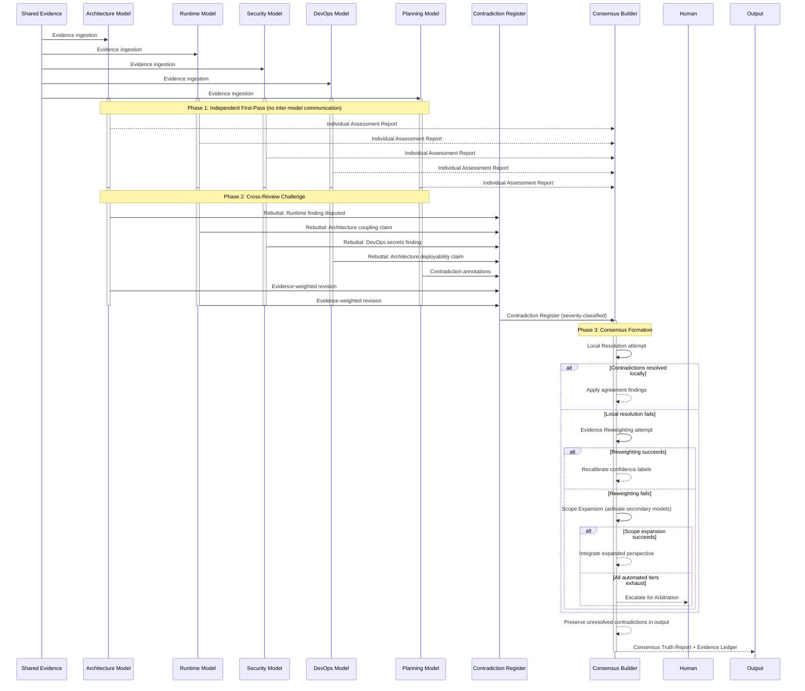

## 3. AI Governance Work Model

The Multi-Model Truth Council is the platform's central architectural innovation. Where conventional tools deploy a single model to produce a unified output — flattening nuance and suppressing uncertainty — the Truth Council orchestrates five role-specialized models through an adversarial review protocol that treats disagreement as signal rather than noise. Each model evaluates the same evidence from a distinct analytical perspective; findings survive only after cross-examination from models with different domain expertise. The result is a **Consensus Truth Report** that preserves contradiction, labels uncertainty explicitly, and links every claim to source artifacts.

No competing platform implements multi-model adversarial review.[^1^] Static analysis tools run deterministic rules. Code review platforms apply single-model inference. Technical due diligence relies on human consultants whose judgments cannot be systematically contradicted or confidence-graded. The Truth Council fills this gap by embedding institutional-grade adversarial process into an automated governance layer. As established in Chapter 2, the Council operates within **Layer 5** of the functional pipeline, receiving the reconstructed system model from Layer 3 and evaluation findings from Layer 4, and producing synthesized truth artifacts that feed Layer 6 (Planning) and Layer 7 (Visualization).

---

### 3.1 Truth Council Architecture

#### 3.1.1 Five-Model Specialization

The Council comprises five models, each assigned a domain-specific role and prompt-engineered to evaluate evidence through a distinct conceptual lens.[^2^]

The **Architecture Model** reasons about system decomposition, service boundaries, module coupling, and structural debt — which components belong together, which interfaces are well-defined versus accidental, and where structural integrity degrades.

The **Runtime Model** traces execution paths, user flows, integration breakpoints, and operational failures — which entry points fire, which services communicate, where request chains break, and which environmental assumptions fail under load.

The **DevOps Model** evaluates deployability, environment completeness, secrets management posture, and release process maturity — whether the system can be reliably shipped and rolled back.

The **Security Model** analyzes trust boundaries, credential exposure, authentication weaknesses, and exploit patterns — identifying attack entry points, unguarded data flows, and vulnerable dependencies.

The **Planning Model** converts all findings into a sequenced, taskable implementation plan, prioritizing remediation by dependency order, effort, and criticality.[^3^]

Each model receives identical evidence — the reconstructed project model, parsed symbol graphs, dependency maps, and configuration artifacts — but evaluates it through its own analytical framework without prior knowledge of the other models' conclusions.

#### 3.1.2 Activation Patterns

The Council supports three activation modes tuned to analysis scope and cost.

**Full Council** activates all five models for comprehensive analysis, triggering on initial ingestion, milestone reviews, and complete system assessments. It produces the full artifact set: individual assessments, contradiction register, consensus truth report, and evidence ledger.

**Sub-Council** activates a targeted subset for focused review — for example, Security, Architecture, and Runtime for a security review, or DevOps, Runtime, and Architecture for deployment-readiness. Sub-council mode reduces latency and cost while preserving adversarial review.

**Single-Model** activates one model for specialized queries. A builder seeking only a deployability assessment might run the DevOps model alone. Single-model mode bypasses cross-review and contradiction detection; the platform flags such outputs with a **non-consensus** warning.

#### 3.1.3 Model Capability Matrix

Table 3.1 defines which models activate for each analysis dimension. Primary designations indicate principal analytical authority. Secondary designations indicate cross-domain contribution without lead assessment authority. Not-applicable designations indicate scope exclusion.

| Model | Architecture | Runtime | Security | DevOps | Planning |
|---|---|---|---|---|---|
| Architecture Model | **Primary** | Secondary | Secondary | Not applicable | Secondary |
| Runtime Model | Secondary | **Primary** | Secondary | Secondary | Secondary |
| Security Model | Secondary | Secondary | **Primary** | Secondary | Not applicable |
| DevOps Model | Not applicable | Secondary | Secondary | **Primary** | Secondary |
| Planning Model | Secondary | Secondary | Not applicable | Secondary | **Primary** |

*Table 3.1 — Model Capability Matrix. Primary indicates principal analytical authority; Secondary indicates cross-domain contribution; Not applicable indicates scope exclusion.*

The matrix reveals an important structural property: no single model holds primary authority across more than one dimension, and every dimension receives at least one secondary review. Architecture assessments receive secondary evaluation from both the Runtime and Security models, creating cross-domain challenge without requiring every model to participate in every assessment. This design balances analytical depth with adversarial coverage — enough models touch each dimension to enable meaningful contradiction.

---

### 3.2 Cross-Review and Contradiction Mechanics

The Council's deliberation protocol proceeds through three sequential phases. Each phase transforms the outputs of the previous phase, moving from independent opinion through structured disagreement toward synthesized truth.

#### 3.2.1 Independent First-Pass Assessment

In Phase 1, each model evaluates the shared evidence independently with no knowledge of other models' assessments.[^4^] This independence is structurally enforced — model outputs are isolated until all first-pass assessments complete, preventing anchoring effects where an early conclusion biases subsequent analysis.

The Phase 1 output is five **Individual Assessment Reports**, each containing domain-specific findings, per-finding confidence labels, and explicit statements of what the model could not determine. Each report is internally consistent but may contradict other reports in ways that surface in Phase 2.

#### 3.2.2 Cross-Review Challenge

In Phase 2, models gain access to each other's Phase 1 findings and issue **evidence-weighted rebuttals**: challenges citing specific evidence artifacts to refute, qualify, or downgrade another model's conclusion.[^5^] A Runtime Model finding that an endpoint is operational may be rebutted by the Security Model citing evidence that the endpoint lacks authentication — the same evidence interpreted differently. An Architecture Model finding of loose coupling may be rebutted by the Runtime Model demonstrating a dense call graph between the modules.

Rebuttals must reference specific evidence — source files, dependency graphs, configuration values — not merely express disagreement. This ensures Phase 2 challenges are substantive rather than rhetorical. The platform logs every rebuttal in the **Contradiction Register** with its evidence citations, participating models, and severity classification.

#### 3.2.3 Contradiction Detection

The Contradiction Register captures explicit inter-model disagreements with structured severity classification. Contradictions are not suppressed, averaged, or resolved by voting at this stage. They are documented as first-class analytical objects.[^6^]

Contradictions receive one of three severity classifications. **Structural** contradictions indicate fundamental disagreement about system properties — for example, the Architecture Model classifying two modules as independent while the Runtime Model demonstrates dense cross-module call paths. **Confidence** contradictions indicate agreement on a finding's direction but disagreement on its confidence level — for example, the Security Model rating a vulnerability as confirmed while the Architecture Model rates it only strongly inferred. **Scope** contradictions indicate that one model identifies a finding another missed entirely — for example, the DevOps Model flagging a missing secrets management system no other model assessed.

#### 3.2.4 Contradiction Resolution

Phase 3 applies a tiered resolution protocol. The system attempts resolution at each tier before escalating to the next, ensuring that only genuinely irresolvable contradictions reach human attention.

| Pattern | Description | Resolution Path | Escalation Trigger |
|---|---|---|---|
| Local Resolution | Models reach agreement through evidence re-examination without external intervention | Re-examining shared evidence causes one or more models to revise position based on new interpretation | No agreement after evidence re-examination within model-defined iteration budget |
| Evidence Reweighting | Contradiction stems from differential weighting of evidence sources; resolved by recalibrating evidence strength across models | Platform recalculates per-model evidence weights using cross-model agreement as signal; models reassess with adjusted weights | Recalibration fails to reduce contradiction below threshold or produces new contradictions |
| Scope Expansion | Contradiction reflects insufficient evidence; resolved by requesting additional analysis from complementary models | Platform activates secondary models (from capability matrix Table 3.1) to provide missing perspective | Additional models cannot resolve the gap or analysis scope exceeds resource budget |
| Human Arbitration | Models fundamentally disagree and no automated resolution path exists | Platform surfaces contradiction to human reviewer with full evidence chain, model positions, and confidence labels | Automated tiers exhaust without resolution; or contradiction severity is Structural with no path to agreement |

*Table 3.2 — Contradiction Resolution Patterns. Patterns are evaluated sequentially; each pattern attempts resolution before escalation to the next tier.*

The majority of contradictions resolve at the Local tier when models, upon re-examining evidence, recognize that their initial interpretation was incomplete. Evidence Reweighting handles cases where models weighted sources differently. Scope Expansion addresses gaps where an insufficient model subset participated. Human Arbitration serves as a final safety valve for genuinely ambiguous cases.

The following Mermaid sequence diagram illustrates the three-phase deliberation protocol:

---

### 3.3 Consensus Formation Protocol

#### 3.3.1 Consensus Types

The Consensus Builder produces one of four consensus types depending on the degree of inter-model agreement. Unlike conventional voting mechanisms that suppress minority positions, the Truth Council's consensus protocol preserves all model positions — agreement is documented, disagreement is preserved, and the output format adapts to reflect the actual state of agreement rather than manufacturing false unity.[^7^]

| Type | Required Agreement | Use Case | Output Format |
|---|---|---|---|
| Unanimous | All 5 models agree on finding and confidence level | High-confidence architectural claims with direct evidence; security vulnerabilities with clear exploit paths | Single finding with unified confidence label; no minority report generated |
| Supermajority | 4 of 5 models agree; 1 model dissents or assigns different confidence | Most runtime assessments and DevOps findings where one model has domain-specific nuance | Consensus finding with primary confidence label; dissenting model produces Minority Report documenting alternative position |
| Plurality | 3 of 5 models agree; models disagree on specifics or confidence | Complex architectural judgments with ambiguous evidence; novel pattern assessments | Consensus finding tagged as plurality-level confidence; Minority Reports from dissenting models; explicit contradiction documentation |
| Dissent-Recorded | No consensus (2-2-1 or 3-1-1 splits) | Fundamentally ambiguous evidence; cases requiring human judgment | No consensus finding; all model positions preserved as competing hypotheses; full escalation to human arbitration recommended |

*Table 3.3 — Consensus Type Definitions. The required agreement threshold determines output format and confidence treatment.[^8^]*

The consensus type directly modulates the confidence taxonomy applied to findings. Unanimous findings may be labeled confirmed when evidence supports it. Supermajority findings are capped at strongly inferred unless evidence is overwhelming. Plurality findings are capped at weakly inferred. Dissent-Recorded findings carry no consensus confidence and require human adjudication before action.

#### 3.3.2 Confidence Aggregation

The Consensus Builder computes aggregate confidence through a weighted combination of per-model confidence scores with a disagreement penalty applied.[^9^] Each model assigns confidence using the taxonomy defined in Section 3.4.2. The builder converts categorical levels to numerical weights, computes a weighted average, then applies a penalty based on cross-model disagreement magnitude. Higher disagreement increases the penalty, reducing aggregate confidence regardless of individual model certainty. This prevents a single highly confident model from dominating the consensus when other models dissent.

The penalty function is non-linear: small disagreements incur modest penalties, while large disagreements (models on opposite ends of the confidence spectrum) produce severe confidence reductions. In extreme cases — where models assign contradicted and confirmed to the same finding — the penalty forces the aggregate to contradicted, requiring human arbitration.

#### 3.3.3 Minority Report Generation

When consensus falls below unanimous, dissenting models produce **Minority Reports**: documented positions explaining why the model disagrees with the consensus finding, citing evidence for its alternative position, and stating what additional evidence would resolve the disagreement.[^10^] Minority Reports are first-class output artifacts displayed alongside the consensus finding, ensuring the platform never presents a simplified conclusion where genuine analytical disagreement exists.

The Planning Model receives all Minority Reports during remediation sequencing. A finding with an active Minority Report may produce parallel remediation paths — one reflecting the consensus interpretation, one the minority position — allowing human builders to decide which interpretation to act upon.

#### 3.3.4 Consensus Packaging

The final **Consensus Truth Report** packages consensus findings, active Minority Reports, unresolved contradictions, and the full Evidence Ledger into a single artifact. The report follows a strict **never-hide-disagreement** principle: contradictions surface in executive summaries, confidence levels display prominently, and the contradiction count appears in the report header.[^11^]

The report includes a **No-Fluff Summary** applying direct categorical labels — confirmed, inferred, broken, missing, unsafe, unproven, or contradicted — translating analytical nuance into actionable language for builders who need immediate orientation.

---

### 3.4 Evidence and Confidence Governance

#### 3.4.1 Evidence Chain Requirement

Every claim in every model output must link to specific evidence sources: source files, symbol definitions, configuration values, dependency patterns, or infrastructure declarations.[^12^] Claims without evidence links are flagged during output validation and either rejected or tagged as speculative. The **Evidence Ledger** maintains a bidirectional index: for any claim, it lists supporting evidence; for any evidence artifact, it lists all referencing claims.

This chain requirement serves as the primary anti-hallucination safeguard. A model cannot assert that a service exists without citing its definition file, entry point, or registration configuration. A model cannot claim a vulnerability without pointing to the specific code pattern, dependency version, or trust boundary creating the exposure. The Evidence Ledger makes these linkages inspectable.

#### 3.4.2 Five-Tier Confidence Taxonomy

Every finding receives a confidence label drawn from a five-tier taxonomy.[^13^] The taxonomy appears throughout the Truth Council's output — in individual assessments, in the Consensus Truth Report, and in the Evidence Ledger. Confidence levels are defined as follows:

- **Confirmed**: Directly evidenced by unambiguous source artifacts. The finding is observable in the code, configuration, or dependency graph without interpretation. A service existence claim is confirmed when the service file, its entry point, and its registration are all visible.
- **Strongly Inferred**: Supported by multiple converging evidence sources. No single source confirms the finding, but the combined weight of indirect evidence makes it highly probable. A data flow pattern is strongly inferred when multiple call sites reference the same data structure, the schema defines matching fields, and the API contract documents the transfer.
- **Weakly Inferred**: Plausible based on limited or ambiguous evidence. The finding is consistent with available evidence but lacks the convergence or specificity needed for stronger confidence. An architectural pattern is weakly inferred when one or two files suggest it but the broader structure does not confirm.
- **Unknown**: Cannot be determined from available evidence. The model recognizes that a question is relevant but cannot answer it with the evidence at hand. This state is explicitly labeled rather than silently skipped.
- **Contradicted**: Evidence sources conflict, or models disagree at the structural level with no resolution path. The finding cannot be reliably assessed without additional evidence or human arbitration.

Chapter 7 defines the confidence taxonomy in full. The Truth Council applies these labels during both first-pass assessment and consensus formation, with final consensus confidence potentially lower than any individual model's due to the disagreement penalty (Section 3.3.2).

#### 3.4.3 Anti-Hallucination Safeguards

The platform's anti-hallucination mechanisms operate as an integrated system rather than isolated features.[^14^] Three structural properties create a defense-in-depth architecture against model-generated falsehoods.

First, the **multi-model adversarial review** protocol ensures that any single model's hallucination faces challenge from four other models evaluating the same evidence. A hallucinated claim — one without evidence support — is likely to be contradicted during Phase 2 cross-review because other models cannot locate supporting evidence. The Contradiction Register captures these challenges and prevents unsupported claims from reaching consensus.

Second, the **evidence-linking requirement** (Section 3.4.1) creates a verifiability threshold. Claims without evidence links fail validation. Human reviewers can inspect any claim's evidence chain, making hallucinations detectable through audit.

Third, the **unknown-state explicit labeling** policy requires models to flag what they cannot determine rather than fabricating plausible-sounding conclusions.[^15^] A model that cannot confirm whether an endpoint requires authentication must label the status as unknown, not assume it based on typical patterns. This transforms knowledge gaps from hidden weaknesses into documented limitations.

---

### 3.5 AI Safety and Policy Controls

#### 3.5.1 Model Behavior Boundaries

All Truth Council models operate within strict behavioral constraints enforced at the infrastructure level. Models are prohibited from executing code — they analyze static evidence only, never run the projects they evaluate. Models are prohibited from making external network calls — all reasoning operates on ingested evidence within the platform's secure analysis environment. Models are prohibited from exfiltrating data — outputs flow only through defined platform channels to authenticated users with workspace permissions.[^16^]

These boundaries are architectural, not policy-based. The model execution environment lacks network egress, file system write access outside temporary directories, and any interface for executing ingested code. Enforcement occurs at the container and network level, not through prompting, making circumvention impossible through prompt engineering.

#### 3.5.2 Bias Monitoring

The platform monitors for systematic scoring bias across projects. Bias detection compares model outputs across structurally similar projects to identify patterns where models consistently over-score or under-score specific categories.[^17^] For example, if the Security Model assigns higher vulnerability severity to TypeScript than Python projects with equivalent security patterns, the platform flags potential language bias.

When bias detection identifies a pattern, two responses trigger. First, the affected model's recent outputs receive additional cross-review scrutiny from models less likely to share the same bias. Second, the model's prompt template and rules are flagged for revision. Persistent bias results in model version rollback.

#### 3.5.3 Model Version Management

The platform maintains reproducible analysis results through pinned model versions, versioned prompt templates, and versioned evaluation rules.[^18^] Each analysis run records the exact model version, prompt hash, and rule set version used. When a builder re-runs analysis on the same snapshot, the platform uses identical analyzer configurations unless explicitly updated. This ensures that changes in model output reflect changes in the project — not changes in the analyzer.

Model version upgrades follow a staged rollout: new versions are validated against a benchmark corpus with known expected outputs before promotion to general availability. Builders may opt into newer versions on a per-workspace basis, with analysis history preserved across changes so trend comparisons remain valid.

The version management system also applies to the consensus algorithm itself. Changes to the confidence aggregation formula, disagreement penalty function, or contradiction resolution sequencing are versioned and recorded in the analysis audit log. Builders can inspect which consensus protocol version produced any historical report, ensuring that governance methodology remains transparent and reproducible.[^19^]
