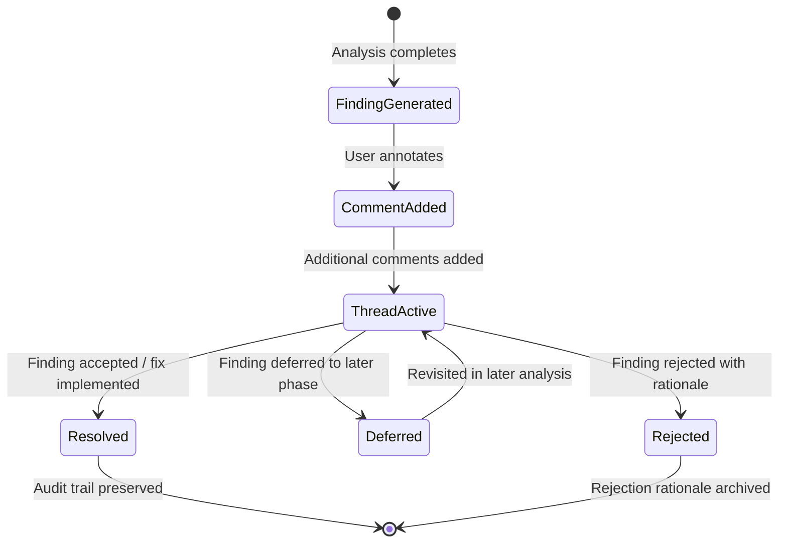
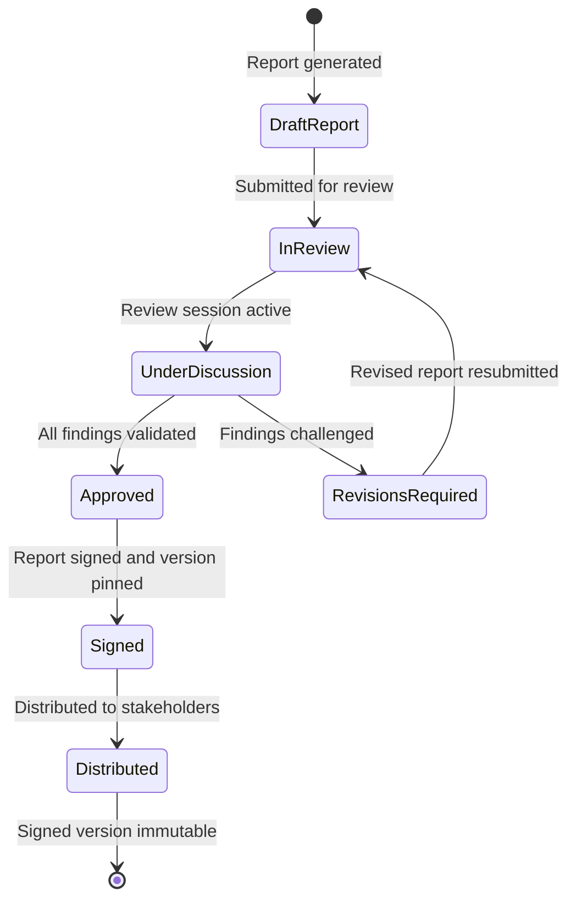

## 4. User & Collaboration Work Model

The CodeTruth platform is designed around the principle of **Non-Coder Sovereignty** — the conviction that complex system understanding must be accessible to people who are not traditional coders but are nevertheless the architects and owners of the systems being built[^1^]. This principle does not simplify the underlying analytical depth; rather, it translates code-level reality into structural and conceptual language that any intelligent builder can act upon. The user model serves two distinct populations simultaneously: technical builders who need granular evidence and execution paths, and non-technical owners who need system truth at the architectural and executive level.

The platform supports seven distinct user types: solo builders and independent architects; non-coder founders and institutional-grade project owners; technical leads managing complex codebases; engineering agencies delivering client projects; investment and acquisition teams conducting technical due diligence; AI agent system builders managing multi-agent architectures; and open source maintainers overseeing large contributor-driven codebases[^2^]. Each user type enters the platform with different capabilities, expectations, and action requirements. The work model in this chapter defines how the platform structures access, orchestrates collaborative workflows, and ensures that every finding carries an unbroken evidence chain to its source.

### 4.1 User Roles and Permission Model

All collaborative interaction within CodeTruth OS occurs within a **Workspace** — the logical boundary that contains projects, snapshots, reports, users, and policies. Access within a Workspace is governed by a role-based permission system comprising five discrete roles, each matching a distinct set of responsibilities in the software governance lifecycle[^3^].

The **Owner** holds full workspace control. This role is assigned at workspace creation and cannot be self-assigned by other members. The Owner manages billing and subscription configuration, controls member invitation and removal, defines workspace-level policies including privacy settings and data retention, and has sole authority to decommission or archive the workspace. In institutional deployments, the Owner is typically the project founder, executive sponsor, or account principal.

The **Admin** serves as the operational manager of day-to-day workspace activity. Admins can create and manage projects, invite new users and assign roles up to Admin (but not Owner), approve or reject reports through the approval workflow, and enforce policy compliance. This role bridges governance and execution without requiring full ownership privileges.

The **Engineer** is the primary technical operator. Engineers can trigger analysis runs on connected repositories, view all report types and their full evidentiary depth, annotate findings with comments and resolution suggestions, and export tasks to external backlog systems (GitHub Issues, Jira, Linear) in ticket-compatible formats. The Engineer role assumes hands-on interaction with the functional pipeline described in Chapter 2 — ingestion, parsing, reconstruction, evaluation, and planning — and represents the population most frequently initiating analysis workflows.

The **Reviewer** participates in the quality assurance and validation layer. Reviewers can view all reports at any presentation depth, annotate findings with comments in threads, accept or reject recommendations generated by the Planning Layer, and participate in shared review sessions. This role is designed for stakeholders who must validate findings — senior engineers, security auditors, client representatives — without triggering new analysis runs or managing workspace membership.

The **Viewer** has read-only access to reports and spatial visualization. Viewers can consume the Executive Truth Report, navigate the spatial project model at all zoom levels, and export reports in PDF format. They cannot annotate, approve, trigger analysis, or export tasks. This role serves non-technical owners, investors, client executives, and other stakeholders who need system understanding without operational interaction.

#### Table 4.1: Role-Permissions Matrix

| Permission | Owner | Admin | Engineer | Reviewer | Viewer |
|---|---|---|---|---|---|
| Workspace Management | Full | Partial | None | None | None |
| Trigger Analysis | Full | Full | Full | None | None |
| View Reports | Full | Full | Full | Full | View |
| Annotate Findings | Full | Full | Full | Full | None |
| Approve Reports | Full | Full | None | Partial* | None |
| Export Tasks | Full | Full | Full | None | None |
| Manage Users | Full | Full | None | None | None |
| Configure Policies | Full | Partial | None | None | None |

*Reviewer can accept or reject individual recommendations within a review session but cannot execute final report approval or signing.

The matrix reveals a deliberate permission gradient. Only Owner and Admin roles possess workspace governance capabilities. Only Owner, Admin, and Engineer can trigger analysis or export tasks. View Reports and Annotate Findings are the most broadly distributed permissions — shared by four of five roles — reflecting the platform's design philosophy that evidence-linked system understanding should be accessible to the widest possible audience within a workspace. The Reviewer's limited approval permission ensures that recommendation validation is participatory while final report authority remains with governance roles.

### 4.2 User Journeys

A user journey is defined as the sequence of touchpoints — interface interactions, report consumptions, decision points, and action outputs — that a specific user type experiences from initial workspace entry to sustained operational use. The platform does not enforce a single prescribed path; it exposes capabilities that different user types naturally assemble into distinct journey patterns based on role, technical depth, and organizational context.

#### Table 4.2: User Type Journey Mapping

| Journey Stage | Solo Builder | Non-Coder Owner | Technical Lead | Agency |
|---|---|---|---|---|
| **Connect** | Link personal GitHub repo; select branch; trigger first snapshot | Receive workspace invite; connect project via guided setup wizard | Import team repos; configure monorepo targets; invite team members | Create client workspace; connect client repo; set privacy policy |
| **Analyze** | Run full pipeline; review build-state scorecard; inspect architecture graph | Receive Executive Truth Report; review maturity classification | Monitor architecture drift across repos; run gap analysis on critical services | Generate due diligence report package; review all six report types |
| **Review** | Drill to file-level findings; annotate with fix notes; mark items resolved | Participate in review session; ask questions via annotations | Review engineering detail; validate recommendation priorities | Share report with client via Viewer invite; collect client annotations |
| **Act** | Export tasks to personal backlog; implement fixes; re-run analysis to verify | Direct team based on findings; track progress via spatial view | Assign tasks via Jira/GitHub export; monitor completion | Address client feedback; iterate analysis on new commits; finalize signed report |
| **Collaborate** | Optional: invite collaborator as Reviewer | Maintain ongoing workspace; receive updated reports on re-analysis | Scale workspace membership; establish approval workflows | Deliver final signed report; archive or transfer workspace to client |

**Solo Builder Journey.** The solo builder enters through direct GitHub repository connection. After OAuth authentication and branch selection, the builder triggers the first analysis run. The primary engagement surface is the Build-State Scorecard, which delivers an immediate maturity classification across ten scoring domains[^4^]. The builder navigates from the executive overview into the Engineering Report, following evidence links from findings to source files. Findings are annotated with implementation notes, marked as resolved when fixed in code, and verified through re-analysis on a new snapshot. Task export to personal backlog systems closes the loop from understanding to execution.

**Non-Coder Owner Journey.** The non-coder owner enters through a workspace invitation. A guided setup wizard handles repository connection and initial snapshot creation without requiring technical configuration knowledge. The owner's primary touchpoint is the Executive Truth Report, which delivers what the project is, what works and what does not, maturity classification with investment or delivery risk, the top five critical findings, and recommended immediate actions[^5^]. The owner participates in shared review sessions where clarifying questions are asked via annotations, navigates the spatial visualization to comprehend system structure without reading code, and uses the build-phase progression display to track team implementation progress. Decision-making authority flows from report understanding to team direction.

**Technical Lead Journey.** The technical lead's journey is characterized by scale and continuity. Multiple team repositories are imported — including monorepo subdirectory targeting — and team members are invited with role assignments. The lead's operational focus is on **architecture drift detection**: comparing the Architecture Graph across snapshots to identify where implementation has diverged from intended structure. The Gap Analysis output from Layer 4 is consumed regularly, and the lead reviews Engineering Report detail to validate priorities before assignment. Task export to Jira or Linear distributes work across the team, and the spatial visualization serves as a shared reference during architecture discussions. Over time, the lead establishes formal approval workflows for report validation and signing before stakeholder distribution.

**Agency Journey.** The agency operates CodeTruth OS as a quality assurance and client communication instrument. A dedicated workspace is created per client project, with privacy policies configured to restrict cross-project data visibility. After connecting the client repository, the agency generates the full report package — all six report types[^6^]. The agency's distinctive pattern is the **due diligence loop**: the report package is shared with the client through Viewer-role invitations, the client annotates findings with questions, the agency responds within comment threads, and the report is iterated until final. The final report is pinned to a specific snapshot version with analyzer and prompt version identifiers for full reproducibility, then delivered as a signed artifact. The workspace is either archived for record retention or transferred to the client.

### 4.3 Interaction Patterns

The platform exposes four core interaction patterns that define how users transform platform outputs into decisions and actions: report consumption at graduated depths, spatial navigation from system-level to file-level views, annotation workflows with audit trails, and approval workflows for institutional-grade report validation.

**Report Consumption.** Every report is available at three presentation depths selectable by the user based on role and information need[^7^]. The **Executive** depth presents high-level, risk-focused summaries: project identity, what works and what does not, maturity classification, the top five critical findings, and recommended immediate actions. This depth is optimized for decision-makers who need actionable intelligence without engineering detail. The **Engineering** depth provides full analytical granularity: architecture breakdowns with evidence links to source files, runtime flow decompositions with confirmed versus inferred sections labeled, file-level and module-level findings, priority remediation items with dependency chains, and acceptance test recommendations. The **No-Fluff Truth** depth applies direct categorical labels to every finding: confirmed, inferred, broken, missing, unsafe, unproven, or contradicted[^8^]. This depth is designed for users who need unambiguous status classification without explanatory prose.

**Spatial Navigation.** The spatial visualization layer (Layer 7) enables a three-level navigation pattern[^9^]. At the **whole-system view**, the user perceives all services, modules, and external dependencies as spatial objects, with risk concentration visible as heat zones and confidence encoded as visual solidity or opacity. The user then focuses on a specific service or module — the **service focus** level — where data flows, runtime paths, and integration points are rendered as spatial connections. Finally, the user drills to **file-level detail**, where clicking any node reveals the complete evidence chain: source files, configuration entries, and dependency patterns justifying the platform's claims. This pattern makes institutional-level complexity accessible to non-technical users by leveraging human spatial reasoning while preserving the evidentiary link to underlying code reality.

**Annotation Workflow.** Every finding in every report is annotatable. The workflow follows a defined state sequence:

When a user annotates a finding, a comment thread is initiated. Members with annotation permissions respond, creating a threaded discussion linked to the specific finding and its evidence. The finding transitions through resolution states: Resolved (accepted and a fix is implemented or planned), Deferred (acknowledged but scheduled for later), or Rejected (disagreed with, requiring a rejection rationale that is archived). Every transition is recorded in the workspace audit log, creating an immutable trail of human judgment applied to machine-generated findings.

**Approval Workflow.** For workspaces requiring institutional-grade report validation, the platform implements a formal approval workflow:

A draft report is generated by the analysis pipeline. The Engineer or Admin submits it for review. Reviewers participate in a shared review session — a real-time collaborative environment with synchronized report viewing and live comment threads — where findings are validated, challenged, or clarified. If revisions are required, the report returns to draft for re-generation on updated evidence. Upon approval, the report is **signed** — pinned to a specific snapshot version with analyzer and prompt version identifiers for full reproducibility — and distributed. The signed version is immutable; subsequent analysis generates a new report rather than modifying the signed artifact.

### 4.4 Workspace Governance

Workspace governance defines the structural boundaries, lifecycle states, and policy controls that ensure multi-user workspaces operate securely and accountably.

**Workspace Lifecycle.** Every workspace progresses through five lifecycle states[^10^]:

| State | Definition | Transitions |
|---|---|---|
| **Creation** | Workspace instantiated with Owner assignment; billing profile attached; initial policy defaults applied | Creation → Configuration |
| **Configuration** | Projects connected; members invited with role assignments; privacy and retention policies customized | Configuration → Active Operation |
| **Active Operation** | Full workspace capability available; analyses running; collaboration ongoing | Active Operation → Archival |
| **Archival** | Data preserved in read-only state; no new analyses or member changes; audit log retained per policy | Archival → Active Operation or Archival → Decommissioning |
| **Decommissioning** | All data purged per retention policy; audit log exported to Owner; workspace identifier released | Terminal state |

The lifecycle enforces that workspace termination is deliberate and governed rather than accidental. The Archival state provides a protected interval for reactivation, preventing data loss from administrative error or billing interruption. Decommissioning occurs only after the retention period defined in workspace policy has elapsed.

**Project Isolation.** Within a workspace, projects are isolated at the data level. Each project maintains its own snapshot history, report archive, and annotation records. All workspace members can view all projects within that workspace, but cross-workspace project visibility is prohibited by default. The Owner may configure **cross-project visibility rules** that allow specific projects to be shared across workspaces — a pattern used by agencies managing multiple client workspaces. Data boundaries are enforced at the storage layer: repository contents, analysis artifacts, and report exports are scoped to the project that generated them.

**Policy Engine.** The workspace policy engine controls three operational dimensions[^11^]. **Privacy settings** determine whether data is processed by shared or isolated compute, whether repository contents are retained after analysis, and whether reports can be shared via public links or require authenticated access. **Model usage controls** allow the Owner to specify which AI model providers are permitted for analysis runs — a critical control for organizations with vendor restrictions or data residency requirements. **Data retention configuration** defines the duration for which snapshot data, report archives, and audit logs are preserved before automated purging. The Owner can configure delete-on-demand policies that trigger immediate purging upon explicit request, ensuring compliance with zero-retention guarantees for sensitive repositories.

The policy engine operates at the workspace level and applies uniformly to all projects and members. Admin roles can modify policies within Owner-defined constraints but cannot override Owner-level policy locks. This hierarchical control ensures that organizational compliance requirements propagate consistently while preserving operational flexibility for day-to-day workspace management.
