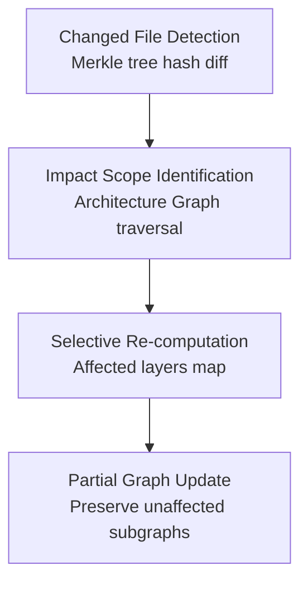

## 6. Operational Work Model

Chapter 2 defines *what* the eight-layer pipeline produces. Chapter 5 defines *what* technically runs. This chapter closes the operational loop: it specifies *when* the pipeline runs, *how* work is distributed, how results evolve across project history, and how the platform monitors its own health.

The operational model rests on three design commitments from the non-functional specifications: **queue-based orchestration** decouples pipeline stages and enables concurrent workspace processing; **incremental analysis** re-evaluates only changed or impacted artifacts rather than re-running the full pipeline; and **streaming delivery** publishes partial findings before full analysis completes[^1^]. These three commitments shape every mechanism described in this chapter.

### 6.1 Continuous Operation Pipeline

#### 6.1.1 Analysis Scheduling

Three trigger modalities initiate pipeline execution, each carrying distinct priority weighting and latency expectations.

**On-demand triggers** are user-initiated requests through the web interface, REST API (`POST /analyses`), or Slack slash command. These enter the queue with medium priority and execute as capacity becomes available[^2^].

**Scheduled triggers** execute at configured cron intervals — default daily at 02:00 workspace time. Scheduled runs receive the lowest priority; they are distributed across a 60-minute jitter window to prevent thundering-herd effects when many workspaces share the default time[^3^].

**Event-driven triggers** fire on external lifecycle events delivered via webhook. Push events to the default branch enqueue snapshot creation followed by incremental analysis; pull request events trigger branch-targeted analysis with results posted back to the PR. Event-driven triggers receive the highest priority because they correlate with active developer workflows — a push event represents a human waiting for feedback[^4^].

**Table 6.1 — Trigger Type Definitions**

| Trigger Type | Activation Method | Use Case | Priority Level | Example |
|---|---|---|---|---|
| On-demand | User click, API call, Slack command | Ad-hoc analysis; what-if exploration | Medium (2) | Engineer clicks "Analyze Now" on project dashboard |
| Scheduled (cron) | Time-based interval, default daily 02:00 | Continuous drift detection; trend baselining | Low (3) | Nightly snapshot and scorecard update for all connected projects |
| Event-driven (webhook) | Git push, PR create/merge, branch create | Immediate feedback on code changes; CI gating | High (1) | Developer pushes commit to main; analysis enqueues within seconds |

The priority scheme carries direct operational consequences. High-priority event-driven jobs may preempt warm worker slots occupied by scheduled runs. When queue depth exceeds a configurable threshold, the platform pauses new scheduled job submission while preserving event-driven and on-demand throughput[^5^]. This backpressure mechanism ensures that active developer workflows never stall due to batch processing load.

#### 6.1.2 Job Orchestration

Pipeline execution is managed through a distributed job queue with three structural properties: priority ordering, retryable delivery, and workspace-scoped concurrency isolation.

Each pipeline stage — Ingestion, Parsing, Reconstruction, Evaluation, Truth Council, Planning — consumes a dedicated queue topic[^6^]. The Ingestion Service produces a Snapshot Created event; the Parsing Engine consumes it and enqueues per-batch parsing jobs. When parsing completes, the Reconstruction Engine begins service boundary inference. This topic-per-stage design enforces the failure isolation principle: a parsing error in one file does not block reconstruction of the rest of the project[^7^].

Each workspace receives a dedicated virtual queue with a maximum concurrency cap per stage. Within a workspace, jobs execute in dependency order (Layer 2 completes before Layer 3 for a given snapshot). Between workspaces, jobs interleave according to priority and queue depth[^8^]. RBAC permissions govern which roles can trigger which analysis types: Owners and Admins can trigger full analyses including Truth Council deliberation; Engineers can trigger standard pipeline runs; Reviewers and Viewers receive read-only access to completed results without queue injection rights.

Retry policy follows exponential backoff: 5s, 15s, 45s, 2min, 6min. After five attempts, the job moves to a dead-letter queue for manual inspection. Permanent failures — authentication revocation, repository deletion — fail fast without retry[^9^].

#### 6.1.3 Streaming Results

The platform delivers findings as each pipeline stage completes. The progression follows the pipeline's natural dependency order: the Snapshot Record and File Manifest appear first after Ingestion; the Symbol Index and Dependency Graph appear as Parsing completes per batch; the Architecture Graph renders after Reconstruction; scorecard domains populate as Evaluation finishes each of the 10 scoring domains; individual model assessments stream from the Truth Council as each model completes its first-pass; the Consensus Truth Report appears after Phase 3 synthesis[^10^].

WebSocket connections push stage-completion events to connected clients, enabling granular progress indicators. A 1,000-file project may stream 20-30 progress events before the final report. The Spatial Renderer begins scene construction as soon as the Architecture Graph is ready, refining the layout incrementally as additional entities and relationships are discovered[^11^]. This streaming model transforms the analytical experience from a batch wait into a progressive reveal: the builder sees the project's structure emerge in real time, with confidence and risk information accumulating as deeper layers complete their work.

### 6.2 Snapshot Lifecycle Management

A Snapshot Record is the platform's fundamental unit of temporal identity — an immutable, content-addressed capture of project state[^12^]. This section governs how snapshots are triggered, retained, and compared.

#### 6.2.1 Trigger Conditions

Snapshot creation follows the three trigger modalities. Manual snapshots capture the current repository state and optionally enqueue analysis. Scheduled snapshots capture the default branch for trend tracking. Push-event snapshots create a new Snapshot Record linked to its parent through an explicit parent reference, forming a directed acyclic graph of project history[^13^].

PR events create branch-specific snapshots existing outside the main chain, subject to shorter retention. Merge events link the PR snapshot into the main chain, preserving analytical lineage from branch creation through merge[^14^].

#### 6.2.2 Retention Policy

Snapshot storage follows a three-tier model balancing access latency, cost, and compliance requirements.

**Hot tier** contains the most recent snapshot per project plus all snapshots from the past 30 days, stored in standard object storage with sub-100ms latency. This is the working set for comparison, incremental analysis, and spatial rendering[^15^].

**Warm tier** holds snapshots aged 30-90 days in infrequent-access storage (5-30 second retrieval). They support historical comparison and trend analysis but require pre-fetch for spatial rendering. Administrators can promote warm snapshots to hot on demand[^16^].

**Cold tier** archives snapshots for compliance beyond the workspace deletion window, with 1-hour retrieval latency and cryptographic integrity verification. Cold retention is seven years for compliance-bound workspaces, configurable for others[^17^].

#### 6.2.3 Snapshot Comparison

The comparison engine produces four output types for evolution tracking.

**Structural diff** enumerates added files, deleted services, renamed modules, and new dependency edges by comparing content hashes between parent and child snapshots. A file with an unchanged hash contributes nothing regardless of path changes[^18^].

**Scorecard delta** computes per-domain score changes, tagged with direction (improvement, regression, stable) and magnitude (minor <5 points, moderate 5-15 points, major >15 points). A 20-point security score drop between snapshots triggers an automatic alert[^19^].

**Finding change detection** classifies findings as *new* (in child only), *resolved* (in parent only), *persisting* (both snapshots), or *mutated* (both but severity or confidence changed). This classification transforms the static finding view into a dynamic health trajectory[^20^].

**Evolution animation** renders the structural diff as a time-sequenced spatial transition: new services materialize, deleted services fade, and score changes encode as node color transitions playing forward or backward[^21^].

### 6.3 Incremental Analysis Engine

The Incremental Analysis Engine reduces computational scope from the entire project to only what changed or was affected. It follows a four-step decision sequence.

#### 6.3.1 Change Detection

The engine computes a Merkle-style tree diff by comparing SHA-256 content hashes at each directory and file level between parent and child snapshots. Identical hashes produce identical subtree comparisons, enabling efficient short-circuit evaluation. A typical commit modifying 2-5% of files in a 1,000-file project produces a change set of 20-50 files identified in under one second[^22^].

#### 6.3.2 Impact Scope and Selective Re-computation

From the changed file set, the engine traverses the Architecture Graph to identify transitively affected entities. A function body change triggers re-evaluation of its callers (CALLS edges), its containing service (SERVES edges), and its data flows (FLOWS_TO edges). A configuration change triggers re-evaluation of deployment topology. The **affected layers map** specifies which pipeline stages need re-execution for which entities[^23^].

The orchestrator then enqueues jobs only for changed or impacted entities. Unchanged files retain their symbol indexes and architectural inferences from the parent snapshot. Unchanged services retain their scorecard entries. The Truth Council runs only for models whose assessment domains are affected by the change. For a typical commit, incremental processing reduces analysis time by 90% or more compared to full re-analysis[^24^].

#### 6.3.3 Incremental Knowledge Graph Updates

The final step mutates the Architecture Graph through **partial graph mutation**: nodes and edges within the impact scope are deleted and recreated with new inference results; nodes outside the scope retain their confidence labels, evidence chains, and historical metadata intact. A service boundary tagged *confirmed* in the parent snapshot and unaffected by the current change remains *confirmed* in the child. Only findings whose supporting evidence changed are re-evaluated, and their confidence transitions are recorded in the audit log[^25^].

### 6.4 Monitoring and Observability

#### 6.4.1 Pipeline Health Metrics

Every pipeline stage publishes four metric streams: **queue depth** (pending jobs per stage per workspace; sustained depth >100 triggers horizontal scaling); **processing latency** (enqueue-to-completion time segmented by stage, project size, and trigger type; p50/p95/p99 over 5-minute windows); **error rate** (permanent and transient failures; >1% over 10 minutes triggers an alert); and **retry count** (jobs succeeding after retry; rising trends predict incipient dependency outages)[^26^].

#### 6.4.2 Model Performance Tracking

The Truth Council's output quality is tracked through three metrics. **Accuracy** compares model findings to human-reviewed ground truth on a held-out validation set; a >10 percentage point drop from baseline triggers prompt-version review. **Confidence calibration** measures whether confidence labels match empirical accuracy — *confirmed* findings should be near 100% correct, *strongly inferred* at 80-90%. **Contradiction frequency** tracks model disagreement rates; sustained increases suggest an evidence distribution shift such as a new framework or language not well-represented in the training corpus[^27^].

#### 6.4.3 Operational SLAs

**Table 6.2 — Operational SLA Specifications**

| Pipeline Stage | Target Latency (1,000 files) | Scaling Factor | Failure Behavior |
|---|---|---|---|
| Ingestion | <2 minutes | O(n) in file count | Retry 5× with exponential backoff; dead-letter after permanent failure |
| Parsing | <5 minutes | O(n) in files; O(k) in languages (parallel) | Per-file isolation; malformed files logged and skipped |
| Reconstruction | <4 minutes | O(n log n) in symbol count | Partial output on boundary failure; unmapped components flagged |
| Evaluation | <3 minutes | O(d) in domains (10 fixed); parallel per domain | Per-domain isolation; missing domains flagged incomplete |
| Truth Council | <3 minutes | O(m) in models (5 fixed); first-pass parallel | Per-model retry; unresolved contradictions to human review |
| **Full Analysis Total** | **<15 minutes** | Sum of stage latencies; incremental mode reduces to ~3-5 min | Stage-fault isolation; partial results delivered for non-failing stages |

The targets are worst-case bounds for full analysis under standard provisioning. Incremental analysis on a typical commit completes in 3-5 minutes total. The targets assume a project with 1,000 source files, 3-5 programming languages, and 5-10 microservices. Projects exceeding 10,000 files or 20 services scale horizontally with additional worker allocation[^28^].

#### 6.4.4 Alert Type Taxonomy

**Table 6.3 — Alert Type Taxonomy**

| Alert Category | Severity | Trigger Condition | Response Action | Escalation Path |
|---|---|---|---|---|
| Pipeline — queue saturation | Warning | Queue depth >100 per stage per workspace for >5 min | Auto-scale workers; throttle scheduled jobs if persists | Platform ops → workspace admin |
| Pipeline — stage failure spike | Critical | Error rate >1% over 10-minute window for any stage | Alert on-call engineer; reduce concurrency to failing stage | Platform ops → engineering lead if unresolved in 30 min |
| Pipeline — latency degradation | Warning | p95 latency exceeds 2× SLA target for any stage | Investigate resource contention; scale affected workers | Platform ops |
| Model — accuracy drift | Warning | Model accuracy drops >10 percentage points from baseline | Trigger prompt-version review; re-evaluate on validation set | AI governance team → model owner |
| Model — contradiction surge | Warning | Unresolved contradictions >20% for 3 consecutive analyses | Review evidence corpus for new patterns; check model prompt version | AI governance team |
| Security — secret exposure | Critical | Unredacted secret detected in output | Immediate output quarantine; mandatory human review before release | Security team → workspace admin |
| Security — auth anomaly | Critical | Multiple failed auths from single source; unusual token usage | Rate-limit source; revoke compromised tokens; audit log review | Security team |
| Quota — limit approaching | Warning | Storage >80% or analysis count >90% of monthly quota | Notify workspace admin with upgrade options | Workspace admin → billing contact |
| Quota — limit exceeded | Critical | Storage or analysis count exceeds workspace quota | Pause scheduled jobs; allow on-demand with override; notify admin | Workspace admin (immediate) |

**Warning** alerts generate dashboard notifications and daily digest emails but do not page an on-call engineer. **Critical** alerts trigger immediate notification to the responsible team with escalation if unacknowledged within the configured window. Every alert is recorded in the audit log with full trigger context, response timestamps, and resolution notes[^29^].

#### 6.4.5 Audit Logging

The audit log is an append-only, tamper-evident record of every significant platform action. Each entry contains: UTC nanosecond timestamp, actor (user ID, API key, or service account), action (upload, analyze, annotate, approve, export, delete), target entity ID, outcome (success, failure, denied), and a cryptographic hash chaining this entry to the previous[^30^].

The hash chain provides tamper evidence: each entry's hash includes the previous entry's hash, forming a cryptographic linked list. Any historical modification breaks the chain and is detected on the next integrity verification pass — run daily on hot-tier logs, weekly on warm-tier archives[^31^].

Actions recorded span seven categories: project connection and disconnection; snapshot creation and deletion; analysis trigger and completion; finding annotation (accept, reject, defer, comment); report generation and export; workspace policy changes; and user role modifications. Even when a workspace exercises delete-on-demand, the fact of deletion — actor, timestamp, and target — is retained per the non-functional specification for full audit logging with tamper-evident trail[^32^].

The operational model described in this chapter — queue-based orchestration, incremental analysis, streaming delivery, snapshot lifecycle management, and comprehensive monitoring — transforms the static pipeline from Chapter 2 into a continuously operating system backed by the architecture from Chapter 5.
