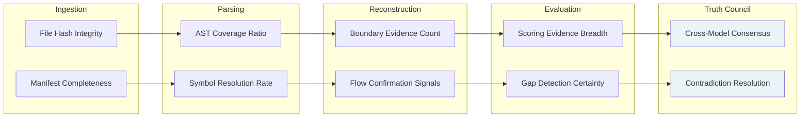

## 7. Quality & Trust Work Model

Quality and trust constitute the platform's core differentiator — the operational standard that separates evidence-based system truth from the hallucinated certainty that plagues conventional code analysis tools. Where traditional tools produce flat assertions about code quality or architecture, CodeTruth OS anchors every claim to verifiable evidence, tags every inference with its confidence level, and exposes exactly what the platform cannot determine. This chapter defines the confidence model, evidence framework, explainability system, and trust boundaries that ensure platform outputs are trustworthy, actionable, and auditable.

These quality standards apply as a cross-cutting layer to all pipeline stages described in Chapter 2, all Truth Council operations described in Chapter 3, and all operational monitoring described in Chapter 6. No finding, score, or architectural claim is exempt.

### 7.1 Confidence Model

The confidence model communicates the evidentiary strength behind every claim the platform makes. It prevents the false certainty that arises when inferred conclusions are presented with the same authority as directly observed facts.

#### 7.1.1 Five-Tier Confidence Taxonomy

The platform employs a five-tier taxonomy that tags every piece of system understanding according to the evidence supporting it [^1^]. Each level carries specific evidentiary requirements, visual encodings, and downgrade paths that activate when contradictory or insufficient evidence emerges.

**Table 7.1: Confidence Taxonomy Detail**

| Level | Definition | Evidence Requirement | Visual Encoding | Downgrade Path |
|---|---|---|---|---|
| Confirmed | Direct evidence exists in source material | Explicit declaration in code (function signature, config file, schema definition) or unambiguous runtime trace | Solid opacity, green-coded badge, fully rendered node in spatial view | Contradicted if conflicting evidence emerges |
| Strongly Inferred | Multiple independent evidence sources converge on the same conclusion | Two or more corroborating signals from distinct evidence categories (e.g., import pattern + config reference + endpoint registration) | High opacity, blue-coded badge, mostly solid node with subtle edge transparency | Weakly Inferred if supporting evidence weakens; Unknown if corroborating sources are invalidated |
| Weakly Inferred | Plausible conclusion supported by sparse or single-source evidence | One indirect signal (e.g., file naming convention, directory placement, partial pattern match) | Moderate opacity, amber-coded badge, semi-transparent node rendering | Unknown if the single supporting signal weakens; Strongly Inferred if corroborating evidence emerges |
| Unknown | Insufficient evidence to support any determination | No discernible signal or evidence quantity below the threshold required for weak inference | Low opacity, gray-coded badge, wireframe or placeholder node in spatial view | Remains Unknown until evidence is discovered; cannot be upgraded without new evidence |
| Contradicted | Evidence exists but points to mutually exclusive conclusions | Two or more signals of equal strength that conflict (e.g., config indicates auth enabled but no auth middleware found in runtime path) | Distinctive pattern (striped or pulsing), red-coded badge, flagged with contradiction register entry | Resolved to Confirmed, Strongly Inferred, or Unknown upon additional evidence; remains Contradicted during resolution |

The taxonomy gives builders precise calibration of evidentiary grounding. A Weakly Inferred architectural boundary is not an analysis flaw — it is an honest statement that available evidence supports a plausible conclusion but cannot confirm it definitively [^2^]. This enables prioritization: confirmed elements require no scrutiny, weakly inferred elements merit validation before architectural decisions depend upon them, and unknown elements represent deliberate gaps the builder must close.

Downgrade paths are state transitions triggered by the **Confidence Recalculation Engine** during the Truth Council cross-review pass. When a model challenges another's finding, the confidence level transitions along the downgrade path automatically, with the transition recorded in the contradiction register [^3^].

#### 7.1.2 Per-Layer Confidence Propagation

Confidence propagates and transforms through each pipeline layer, with each layer's output becoming an input to the next:



At the **Ingestion Layer**, confidence originates from file hash integrity and manifest completeness; hash mismatch caps maximum confidence at subsequent layers [^4^]. At the **Parsing Layer**, it transforms into AST Coverage Ratio and Symbol Resolution Rate. At the **Reconstruction Layer**, it becomes Boundary Evidence Count and Flow Confirmation Signals. At the **Evaluation Layer**, it manifests as Scoring Evidence Breadth and Gap Detection Certainty. At the **Truth Council Layer**, confidence achieves final form through Cross-Model Consensus and Contradiction Resolution [^5^].

#### 7.1.3 Aggregate Confidence Computation

Individual confidence signals combine into unified aggregate scores through a **weighted consensus function**. The system collects all signals associated with a finding, weights them by source reliability (direct code evidence highest, runtime trace secondary, pattern-based inference tertiary), and maps the aggregate to the taxonomy tier whose evidence requirements the weighted ensemble satisfies.

The function is conservative by design: a single contradicted signal prevents aggregate confirmed status; a single confirmed signal alongside weaker signals elevates the finding to confirmed only if no contradicted signals exist; and absence of any qualifying signal defaults to unknown rather than permitting inference from silence [^6^].

#### 7.1.4 Visual Encoding

Confidence levels render directly into every interface surface. In the **spatial view**, confirmed nodes render at full opacity with sharp edges, strongly inferred at 85% opacity, weakly inferred at 60% opacity, unknown as wireframe placeholders, and contradicted with pulsing or striping patterns [^7^]. In **reports**, each finding carries a color-coded inline badge: confirmed (green), strongly inferred (blue), weakly inferred (amber), unknown (gray), contradicted (red). In the **evidence ledger**, confidence is a structured field enabling programmatic filtering by evidentiary strength.

### 7.2 Evidence Framework

The evidence framework defines how the platform collects, structures, validates, and chains evidence from raw source material to final report claim. It operationalizes the **Evidence-Linked Every Claim** principle: no output states something about a project without pointing to the specific evidence — files, symbols, configs, or dependency patterns — that justifies that claim [^8^].

#### 7.2.1 Evidence Types

The platform recognizes four primary evidence categories.

**Table 7.2: Evidence Requirements by Type**

| Evidence Type | Source | Strength | Confidence Contribution | Validation Method |
|---|---|---|---|---|
| Static Code | Source files, configuration files, build manifests, schema definitions, symbol tables | Highest for explicit declarations; variable for inferred patterns | Confirmed when direct declarations exist; Strongly Inferred when multiple static signals converge | AST parsing with syntax validation, hash verification against snapshot, symbol resolution to definition site |
| Runtime Data | Execution logs, trace outputs, endpoint responses, database query logs, error telemetry | High for observed behavior; dependent on log completeness and freshness | Confirmed when runtime trace matches static prediction; Strongly Inferred when runtime corroborates static evidence; Contradicted when runtime conflicts with static claim | Trace correlation across multiple captures, timestamp validation, log integrity verification |
| Historical Patterns | Prior snapshot records, trend trajectories, change frequency metrics | Moderate for trend-based inference; strength increases with snapshot depth | Weakly Inferred for single-snapshot patterns; Strongly Inferred when multi-snapshot trends confirm | Snapshot-to-snapshot diff validation, trend statistical significance testing |
| External Sources | CVE databases, package registry metadata, documentation repositories, protocol specifications | High for authoritative databases; variable for community documentation | Contributes primarily to security posture and dependency risk; elevates confidence when external vulnerability data corroborates internal detection | Database freshness verification, cross-reference with multiple sources, authority ranking of provenance |

The framework surfaces this differential explicitly rather than collapsing it into a uniform score. A vulnerability flagged on static evidence alone receives lower aggregate confidence than the same vulnerability flagged on static evidence plus CVE corroboration plus runtime trace confirmation.

#### 7.2.2 Evidence Chain Structure

Every finding carries a complete **Evidence Chain** structured as a linked list:

```
Finding → Analyzer → Model → Source File → Line/Symbol → Raw Content
```

The **Finding** is the output claim (e.g., "Authentication middleware is missing from the API gateway request pipeline"). The **Analyzer** identifies the analysis module (auth flow analyzer within the Runtime Model). The **Model** identifies the Truth Council role that executed the analysis. The **Source File** locates the specific files providing evidence (`src/middleware/index.ts` showing no auth imports, `src/routes/api.ts` showing unguarded route registration). The **Line/Symbol** pinpoints exact line numbers and symbol names. The **Raw Content** renders the actual file content as a verifiable snippet [^9^].

This machine-navigable structure enables the platform's three-click drill-down guarantee: from any report claim, a user reaches raw source content within three navigation actions [^13^].

#### 7.2.3 Tamper Evidence

The evidence framework includes three cryptographic protections. **Snapshot Immutability**: every snapshot receives a unique identifier derived from a cryptographic hash of the complete file manifest plus per-file hashes; once created, it cannot be modified, ensuring evidence chains always point to the exact source material that existed at analysis time [^10^]. **Audit Trail Integrity**: every analysis operation is appended to a tamper-evident audit log employing Merkle-chain hash chaining [^11^]. **Evidence Ledger Linking**: the Truth Council produces an **Evidence Ledger** linking every claim to its supporting source files, configs, or symbols, with the same immutability guarantees as snapshot records [^12^].

### 7.3 Explainability System

The explainability system ensures that platform outputs are not merely correct but comprehensible — builders understand not just what the platform concluded, but how it reached that conclusion, what evidence it considered, and what remains uncertain.

#### 7.3.1 Explanation Levels

The platform provides three explanation levels, each designed for a different cognitive task.

**Table 7.3: Explainability Levels**

| Level | Description | Use Case | Information Included | Access Method |
|---|---|---|---|---|
| Summary | A single-sentence explanation of the finding and its significance | Executive review, high-velocity triage, priority filtering | Finding statement, confidence level badge, one-line rationale | Inline in report summaries, hover tooltip on spatial view nodes |
| Contextual | Explanation embedded within surrounding system context — the finding plus its architectural neighborhood | Engineering review, impact assessment, dependency analysis | Finding statement, confidence level, key evidence source, affected components, related findings from the same domain | Engineering report sections, spatial view inspection panel |
| Detailed | Complete reasoning trace from evidence through analysis to conclusion | Deep audit, model review, compliance verification | Full evidence chain, all contributing evidence signals with individual confidence levels, contradiction register entries, model reasoning steps, explicit list of what could not be confirmed | Detailed report export, evidence ledger inspection, audit mode interface |

A technical lead filtering a hundred findings to identify the five requiring immediate action needs only the summary level. An engineer assessing whether a service boundary finding is reliable enough to support a refactoring decision needs the contextual level. A compliance auditor debugging a model disagreement needs the detailed level to reconstruct the complete reasoning trace.

#### 7.3.2 Provenance Tracking

Every output carries a **Generation Lineage** record specifying which analyzers executed, which models participated, which evidence sources were consulted, which prompt and analyzer versions were active, and which human overrides were applied. The lineage is a structured metadata object attached to every finding, report, and spatial view state [^14^].

The lineage serves **reproducibility** — enabling reconstruction of the exact conditions under which a finding was produced, essential for comparing findings across snapshots or validating that model updates improved rather than degraded quality. It also serves **accountability** — when a finding is challenged, the platform identifies which analyzers and models contributed, enabling targeted review rather than blanket re-analysis.

#### 7.3.3 Unknown-State Explicitness

The platform's primary anti-hallucination mechanism is explicit unknown-state declaration. When evidence is insufficient to support even a weak inference, the platform does not guess or extrapolate. It labels the finding as **Unknown** and, in detailed explanation mode, explicitly states what could not be determined and what additional evidence would be required [^15^].

This behavior contrasts with conventional analysis tools, which produce complete assessments even on incomplete information — generating architecture diagrams with inferred connections that may not exist, assigning quality scores based on partial file coverage, or flagging vulnerabilities from pattern matching that produces false positives. The platform's willingness to say "I don't know" is not a limitation; it is a quality feature that protects builders from acting on fabricated certainty [^16^].

### 7.4 Trust Boundaries and Overrides

Trust boundaries define conditions under which platform outputs require human verification before action, and override mechanisms enable users to challenge findings and trigger systematic quality improvement.

#### 7.4.1 Automated vs. Human-Verified Outputs

The platform classifies outputs into two categories based on action risk and evidence strength. **Automated outputs** — findings at Confirmed or Strongly Inferred confidence in low-action-risk domains — flow directly to reports without human gatekeeping. These include confirmed architecture elements and strongly inferred service boundaries [^17^].

**Human-verified outputs** — findings in high-action-risk domains or at lower confidence levels — require explicit human approval before the platform treats them as resolved or incorporates them into planning. High-action-risk domains include security posture determinations (a false negative leaves a vulnerability unpatched), production deployment readiness (a premature go-live causes downtime), and architecture change recommendations (an incorrect refactoring plan breaks working systems). The human review layer enables team members to annotate, accept, reject, or defer any finding, with the decision recorded in the tamper-evident audit log [^18^]. A finding can transition between categories when its confidence upgrades through additional evidence or downgrades through contradiction.

#### 7.4.2 Override Protocol

Users challenge findings through a structured **Override Protocol** that feeds counter-evidence back into the multi-model evaluation pipeline. **Step 1 — Challenge Submission**: the user flags a finding and provides a textual explanation. **Step 2 — Evidence Submission**: the user optionally provides counter-evidence (source files, configuration excerpts, runtime traces) that enters the evidence framework and participates in the same validation chain as platform-discovered evidence. **Step 3 — Model Re-Evaluation**: the challenged finding is re-submitted to the Truth Council with the counter-evidence included in the shared evidence pool; the originating model re-evaluates, cross-review models assess the impact, and the consensus builder produces a revised synthesis. **Step 4 — Resolution Recording**: the outcome (confirmation, revision, or retraction) is recorded in the audit log with full provenance, and the user receives the resolution at their preferred explanation level [^19^].

This design ensures overrides improve the platform's understanding rather than merely replacing machine judgment with human judgment.

#### 7.4.3 Trust Erosion Detection

The **Trust Erosion Detection** system monitors for systematic disagreement between platform outputs and user corrections, triggering model review when disagreement exceeds defined thresholds.

Detection operates on two dimensions. **Per-model disagreement frequency** tracks how often a given Truth Council model's findings are challenged and overridden. A single override indicates a specific finding may be wrong; a pattern across multiple snapshots indicates systematic bias — for example, consistently over-inferring service boundaries from directory structure or under-weighting runtime evidence [^20^]. **Per-finding-type disagreement correlation** tracks which categories generate the most challenges. If security posture findings are overridden at significantly higher rates than architecture findings, the Security Model's criteria may require recalibration.

When either dimension crosses the threshold — a rolling override rate exceeding 15% for a given model or finding category across the most recent 20 findings — the platform triggers a **Model Review** workflow. The review assembles all overridden findings from the affected scope, analyzes counter-evidence patterns for common features, and generates an improvement recommendation (prompt refinement, analyzer reweighting, or validation rule adjustment). The improvement is validated against a holdout set of previously correct findings to ensure the fix does not introduce regressions.

This trust feedback loop — user corrections feeding systematic disagreement detection feeding model review feeding platform improvement — ensures quality standards are not static specifications but actively improving capabilities that strengthen over time as they incorporate accumulated evidence of human validation [^21^].
